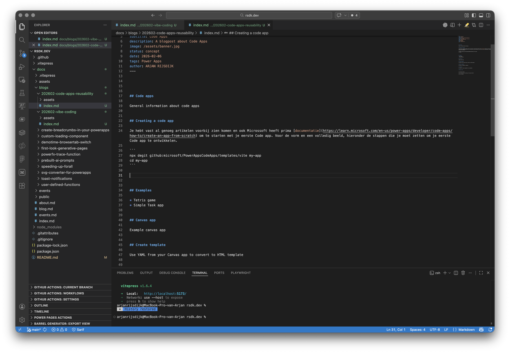

## Code apps

General information about code apps


## Creating a code app

Je hebt vast al genoeg artikelen voorbij zien komen en ook Microssoft heeft prima [documentatie](https://learn.microsoft.com/en-us/power-apps/developer/code-apps/how-to/create-an-app-from-scratch) om te starten met je eerste Code app. Voor de vorm en een volledig beeld, hieronder de stappen die je moet zetten om je eerste Code app te ontwikkelen.

```
npx degit github:microsoft/PowerAppsCodeApps/templates/vite my-app

cd my-app
```

Image



Gif


Movie 


## Examples

* Tetris game
* Simple Task app


## Canvas app

Example canvas app


## Create template

Use YAML from your Canvas app to convert to HTML template


## Build a template

Ask Copilot to generate a template, 


## Components

Ask copilot to create components for you template


## Repo & reuse


Use Tailwind en Radix

Zie ook verhaal over Vibe coding in the power platform

A11Y (zie ChatGPT)

