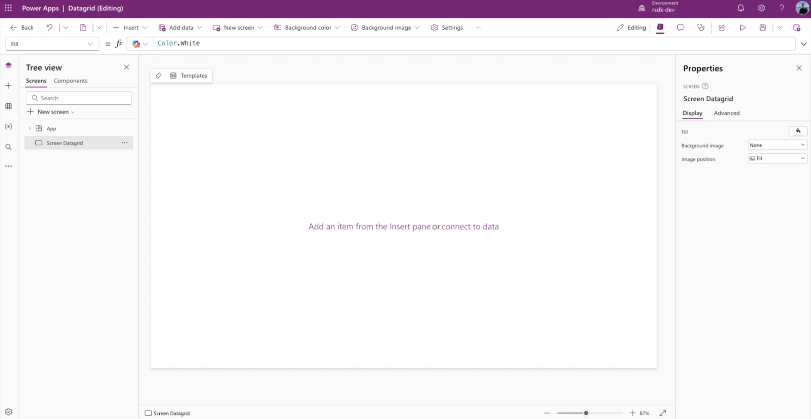
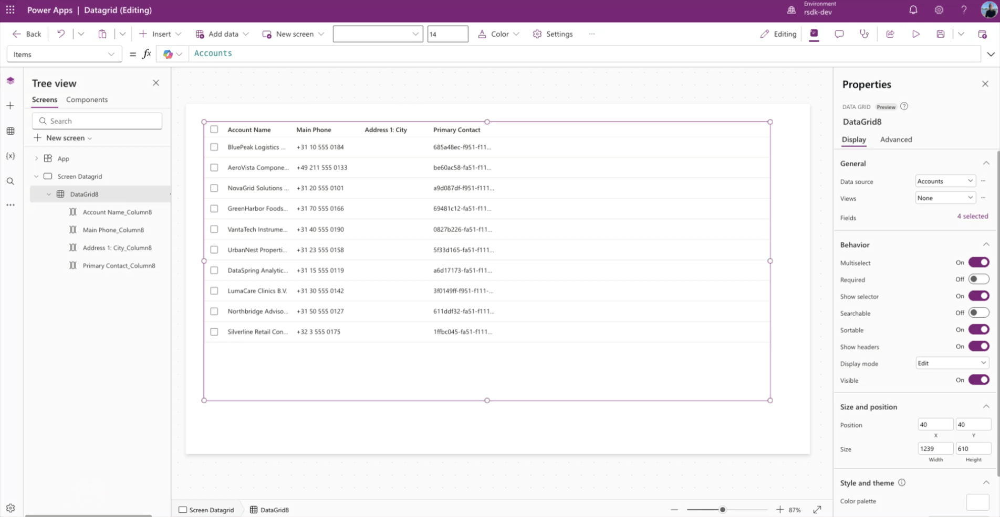
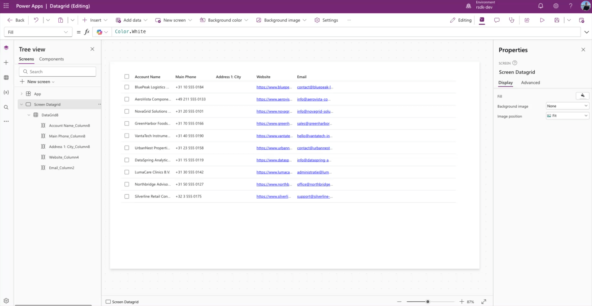
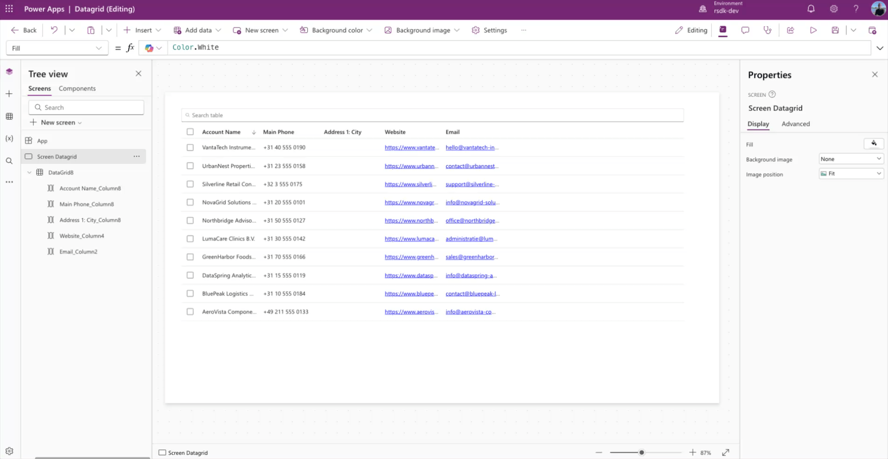
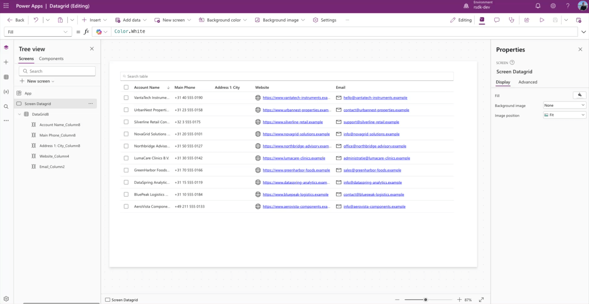
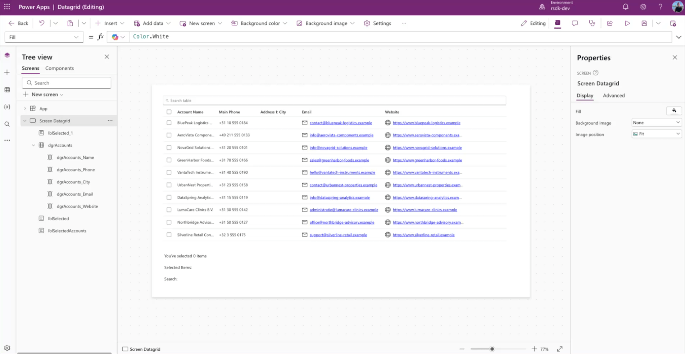

## New Data Grid control in Canvas apps

Microsoft recently announced the "What’s new in Power Platform: May 2026 feature update". You can read the full announcement covering all the new features [here](https://www.microsoft.com/en-us/power-platform/blog/2026/05/14/whats-new-in-power-platform-may-2026-feature-update/).

One of the announcements is the new **Data grid** control in Canvas apps. It is now in public preview, so this is a good time to take a closer look at it!

You can find the documentation for this control here: [Data Grid modern control in canvas apps (preview)](https://learn.microsoft.com/en-us/power-apps/maker/canvas-apps/controls/modern-controls/modern-control-data-grid)

## Add a Data grid control

Open a Canvas app, or create a new one. In this example, we start with a blank screen.

Click **Insert** and choose **data grid (Preview)**.

Next, select the **data source** you want to add to the **data grid**. In this example, we use the Dataverse **Accounts** table.



## Add and remove columns

Of course, you can also add or remove columns in this new **data grid** control. It works the same way as it does in many other controls in Canvas Apps.

In the properties pane, click the **X selected** link, right next to the **Fields** property. Then click **Add column** to add a column, or remove columns that are already connected.



## Search

The new data grid control also comes with built-in search. You can turn it on by enabling the **Searchable** toggle in the properties pane.

Once you enable this feature, a search box appears above the grid. That means you no longer need to build extra logic just to support search.



## Column properties

Not only does the data grid component have its own properties, but the selected columns underneath it also have their own settings.

Here, you can set the **width** of a column, but also things like **visibility** and **wrap**.

You can also add an **icon** to a column. In the example below, I do that for the **website** and **Email** columns.



For icons, you can use the full list that is also available in the modern **Icon** and **Button** controls.

## Multiselect 

By default, a data grid is added to your canvas as a multiselect grid. If you would rather use a single-select grid, you can simply turn off the **Multiselect** property.



## Process output

The data grid control has several output properties. The familiar `Selected` and `SelectedItems` are available, just like in controls such as the Gallery control.

But the Data grid control also includes an extra output property: `SearchText`. This lets you retrieve the value the user typed into the search box. Just keep in mind that this only works when the **Searchable** property is set to **True**.

### SelectedItems

Obviously, you do not just want to use a data grid to display information. You will probably want to do something with the selected items too. For that, you use the `SelectedItems` output property.

For example, you can count the number of selected items in the data grid with the following Power FX code:

```
CountRows(datagridName.SelectedItems)
```

Or you can retrieve the selected values and show them in a single text string:

```
Concat(datagridName.SelectedItems,'Column Name')
```

### SearchText

To retrieve the value the user typed into the search box, you can use the following Power FX code:

```
datagridName.SearchText
```

In the example below, I show how you can use the output properties mentioned above in your Canvas app.




## YAML snippet

If you want to get started right away, copy the YAML below and paste it into your Canvas app. Just make sure you add the Dataverse **Accounts** table to your app first.

```
Screens:
  Screen Datagrid:
    Children:
      - lblSelectedAccounts:
          Control: ModernText@1.0.0
          Properties:
            Text: |-
              =$"Selected Items: { Concat(dgrAccounts.SelectedItems,'Account Name', " - ") } "
            Width: =1000
            X: =40
            Y: =644
      - lblSelected:
          Control: ModernText@1.0.0
          Properties:
            Text: =$"You've selected {CountRows(dgrAccounts.SelectedItems)} items"
            Width: =1000
            X: =40
            Y: =602
      - dgrAccounts:
          Control: ModernDataGrid@1.1.0
          Properties:
            Height: =535
            Items: =Accounts
            OnChange: =Set(varSelected, Self.SelectedItems.name)
            Searchable: =true
            Size: |
              =14
            Width: =1239
            X: =40
            Y: =40
          Children:
            - dgrAccounts_Website:
                Control: ModernDataGridColumn@1.1.0
                Variant: Url
                IsLocked: true
                Properties:
                  FieldDisplayName: ="Website"
                  Icon: =Icon.Globe
                  Text: =ThisItem.Website
                  URL: =ThisItem.Website
                  Width: =300
            - dgrAccounts_Email:
                Control: ModernDataGridColumn@1.1.0
                Variant: Email
                IsLocked: true
                Properties:
                  FieldDisplayName: ="Email"
                  Icon: =Icon.Mail
                  Text: =ThisItem.Email
                  Width: =300
            - dgrAccounts_City:
                Control: ModernDataGridColumn@1.1.0
                Variant: Textual
                IsLocked: true
                Properties:
                  FieldDisplayName: |-
                    ="Address 1: City"
                  Text: |-
                    =ThisItem.'Address 1: City'
            - dgrAccounts_Phone:
                Control: ModernDataGridColumn@1.1.0
                Variant: Textual
                IsLocked: true
                Properties:
                  FieldDisplayName: ="Main Phone"
                  Text: =ThisItem.'Main Phone'
            - dgrAccounts_Name:
                Control: ModernDataGridColumn@1.1.0
                Variant: Textual
                IsLocked: true
                Properties:
                  FieldDisplayName: ="Account Name"
                  Text: =ThisItem.'Account Name'
      - lblSearch:
          Control: ModernText@1.0.0
          Properties:
            Text: |-
              =$"Search: {dgrAccounts.SearchText}"
            Width: =1000
            X: =40
            Y: =685

```

## Question or feedback

If you have any questions, comments, or feedback, feel free to reach out to me on LinkedIn: https://www.linkedin.com/in/arjanrijsdijk/


