## General availability of Code apps

After a period in preview, Microsoft recently announced that Power Apps Code apps are now generally available. See also the [official announcement from Microsoft](https://www.microsoft.com/en-us/power-platform/blog/power-apps/generally-available-host-and-run-code-apps-in-power-apps/).


Of course, Microsoft also provides documentation on building Power Apps Code apps. For more information: [Power Apps code apps documentation](https://learn.microsoft.com/en-us/power-apps/developer/code-apps/).

In this article, I try to dive a bit deeper into the different steps involved in building a Power Apps Code app.


## Preparation

Before we start building a Code app, we need to have a few things in place;

* Power Apps Code apps enabled (Power Platform Admin Center)
* Visual Studio Code (or another IDE)
* Power Platform CLI


### Enable Power Apps Code apps

With the introduction of Power Apps Code apps, Microsoft has added a setting in the Power Platform Admin Center to allow Code apps. This setting is disabled by default and must be enabled in order to build and push a Code app to your environment.

Use the following steps to enable Power Apps Code apps in the Power Platform Admin Center.

1. Open your [Power Platform Admin Center](https://admin.powerplatform.microsoft.com/)
2. Click **Manage** 
3. Click **Environments**

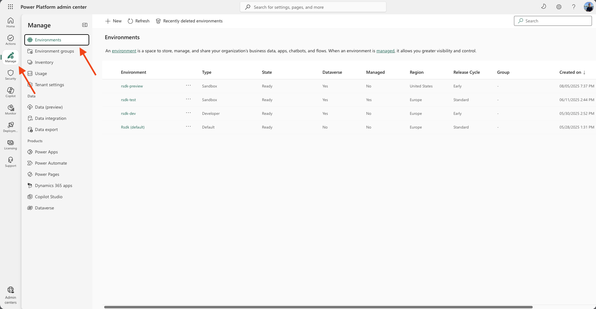

3. Select the **environment** you want enable Power Apps Code apps
4. Click **Settings** (top navigation)
5. Click **Product** > **Features**

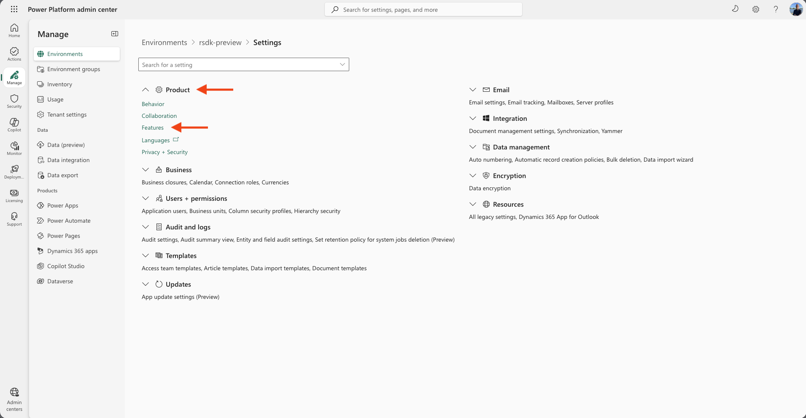

7. Enable **Power Apps Code Apps**

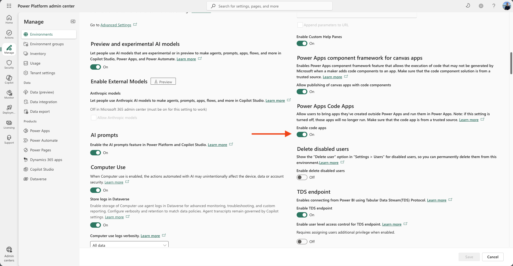


### Visual Studio Code

Before we can start building a Power Apps Code app, we need a development tool or editor. 

During my first experiences building Power Apps Code apps, I used several IDEs (Integrated Development Environments), such as Visual Studio Code, Cursor, and Antigravity. At the end of this article, I’ll reflect on my experiences with these tools. For now, this article focuses on using Visual Studio Code.

Visual Studio Code (VS Code) is a lightweight and fast code editor from Microsoft. The huge ecosystem of extensions (such as Power Platform, Dataverse, and GitHub), combined with the integration of GitHub Copilot, makes it an indispensable tool for me.

Visual Studio Code is free to download and use. If you haven’t installed Visual Studio Code yet, you can download it here:
[Download Visual Studio Code](https://code.visualstudio.com/download)

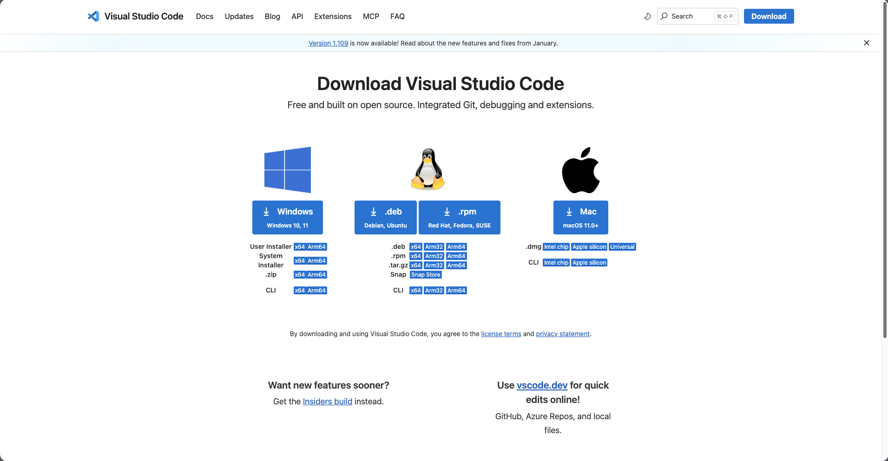


### Power Platform CLI

The Power Platform CLI is a Microsoft-developed command-line interface that allows you to interact with the Power Platform using commands executed in a terminal

Specifically for Code apps, a number of Power Platform CLI commands are important. For example, you need the ```pac auth``` group to authenticate with an environment, and the ```pac code``` commands to push your Code app to the Power Apps cloud.

More information about the Power Platform CLI: [Power Platform CLI](https://learn.microsoft.com/en-us/power-platform/developer/cli/introduction?tabs=windows) or a full reference: [Power Platform CLI Command Groups](https://learn.microsoft.com/en-us/power-platform/developer/cli/reference/)

You can install the Power Platform CLI manually in several ways. You can also use the Power Platform Tools extension for Visual Studio Code. You’ll learn more about this in the next chapter.


### Power Platform Tools extension

The Power Platform Tools extension for Visual Studio Code is an extension that, among other things, installs the Power Platform CLI for you. In addition, it provides an interface for authenticating with your tenant and allows you to view an overview of your environments and solutions.

In my opinion, this is a must-have—especially when working with Code Apps in Visual Studio Code.

#### Install

To install the extension, follow these steps:

1. Open **Visual Studio Code**
2. Click **Extensions** (left navigation)
3. Search and select **Power Platform Tools**
4. Install the extension

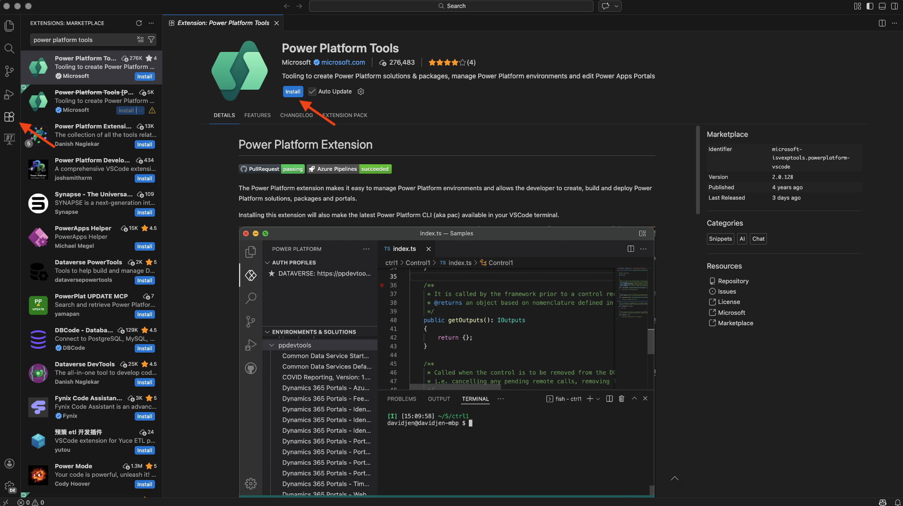


#### Interface

Once the extension is installed, the Power Platform Tools extension will appear in the navigation on the left-hand side.

You will now also have insight into your profiles and the associated environments. For each environment, you can view all solutions that have been created in the selected environment.

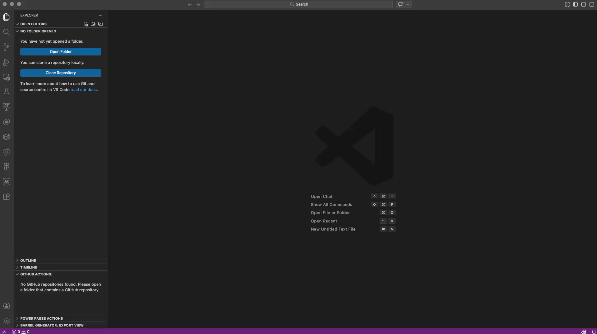


#### Authenticate Tenant


To be able to publish a Code app to the Power Platform later on, we first need to authenticate the tenant. In much of the documentation, this is done using the Power Platform CLI command ```pac auth```. After running this command, you’ll be redirected to a browser window where you can sign in with your account.

Authenticating a tenant (creating a new profile) can also be done directly through the interface of the Power Platform Tools extension.

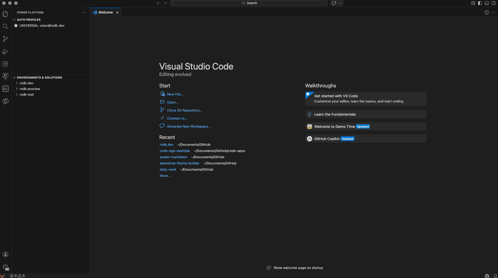

When the sign-in is successful, a new profile will be created in your Power Platform Tools extension.


#### Select Environment

After authenticating the tenant, we also need to select an environment. The environment we select will be the one to which the Code app will be pushed later on.

In the documentation, this is done using the following Power Platform CLI command:

```
pac env select --environment < Your environment ID >
```

However, selecting an environment can also be done directly through the interface of the Power Platform Tools extension. You can do this by clicking the star icon to the right of the environment name.

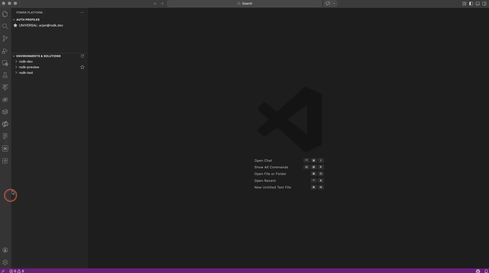


## Creating a code app

We’ve now completed a number of important preparation steps. We can finally ‘really’ start building a Power Apps Code app.

In the next steps, I’ll explain how to get started in Visual Studio Code by pulling down a sample template, running it on a local development server, and then pushing (publishing) the code to your Power Apps environment.


### New terminal

In the next steps, we’ll run a number of commands (such as several PAC CLI commands, as explained above). To run these commands, we first need to open a Terminal window in VSCode.

To open a new terminal window, go to the menu, select **Terminal**, and then choose **New Terminal**. 

You can also do this using the keyboard shortcut ```Cmd + Shift + ` ``` on macOS or ```Ctrl + Shift + ` ``` on Windows.”

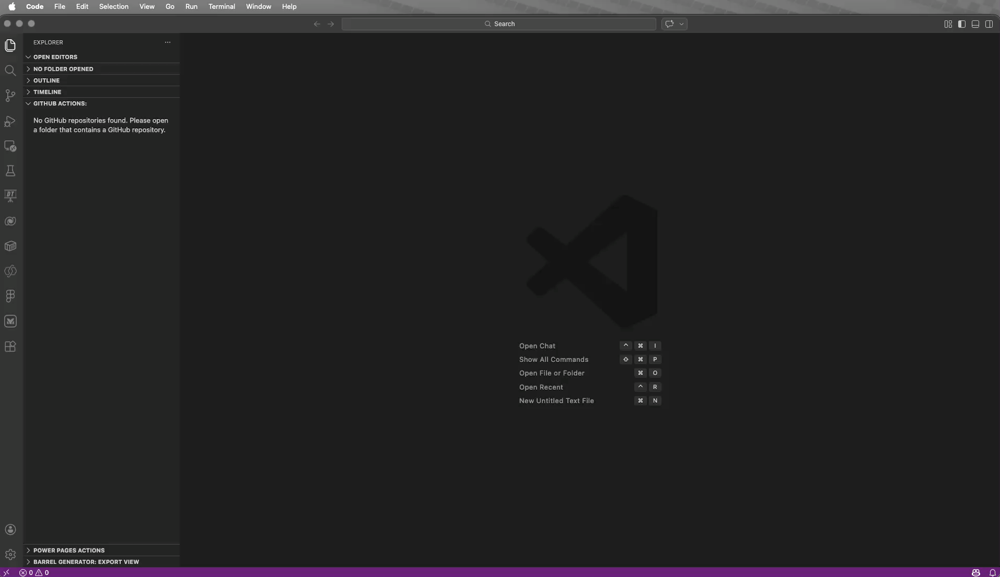


### Folder selection

Now choose a location and create a folder where you want to store your Code app. Make sure you navigate to this location in the terminal.

In this example, I create a folder named **Code Apps** in my **Documents** folder. 

To navigate to this folder I use the following Terminal command

```
cd Documents/CodeApps
```

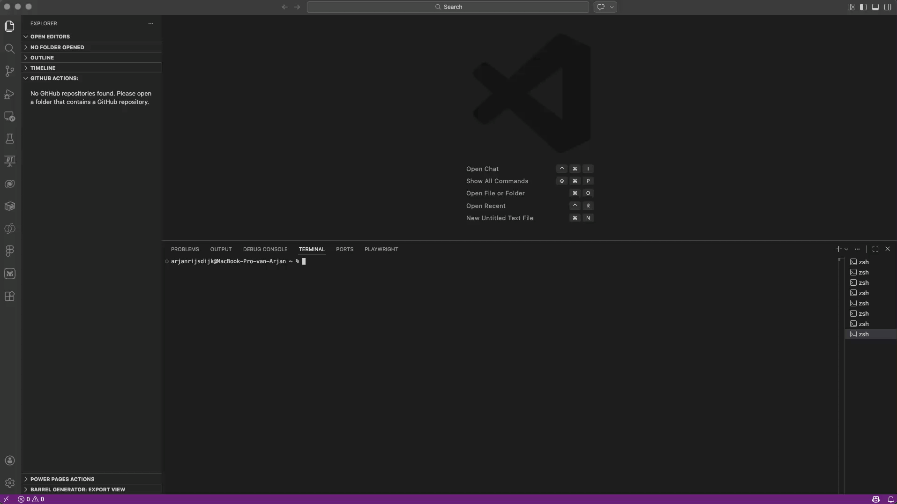


### Getting the template

Microsoft has made a template available for Power Apps Code apps. This template contains all the components needed to get started with a Code app right away.

Open your terminal and run the following command:

```
npx degit github:microsoft/PowerAppsCodeApps/templates/vite MyFirstCodeApp
```

The last part of the command above is the folder name, **MyFirstCodeApp**. All components of the template app will be copied into this folder. Now navigate to this newly created folder using the following command:

```
cd MyFirstCodeApp
```

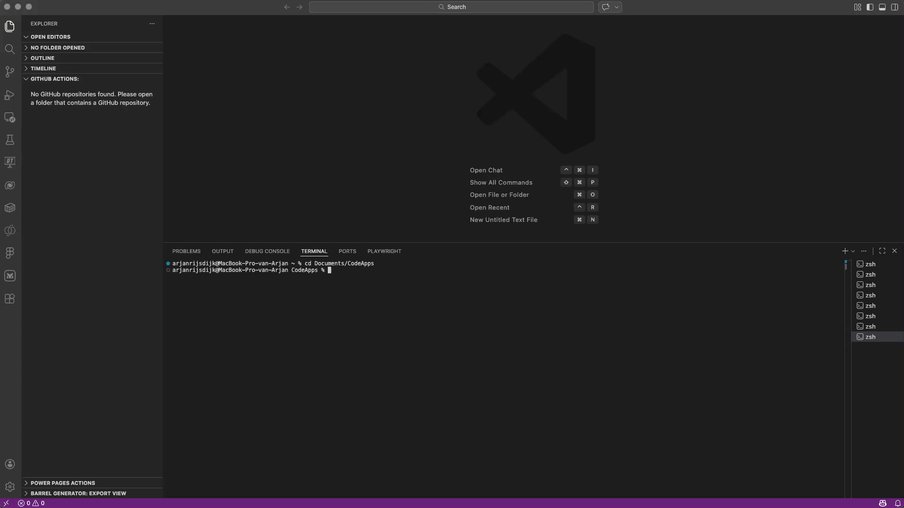


### Authenticate & Select Environment

Before we continue, we need to authenticate a tenant and select an environment.

In the documentation, the following terminal commands are referenced:

*Authenticate*

```
pac auth create
```

*Select environment*

```
pac env select --environment < Your environment ID >
```

As mentioned earlier, these actions can also be done via the Power Platform Tools extension, see: [Authenticate Tenant](#authenticate-tenant) and [Select environment](#select-environment)


#### Get your Environment ID 

In several actions, you’ll be asked to provide an environment ID, for example when using the ```pac env select``` command. You can find your environment ID in the Power Platform Admin Center, but also directly in the Power Platform Tools extension in Visual Studio Code. To do this, right-click on the environment and select **Copy Environment ID**.

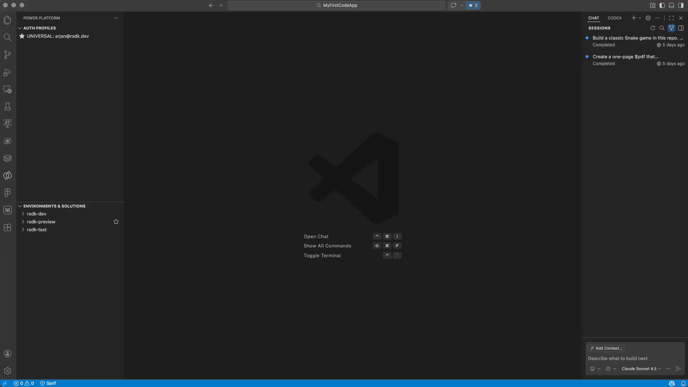


### Open folder

To view the files that were cloned in the previous steps, it’s useful to add the folder to your Visual Studio Code workspace.

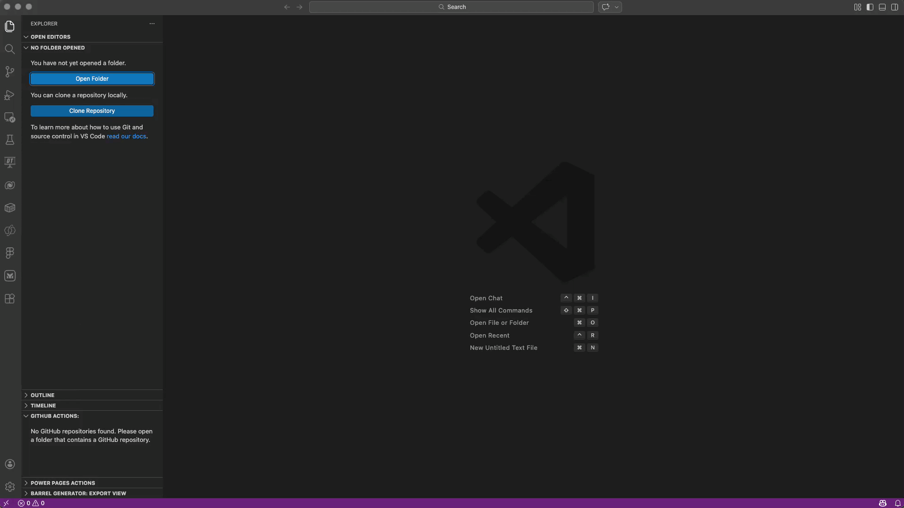


### NPM install

We now need to install the required NPM modules. NPM modules are essentially reusable building blocks for JavaScript/TypeScript applications.

In the previous step, we cloned files into a specified folder. Inside this folder, there is a file called package.json. This file lists all the required NPM modules that need to be installed.

To install the modules, run the following command in your terminal:

```
npm install
```

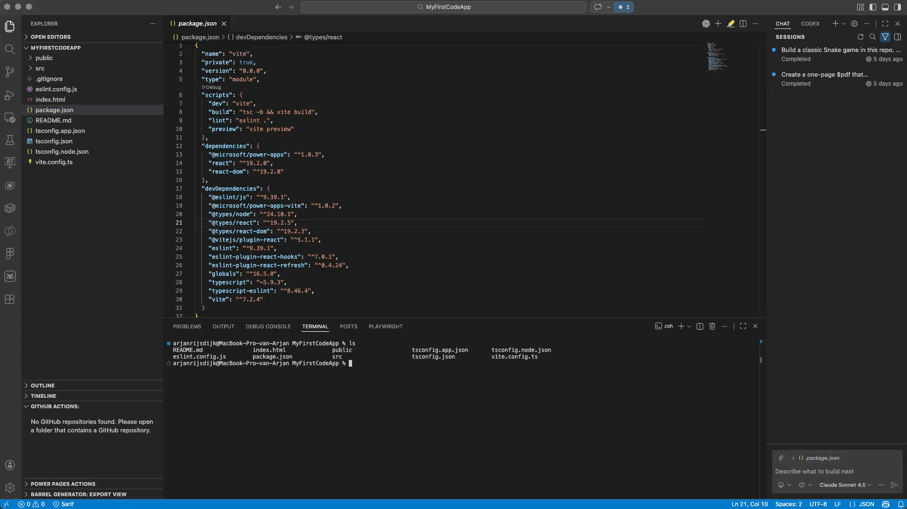

The installation may take a while. Once the installation is complete, the modules will be stored in the **/node_modules** folder.


### Initialize Code App

We can now initialize the Code app. Run the following command in your terminal.

```
pac code init --displayname "My First Code App"
```


### Run

Once the app has been initialized, you can test it by running it locally.

To do this, run the following command in your terminal:

```
npm run dev
```

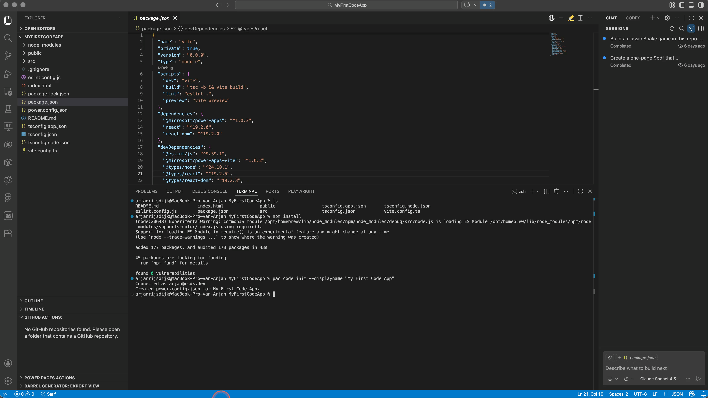

To view the result, click the link in the terminal. Your default browser will open and the Code app will be displayed.


#### Two different links

As you may have noticed, after running the ```npm run dev``` command, two links are shown in the terminal: a localhost link and a Power Apps link.

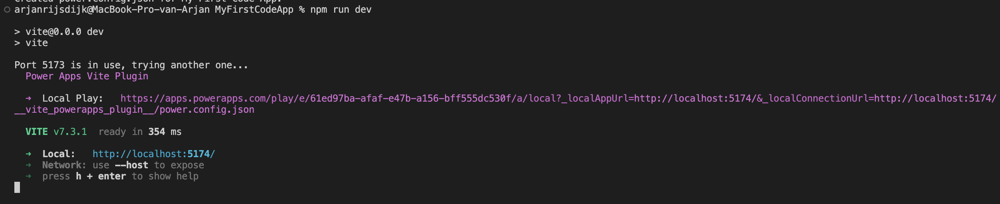

There is an important difference between these two links. The localhost is specifically meant for starting development—building and testing your UI and components.

For Code apps, Microsoft has created a dev tunnel that allows you to test your app with authentication, so you can also test those connections. If you’re using connectors in your Code apps, you’ll need to use the **apps.powerapps.com** link to properly test them.


#### Simple Browser

It can be very useful to view the result of your Code app directly within your Visual Studio Code workspace. You can do this by using the built-in Simple Browser.


### What do we get

Basic structure

copilot-instructions.md 


## Build & deploy

### Build

```
npm run build
```

### Push the app

```
npm code push
```

### Solution

hadmatig aan een solution toevoegen


## Diferent IDE's

