In this post, I will show you how to easily create a custom loading gif using Figma and how to use this image to create a loader component in Power Apps. All you need is an image of about 32 by 32 pixels.

## Create a custom loading image (gif) using Figma

In Figma, create a new frame (64x64 pixels) and place the image centered inside the frame. Give the frame a white background color (#ffffff).

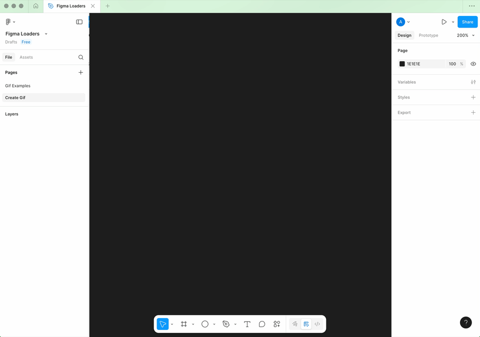

Now copy the frame 11 times, creating 12 identical frames.

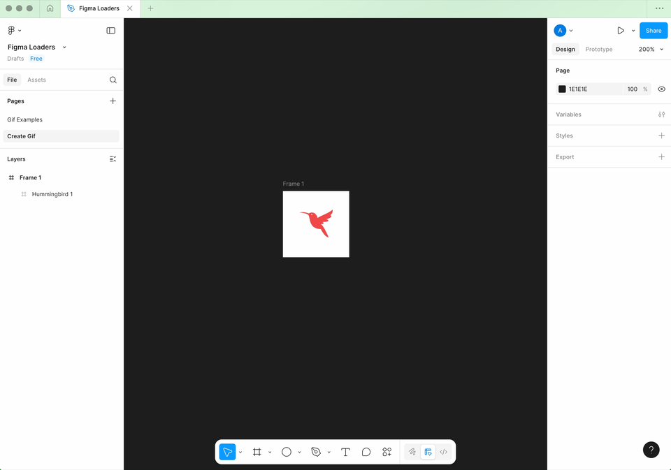

Now use the Rotation setting to rotate the image in each frame 30 degrees each time, so 30, 60, 90 and so on.

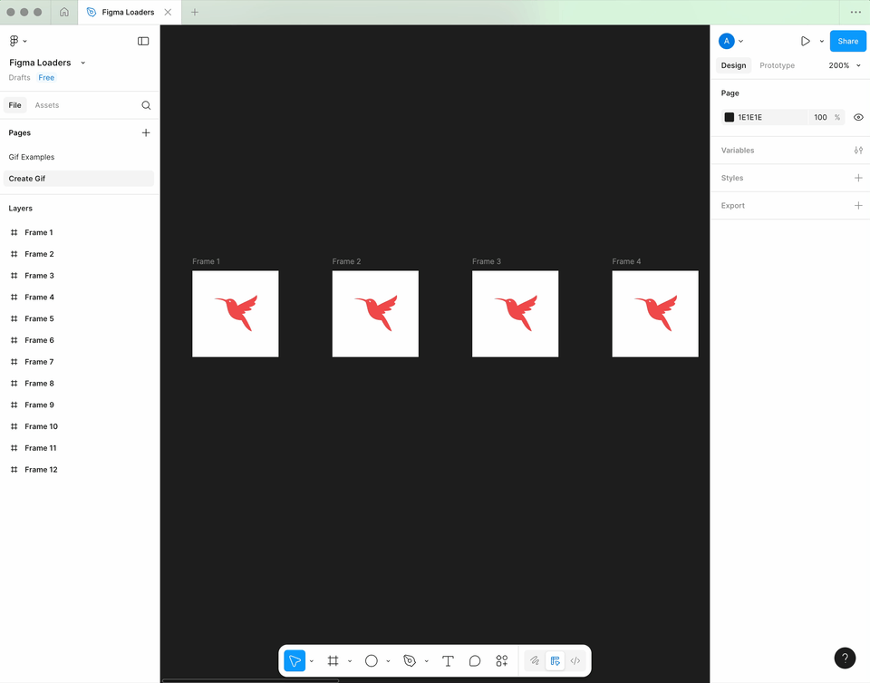

In the 12 frames, you now have a situation where the image rotates exactly 360 degrees across these 12 frames. 

Now select all 12 frames, click on now on Actions and then on Animated Gif Maker.

Click on Generate GIF to see a preview.

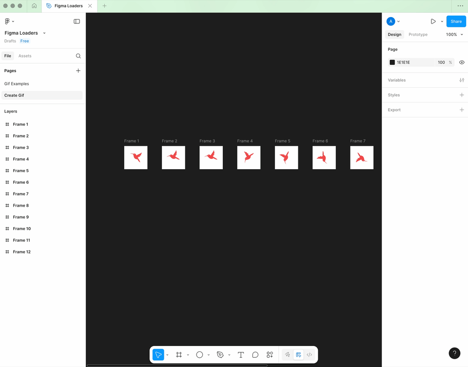

Now click Download Gif and and save it with the name Hummingbird.gif


## Create a loader component in Power Apps
In this example, we will create a component within a Power App. This means that the component is only reusable within the app itself. 

There is also an option to create a Library Component, this can be added to and used in multiple apps within your environment. This requires a different approach, keep an eye on my blogs as I will be writing blog on creating a library component in the near future. 

### Preparations
Before we start, it is important to create two variables in the OnStart property of the app. 

```
// determine whether the component is visible
Set(varLoader, false);

// the text to be displayed in the loader
Set(varLoaderText, "Loading app ...");
```

### Create component
In Power Apps Studio, go to the Tree view, click Components, and then click New component.

Now we give this component the name cmpLoader.

It is important to enable the Access app scope property in this case. This ensures that variable and collections of the app are accessible to this component.

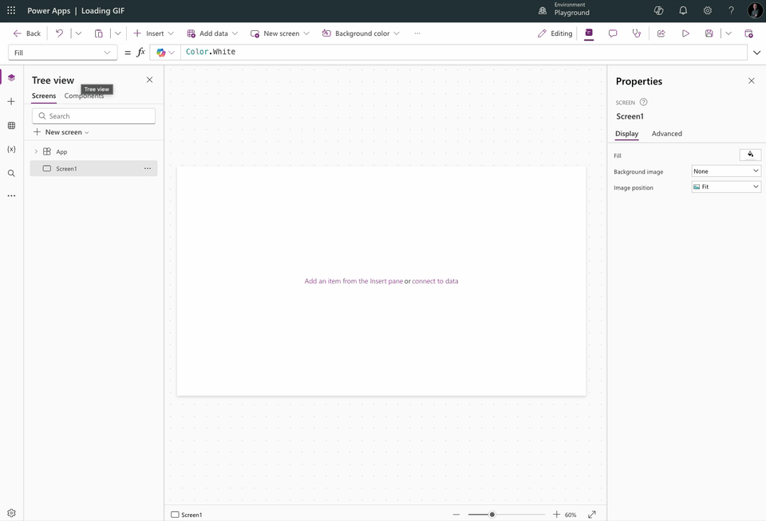

Now place a container in the component. This container should have the same width and height as the component, we do this by using Parent.Width or Parent.Height.

We will also give the container a partially transparent color RGBA(232, 233, 224, 0.75), so that it will be a nice overlay on top of the app. 

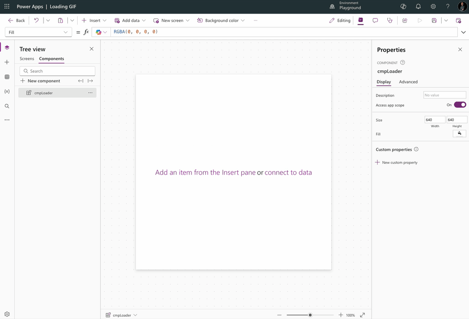

Add the image (gif) created in Figma to your Power App via Media > Add Media > Upload.

Now place the image in the container you just added. 

We need to make sure that the image will be centered in the container at all times. We do this by using a simple formula: 

```
X: (Parent.Width - Self.Width) / 2
Y: (Parent.Height - Self.Height) / 2
``` 

Let's see how we do this in Power Apps

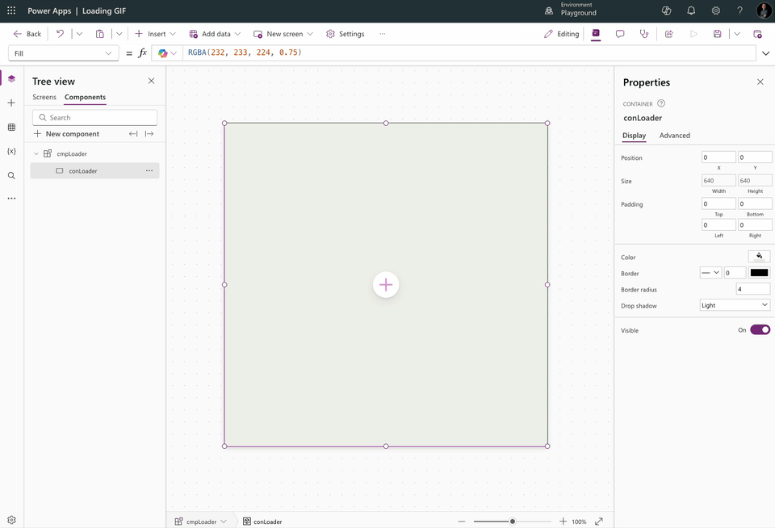

The last thing we need to do in this step is to add a text label in which we can display the text belonging to the action (while the user is waiting).

This text label should be given a related full width to the parent container and we set the Auto height property to true. This way the component will be usable in responsive situations as well.

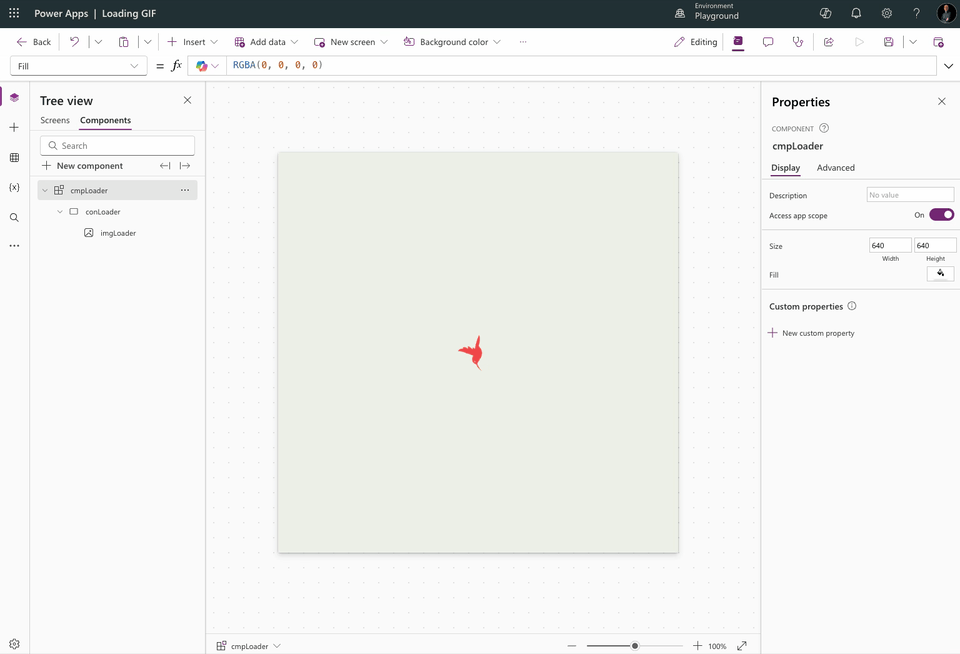

Optionally, you can use the YAML code below to create your component.

```
- conLoader:
    Control: GroupContainer@1.3.0
    Variant: ManualLayout
    Properties:
      Fill: =RGBA(232, 233, 224, 0.75)
      Height: =Parent.Height
      Width: =Parent.Width
    Children:
      - lblLoader:
          Control: Text@0.0.51
          Properties:
            Align: ='TextCanvas.Align'.Center
            FontColor: =RGBA(242, 72, 73, 1)
            Text: =varLoaderText
            Weight: ='TextCanvas.Weight'.Bold
            Width: =Parent.Width
            Y: =(Parent.Height + imgLoader.Height) / 2
      - imgLoader:
          Control: Image@2.2.3
          Properties:
            BorderColor: =RGBA(0, 18, 107, 1)
            Image: =Hummingbird
            X: =(Parent.Width - Self.Width) / 2
            Y: =(Parent.Height - Self.Height) / 2
```

### Use component
Once you have created the component you can add it to one or more screens. You can do this the same way you add other controls to your app. You can find your component(s) in the controls list under the Custom section.

It is important that the component is always the first control on your screen (at the top), so it will always display “over” your app.

Again, we need to give the component the same width and height as the screen (the parent) and use the created variable varLoader for the visible property.

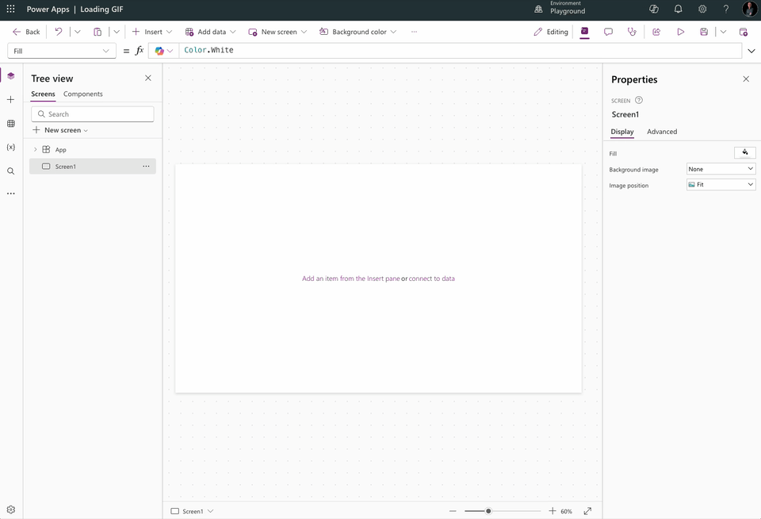

We have now added the component to the app and can use it in various actions, such as triggering a flow, saving to Dataverse, or navigating to other screens.

See an example below.

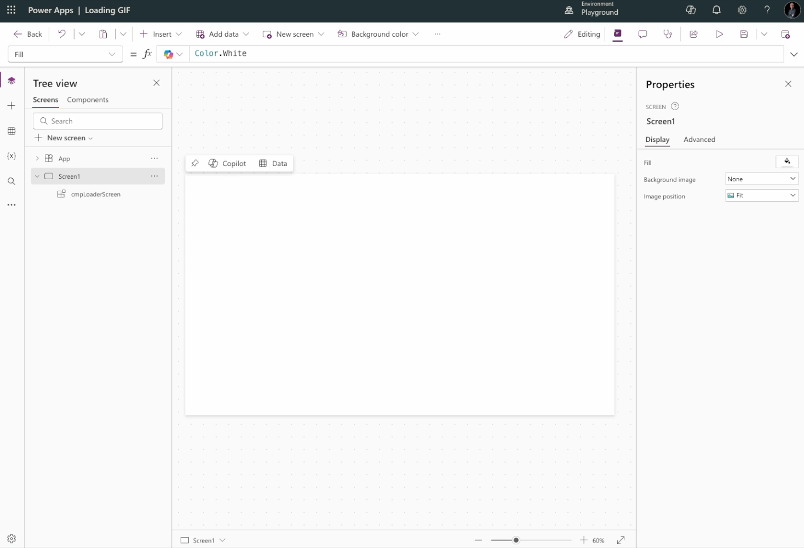

What I personally always do by default is use the loader when navigating between screens. I make the component visible just before calling the Navigate function (for example, in the OnSelect of a button), and then I hide the component again in the OnVisible of the screen (after any other actions).

## Other examples
See below another example of a loading image created with Figma.

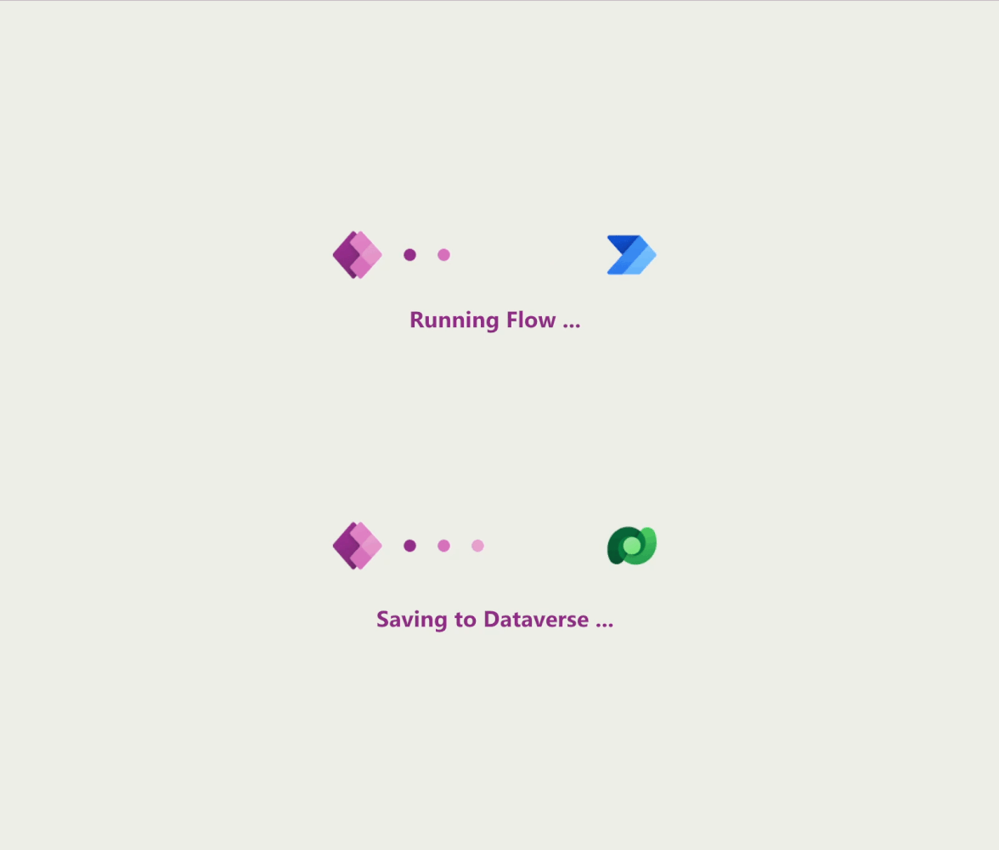

