First of all, it’s important to mention that the generative pages are preview functionality and are not intended for production use.

If you look at the documentation on generative pages on [Microsoft Learn](https://learn.microsoft.com/en-us/power-apps/maker/model-driven-apps/generative-pages), a few things stand out, one of which is the region. For now, the functionality is only available in a United States region environment.

## New environment
So, step 1 (for now) is to create a new environment with the region set to **United States**. Also, make sure to enable the **Get new features early** option.

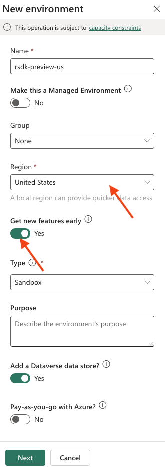

Once the environment has been created, it’s a good idea to activate the 2025 release wave 2. To do this, click Manage under Updates. If the plan hasn’t been installed yet, you can do so by clicking Update now.

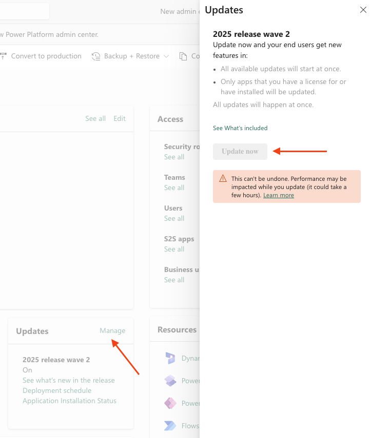

Finally, check that the Enable new AI-powered Copilot features for people who make apps setting is enabled. To do this, go to your environment, click Settings, and then select Features.

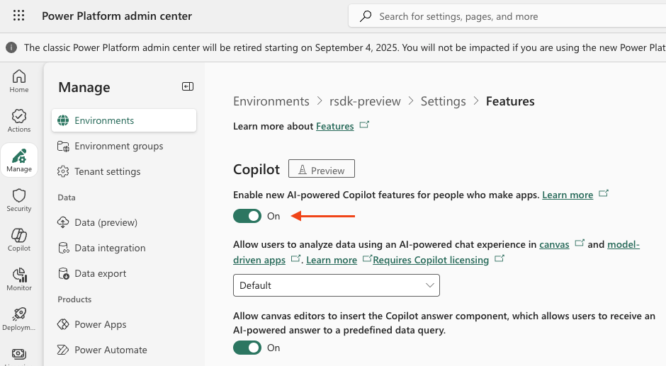

## Model-driven app
To get started with generative pages, we need a model-driven app. In my example, I created a solution and within that solution, I created a model-driven app named Generative pages.

As preparation, I also created two very simple Dataverse tables. See the structure below.

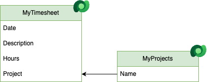

Of course, I also added some data so that the generative page can later use and display this information.

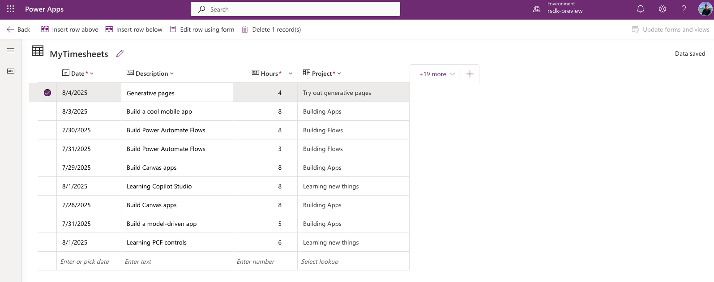

Before you can use the tables when describing your generative page, you’ll need to add them to your model-driven app.

To do this, go to **Data** in the left menu, search for and select the table you want to add, and then click **Add**.

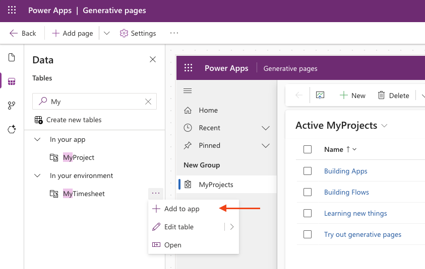

## Add page
Now, click the arrow next to + Add page and select Describe a page.

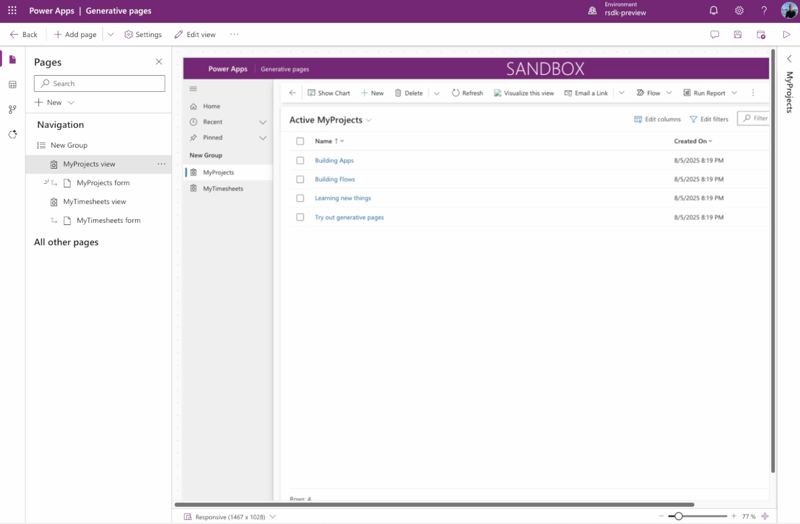

As you can see, a screen is now displayed where we can describe our page using natural language.

Above the prompt field, you’ll also find some guidance from Microsoft with predefined prompts, such as Build a gallery page for accounts, which is a great starting point!

Before we describe the page, we also need to specify which tables should be used for the page. To do this, click + Add data and add the two tables.

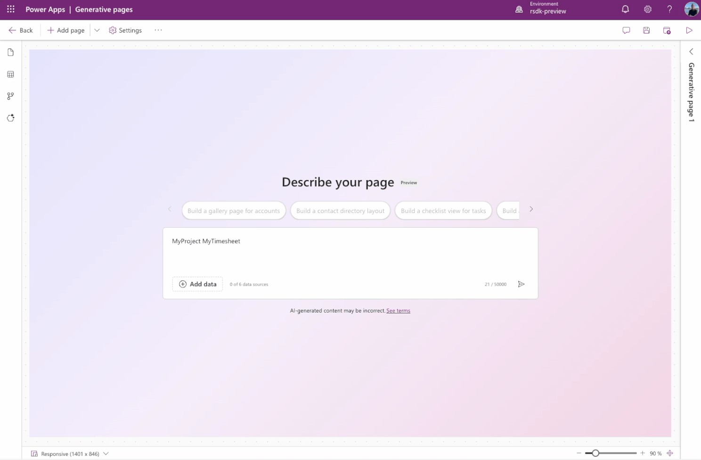

Now that we’ve added the data, we can describe the page. I’ll keep it simple and use the following prompt:

Build a page showing MyTimesheet records as a searchable table in a modern look & feel.

And now, the magic takes over …

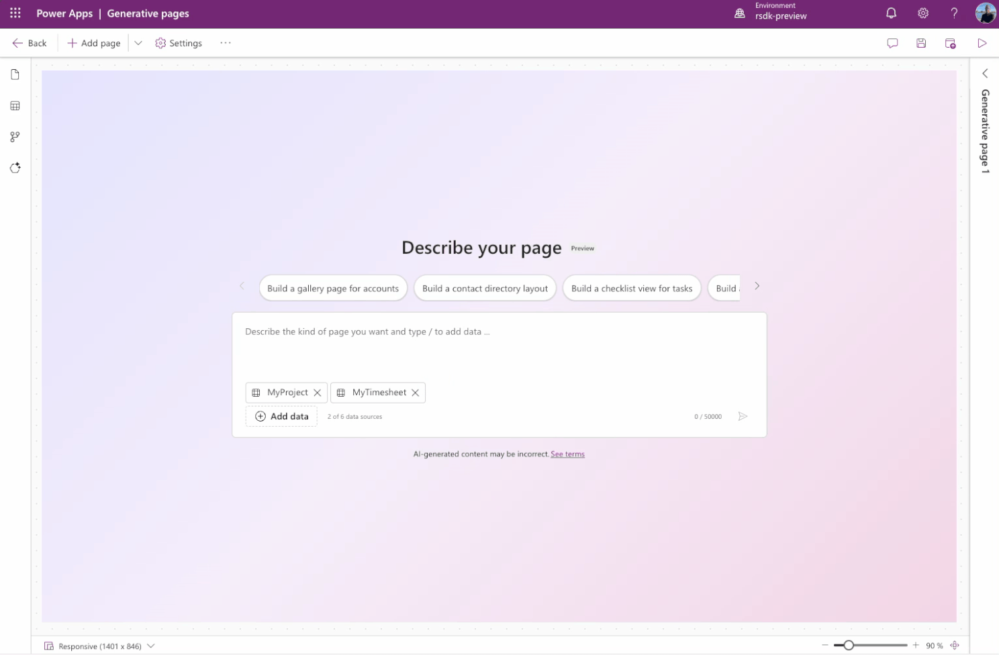

After a bit of patience, the result is nothing short of stunning!

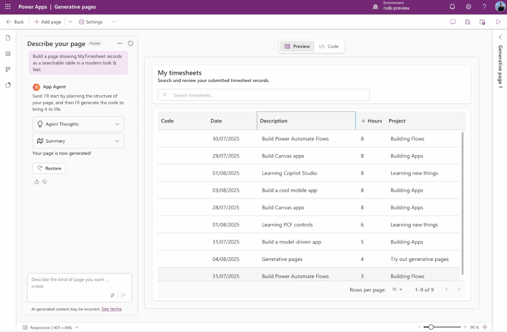

And as always, we must not forget to publish before we can actually use the app with the generative page.

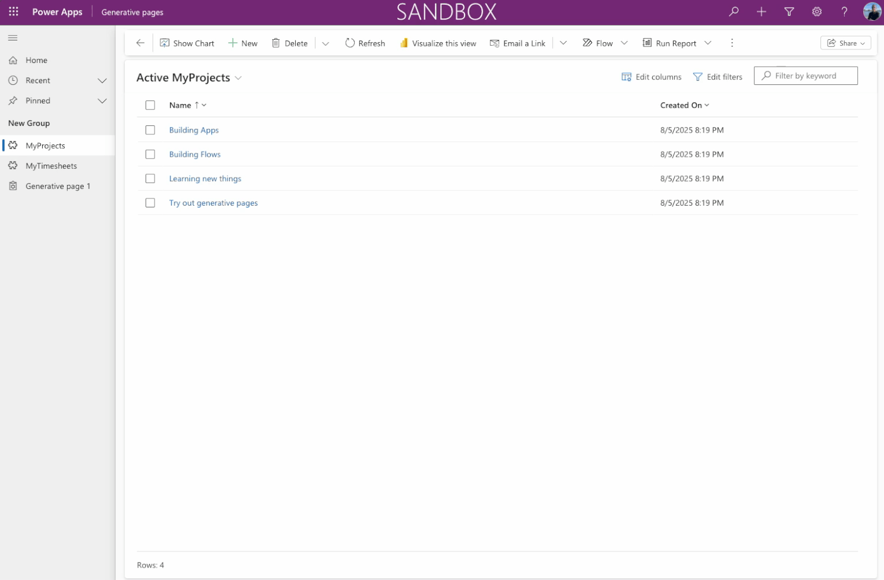

## Conclusion
I’ve only spent a few hours playing around with generative pages, but the results are truly amazing! Most of the time was actually spent creating the new environment :-) 

It’s really impressive to see how you can build an entire page with just a single sentence—and this is only the beginning.

Did everything work perfectly right away? Definitely not. I initially started with a more complex prompt, which resulted in several errors, but that may very well have been due to my prompt.

Either way, I can’t wait to keep experimenting and exploring! I’ll keep you posted 🙂