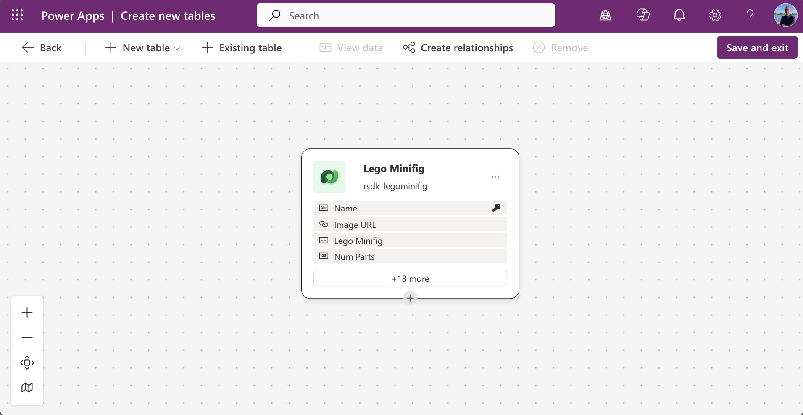

Recently I published an article about generating generative pages with GitHub Copilot CLI and the Power Platform skills plugin. Did you miss it? You can find it here: [Generative pages with GitHub Copilot CLI](https://arjanrijsdijk.com/blogs/genpages-with-copilot-cli/)

In that article I mainly focused on creating a new page using GitHub Copilot CLI in Visual Studio Code and uploading it to a model-driven app.

In this article we're flipping things around, we'll first create a new generative page using the in-app designer, and then edit it further in Visual Studio Code, all with the help of GitHub Copilot CLI.

## What's the plan?

The plan is to build a page with cards based on a table of Lego Minifigs. Each card will show a photo, a name, and the number of parts the minifig contains.

I'm using the following Dataverse table.



Based on the table, here's what we'll do:

1. Describe a new generative page directly in a model-driven app
2. Download the page to a local IDE (Visual Studio Code)
3. Make changes to the page
4. Upload (deploy) the page back to Power Apps

## Preparation

Before we can go through all the steps in this article, we need to do some prep work:

* Install GitHub Copilot CLI [read more](https://github.com/features/copilot/cli/)
* Get Power Platform Skills plugin [read more](https://github.com/microsoft/power-platform-skills/tree/main)
* Authenticate and select environment
* Create a model-driven app

In the first part of my blog about generative pages with GitHub Copilot CLI you can read more about the required preparation. More info can be found [here](https://arjanrijsdijk.com/blogs/genpages-with-copilot-cli/#preparation).

## Create a generative page

First up, we'll create a generative page in the model-driven app. For this I wrote the following prompt:

```
Build a page showing Lego Minifig records as a gallery of cards using modern look & feel. All cards should have fixed size and tall enough to fit 3 lines of titles. Include name, image url (as image in the card) on the top of the card, and num parts as a badge. Add pagination and show maximum of 24 items per page.

Make the component fill 100% of the space. Make the gallery scrollable. Use data from the Lego Minifig table. Make each card clickable to open the Lego Minifig record in a new window. The target URL should be current location path with following query string parameters: pagetype=entityrecord&etn=[entityname]&id=[recordid] where entityname is rsdk_legominifig and id is rsdk_legominifigid.

Add a search field to search all lego minifigs on name.
```

Open your model-driven app in design mode.

Choose **Add page** and then **Describe a page**.


Now we can describe our page. I'm using the prompt I prepared earlier, as described above. After pasting it, we also add the correct table to the description.


The page has now been created and we can view and test it in the app.


Once the page is created it gets a default name (Generative Page x). It's a good idea to rename it to something logical right away, this will come in handy later in the process.


Don't forget to publish the page when you're done.

## Download generative page

We've now created a generative page using the in-app designer of the model-driven app. Next, we'll download this page to our IDE (Visual Studio Code in this case) so we can edit it locally.

Start **Visual Studio Code**.

Open a **terminal** and enter the following command:

```
copilot
```

GitHub Copilot CLI will now start.


We'll now start the genpage skill with the following command:

```
/model-apps:genpage
```

Copilot will run some checks for you regarding the presence of the PAC CLI, Node.js, etc.


Once all checks pass, Copilot's first question will be whether you want to create a new page or edit an existing one.

In this case we choose `2. Edit an existing page`.


The next question is which app contains the page you want to edit.

In this example that's the app **Gen Pages Demo**.

Then you'll be asked **Which page would you like to edit?**

In this example we choose the generative page we just created: **Lego Minifig Gallery**.


The page will now be downloaded. Once done, a new folder named **genpage-edit** will be available in your file explorer.


## Folders & files

Before we continue, let’s take a look at the folder and its contents that were just downloaded by Copilot. As you can see, four files have been downloaded:

* config.json
* page.js
* page.tsx
* prompt.txt

If we compare this with my earlier blog—where we created a new gen page directly through GitHub Copilot CLI—you’ll notice that slightly different files are generated. These are the final files that Power Apps uses to ‘render’ the page.

One interesting thing to see is that the prompt.txt file contains the prompts we previously used when describing the page in the model-driven app.

In the next steps, you’ll see that changes will occur in these files when we upload the page back to Power Apps. For example, a runtimeTypes.ts file will be generated, which contains the required structure of the linked Dataverse tables.

It’s also good to know that the Power Platform Skills plugin used here relies on the new PAC model commands. One of these commands is pac model genpage transpile, which converts the TypeScript code into JavaScript so that Power Apps can read and serve it.

## Make changes

Now that we've downloaded the page, we can edit it locally. Here too I'll keep using GitHub Copilot CLI.

Even better, Copilot will ask you right after the download which changes you'd like to apply to the page. I've prepared a simple prompt for this as well.

```
The image section of the card has a light gray background. Make the background transparent. So that it has the same background color as the card.

Center the 'number of parts' badge horizontally within the card.
```

Enter your desired changes, I'll paste the prompt above.


Copilot will first give you a summary of the changes it's about to make, and then go ahead and apply them.

## Publish to Power Apps

Once the changes have been applied, Copilot will ask if you want to publish the page to Power Apps.

I'll choose `1. Yes, publish it`.


Before Copilot actually publishes the page to Power Apps, it will first ask if you want to verify the result in the browser.

I'll choose `1. Yes, verify in browser`.


Copilot will use Playwright to open a browser and display the generative page.


The requested changes have now been applied and Copilot will provide a summary of all the tasks it has completed.


## Wrapping up

GitHub Copilot CLI adds yet another option to the many possibilities for vibe coding within the Power Platform. As a big fan of CLI tools, I really appreciate this one too.

To be honest though — for me, the real value comes from combining GitHub Copilot CLI with the Power Platform skills plugin. The way Copilot guides you through the CLI in the process of creating, editing, testing and deploying apps (or in this case generative pages) makes the whole workflow genuinely enjoyable.

It's also become clear that the Power Platform skills plugin will soon include a plugin for Code apps. With that addition, we'll not only be able to build genpages via the CLI, but also single-page applications for Power Pages and Code apps for Power Apps, all without having to think about agents, skills, hooks, etc. ourselves.

If GitHub Copilot CLI (especially the last abbreviation) feels a bit intimidating, be sure to check out the [GitHub Copilot CLI for Beginners](https://github.com/github/copilot-cli-for-beginners) repository on GitHub.
