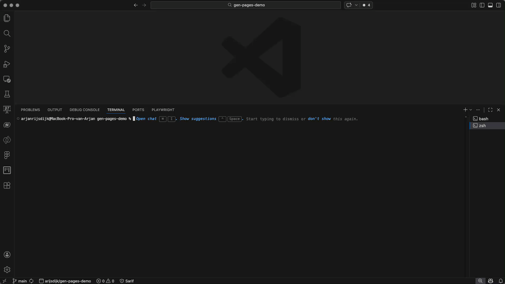
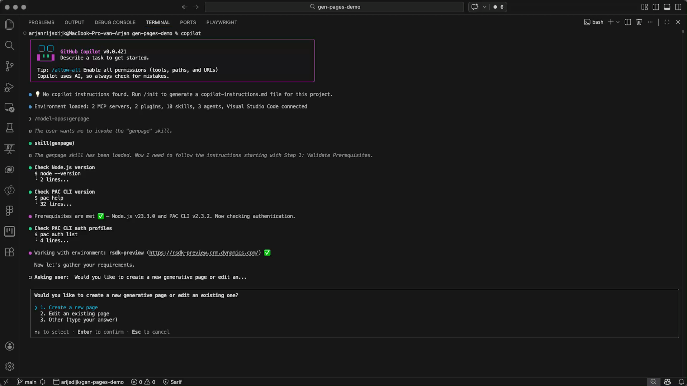
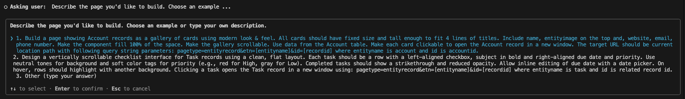
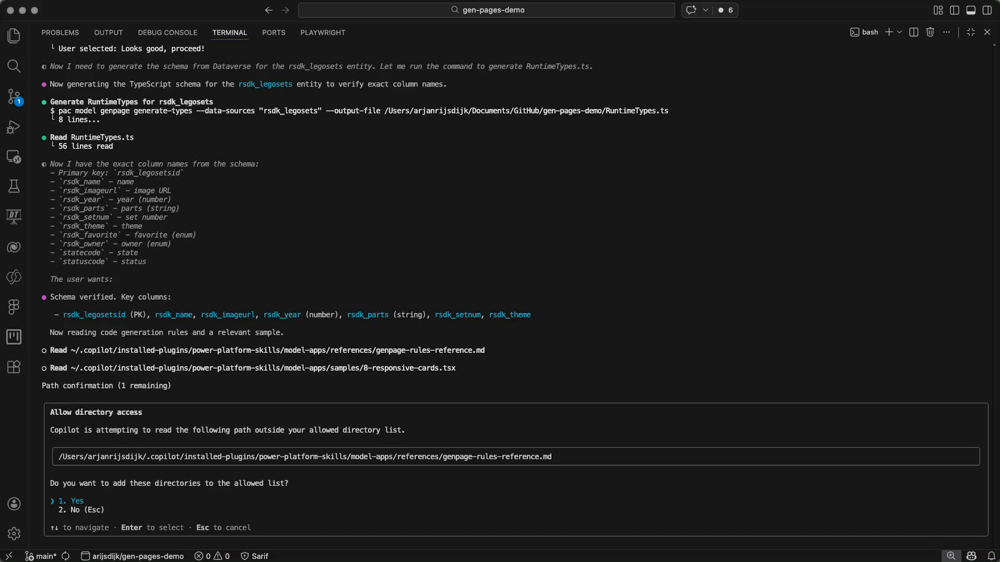
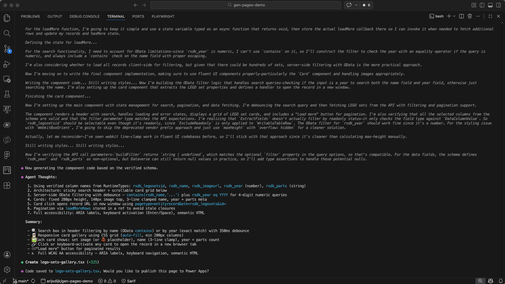
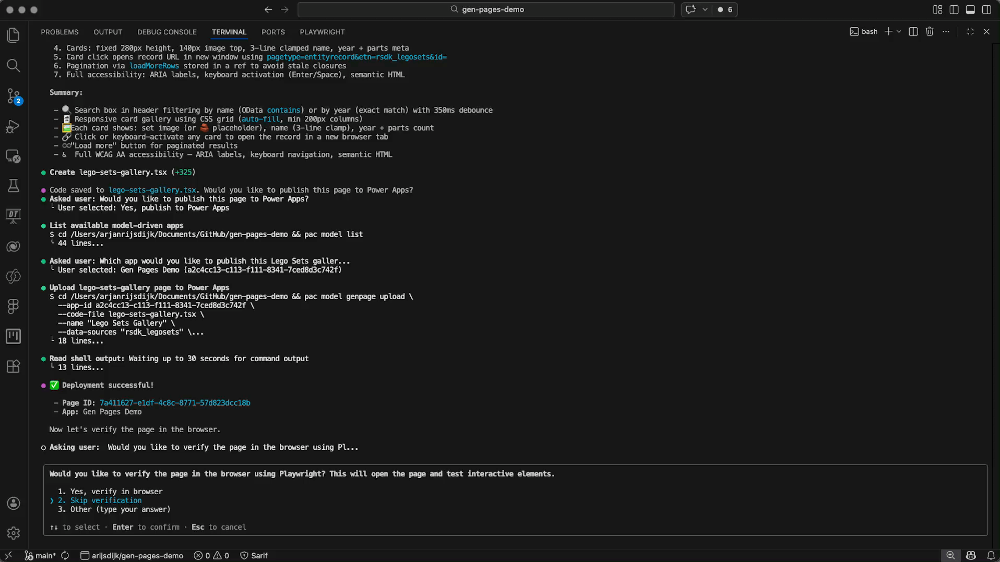
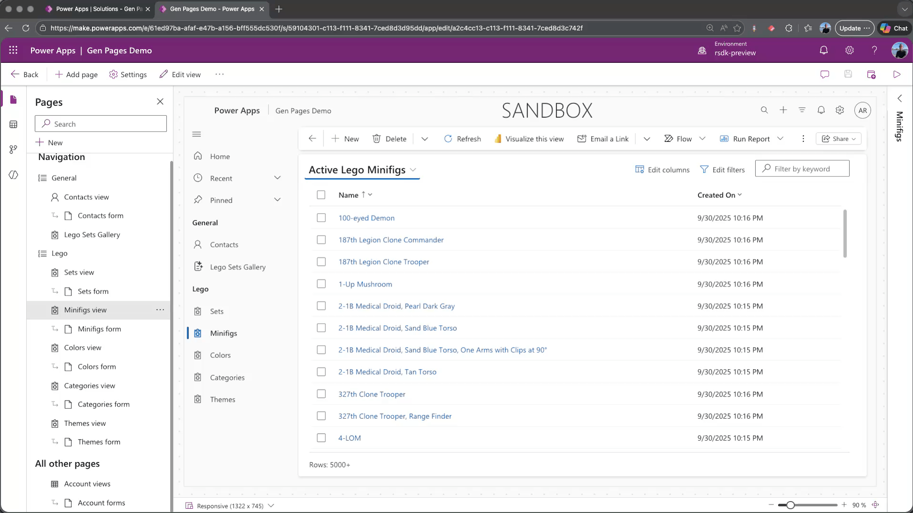

>>> Verwijzen naar deel 1


## Preperation


### Copilot CLI 

Voor we met Copilot CLI starten moeten we deze eerst installeren. Meer informatie over installatie en opties kun je vinden via [Install Copilot CLI](https://github.com/features/copilot/cli/).

Open een terminal window in Visual Studio Code en geef het volgende commando in

```
npm install -g @github/copilot
```


### Power Platform Plugin


https://github.com/microsoft/power-platform-skills/tree/main/plugins/model-apps


### Authenticate and select environment

### Model driven app


## Generate new page with Copilot CLI

### Start Copilot CLI

Open je terminal en start Copilot via je terminal met het volgende simpele commando

```
copilot
```

We gaan nu de genpage skill starten (dit is een onderdeel van de eerder geinstalleerde plugin). Ga naar je terminal en geef het volgende commando in 

```
/model-apps:genpage
```




### Create a new page

Als de genpage skill is gestart zal Copilot wat controles uitvoeren (geselecteerde environment, versies etc.). Als deze controles succesvol zijn uitgevoerd zal Copilot je een aantal vragen stellen. 

De eerste vraag is of je een nieuwe pagina wilt aanmaken, een betaande wilt wijzigen of anders, waarbij je zelf kunt aangeven wat je wilt doen. 

In dit geval kiezen we voor het aanmaken van een nieuwe pagina. 




### Describe your page

Copilot zal je nu vragen je pagina te omschrijven. Je hebt eventueel ook de mogelijkheid om te keizen uit een tweetal vooraf gedefinieerde prompts. 



In dit voorbeeld maak ik gebruik van een eigen omschrijving, zie hieronder mijn prompt.

```
Build a page showing Lego Sets records as a gallery of cards using modern look & feel. All cards should have fixed size and tall enough to fit 3 lines of titles. Include name, image url (as image) on the top, year and parts. 

Make the component fill 100% of the space. Make the gallery scrollable. Use data from the Lego Sets table. Make each card clickable to open the Lego Sets record in a new window. The target URL should be current location path with following query string parameters: pagetype=entityrecord&etn=[entityname]&id=[recordid] where entityname is rsdk_legosets and id is rsdk_LegoSetsId. 

Add a search field to search all lego sets on name or year.
```

In dit voorbeeld kies ik dus voor de optie **3. Other (type your answer)** vervolgens knip en plak ik mijn prompt. Dit ziet er in je terminal dan als volgt uit.


Nu zal Copilot je nog vragen of je omschrijving volledig is en/of je allicht nog aanvullende requirements zou willen toevoegen. In dit geval kies ik voor de optie **1. No, the description covers everything**. In je terminal ziet dat er dan als volgt uit.


Wat je nu ziet is dat Copilot een plan heeft gemaakt op basis van mijn prompt. Op dit punt heb je nog de mogleijkheid om het plan aan te passen of een andere opdracht in te geven. Voor nu ben ik tevreden en kies ik voor de optie **1. Looks good, proceed!**


Copilot gaat nu de pagina voor je bouwen. Tijdens dit proces zal Copilot je vragen om bepaalde mappen en bestanden op de **Allowed list** te zetten, zodat Copilot deze kan benaderen. Bijvoorbeeld het genpage-rules-reference.md bestand in de plugin map. 




### What did we get?

Na een klein beetje geduld heeft Copilot een nieuwe pagina voor ons aangemaakt. Copilot zal ook een uitgebreide samenvatting maken en weergeven. Zie hieronder.  



Voordat we naar de volgende stap gaan en de pagina gaan publiceren in Power Apps gaan we eerst eens kijken naar wat Copilot voor ons heeft gegenereerd. Als we nu kijken naar de file explorer dan zien we dat twee bestanden zijn aangemaakt; 

* RuntimeTypes.ts
* lego-sets-gallery.tsx 


### Publish to Power Apps

Als de pagina is aangemaakt zal Copilot je vragen of je de pagina wilt publiceren naar Power Apps. Uiteraard willen we het resultaat ne wel eens zien en kiezen we dus voor de optie ```1. Yes, publish to Power Apps```. 

In de volgende stap zal Copilot je vragen aan welke model-driven app de pagina moet worden toegevoegd. Omdat we al een environment geselecteerd hadden in een eerdere stap zal Copilot je een keuzelijst tonen. In dit voorbeeld publiceren we de pagina naar de model-driven app met de naam **Gen Pages Demo**


Als we een model-driven app hebben gekozen zal Copilot de pagina publiceren naar de geselecteerde app. 

Vervolgens krijgen we de vraag om de pagina te verifieren in de browser, uiteraard willen we dat en kiezen hier voor ```1. Yes, verify in browser```.

Copilot zal gebruik maken van Playwright als tool om de brwoser te starten. We moeten het gebruik van deze tool dus nog wel. 



Als de browser met de nieuwe pagina is geopend kunnen we deze gaan testen. 


### Playwright

Zoals in een eerdere stap al vermeld zal Copilot de kracht van Playwright gebruiken om de pagina te verifieren en in de browser weer te geven. Echter zal Playwright ook zelf een test uitvoeren om te verifieren dat de pagina correct werkt. 

[hier nog over de testcase]


Als je meer wilt weten en leren over Playwright kijk dan eens op de [Playwright website](https://playwright.dev/)


## Create agenerative page from your model-driven app

### Describe your page

Ga naar je model-driven app en kies voor **Add page** en vervolgens voor **Describe a page**



!!![Nieuwe opname zonder url]

Ook nu hebben we een omschrijving nodig voor de pagina, deze heb ik klaar staan en is vrijwel hetzelfde als de eerder gebruikte prompt, zie hieronder

```
Build a page showing Lego Minifigs records as a gallery of cards using modern look & feel. All cards should have fixed size and tall enough to fit 3 lines of titles. Include name, image url (as image) on the top, year and parts. 

Make the component fill 100% of the space. Make the gallery scrollable. Use data from the Lego Minifigs table. Make each card clickable to open the Lego Sets record in a new window. The target URL should be current location path with following query string parameters: pagetype=entityrecord&etn=[entityname]&id=[recordid] where entityname is rsdk_legominifig and id is rsdk_legominifigid. 

Add a search field to search all lego minifigs on name.
```

We hebben in deze situatie geen beschikking over de plugin met alle context die nodig is voor het toevoegen van bijvoorbeeld datasources gaan we iets anders te werk. In de prompt gaan we nu de tabel opgeven. Ga daarvoor als volgt te werk. 

Plak de prompt in het veld **Describe your page**

Ga naar de opgegeven tabelnaam en type **/** je kunt nu kiezen uit een lijst met tabellen


!!![nieuwe opname voor verhaal met tabellen, geen url]


### Result


### Use Copilot CLI to make changes

## Upload changes

## See the result

Note: you can't add changes to uploaded pages via naturual language directly from your model-driven app


