Onlangs publiceerde ik een artikel over het genereren van generative pages met GitHub Copilot CLI en de Power Platform skills plugin. Heb je hem gemist? Je kunt hem hier terugvinden: [Generative pages with GitHub Copilot CLI](https://arjanrijsdijk.com/blogs/genpages-with-copilot-cli/)

In mijn vorige artikel heb ik vooral stilgestaan bij het maken van een nieuwe pagina met Visual Studio code en het uploaden van deze nieuwe pagina naar je Power apps model-driven app.

In dit artikel gaan we het omdraaien, we maken nu eerst een nieuwe generative pages aan via de in-app designer om de pagina vervolgens verder te bewerken in Visual Studio code en dat allemaal met behulp van GitHub Copilot CLI. 

## Preparation

Alvorens we alle stappen van dit artikel kunnen uitvoeren moeten we een aantal voorbereidingen doen, zoals;

* Install GitHub Copilot CLI [read more](https://github.com/features/copilot/cli/)
* Get Power Platform Skills plugin [read more](https://github.com/microsoft/power-platform-skills/tree/main)
* Authenticate and select environment
* Create a model-driven app

In het eerste deel van dit blog kun je meer lezen over de benodigde voorbereidingen.

https://arjanrijsdijk.com/blogs/genpages-with-copilot-cli/#preparation


## Create a generative page


Als eerste gaan we aan de slag met het maken van een generative page in de model-driven app. Hiervoor gebruik de volgende prompt geschreven:

```
Build a page showing Lego Minifig records as a gallery of cards using modern look & feel. All cards should have fixed size and tall enough to fit 3 lines of titles. Include name, image url (as image in the card) on the top of the card, and num parts as a badge. Add pagination and show maximum of 24 items per page.

Make the component fill 100% of the space. Make the gallery scrollable. Use data from the Lego Minifig table. Make each card clickable to open the Lego Minifig record in a new window. The target URL should be current location path with following query string parameters: pagetype=entityrecord&etn=[entityname]&id=[recordid] where entityname is rsdk_legominifig and id is rsdk_legominifigid. 

Add a search field to search all lego minifigs on name.
```


Open je model-driven app in design moddus

Kies voor Add page en vervolgens voor Describe a page

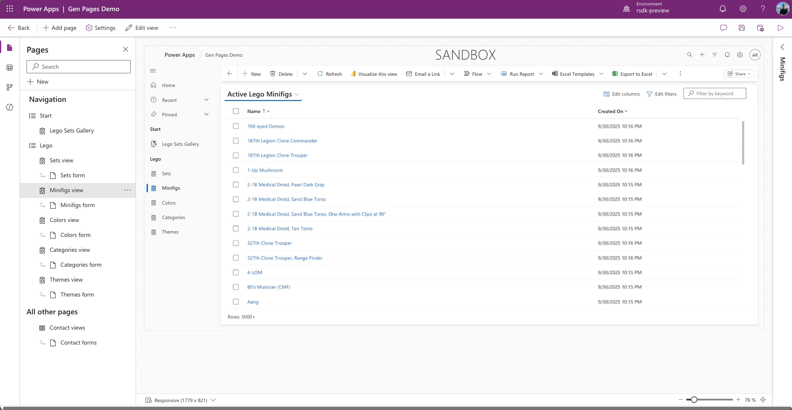

Nu kunnen we onze pagina beschrijven, hiervoor gebruik ik een eerder geschreven prompt, zoals hierboven beschreven. Na het plakken voegen we ook de juiste tabel toe aan de beschrijving.


De pagina is nu aangemaakt en we kunnen deze in de app nu bekijken en testen.

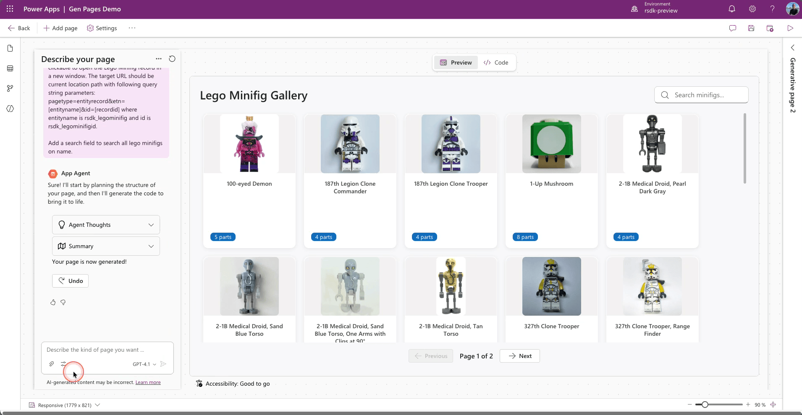

Als de pagina aangemaakt is dan krijgt deze een default naam (Generative Page x), het is raadzaam om de naam nu alvast aan te passen naar een logische naam, dit helpt je verderop in het proces.


Vergeet - als je klaar bent - de pagina niet te publishen.


## Download generative page

We hebben nu dus een generative page aangemaakt via de in-app designer van de model-driven app. We gaan deze pagina nu downloaden naar onze IDE (in dit geval Visual Studio code), zodat we deze lokaal kunnen bewerken. 

Start Visual Studio code

Open een terminal en geef het volgende commando in

```
copilot
```

GitHub Copilot CLI zal nu starten

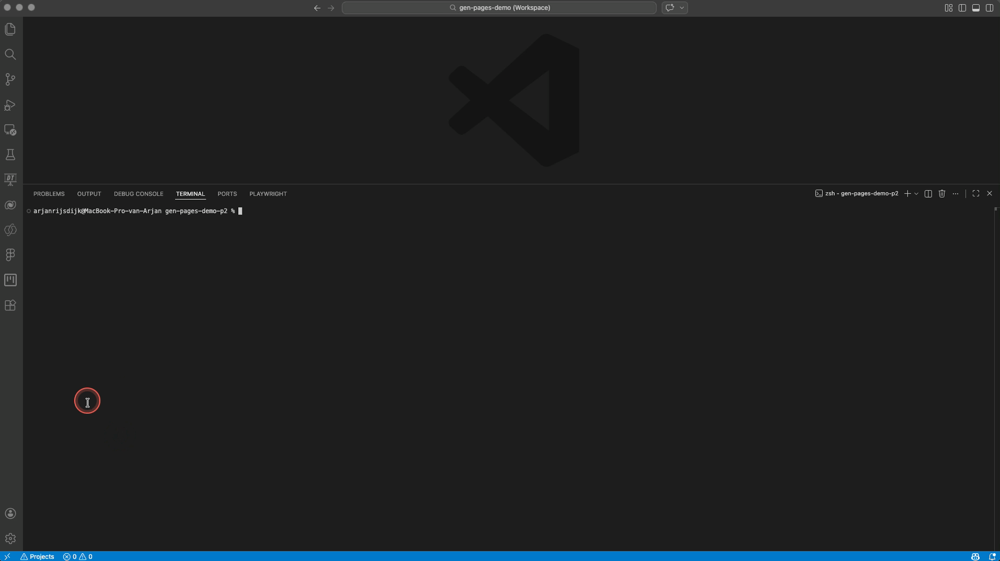

We gaan nu de genpage skill starten met het volgende commando

```
/model-apps:genpage
```

Copilot zal wat controles voor je uitvoeren met betrekking tot de aanwezigheid van Pac cli, Node.js etc.

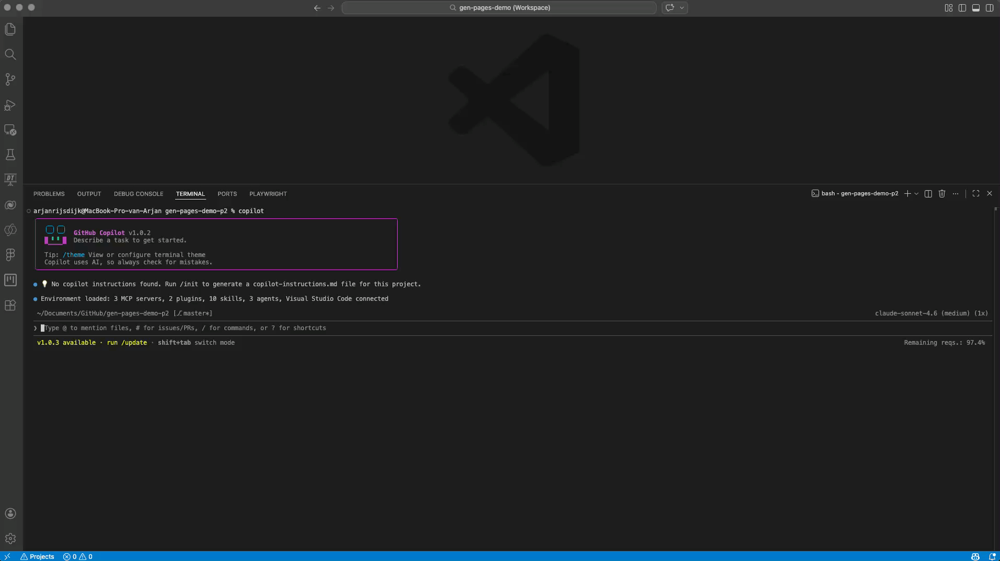

Als alle controles succesvol zijn uitgevoerd zal de eerste vraag van Copilot zijn of je een neiuwe pagina wilt aanmaken of een bestaande wilt wijzigen.

In dit geval kiezen voor ```2. Edit an existing page```

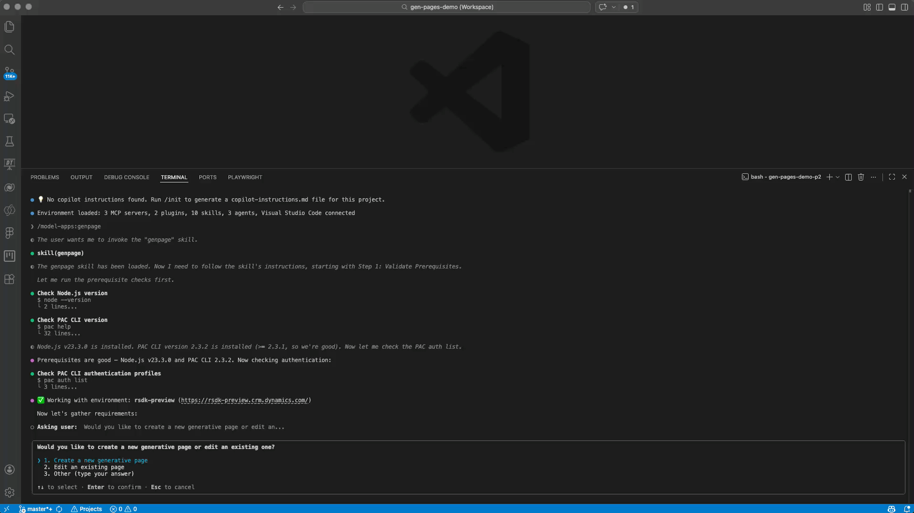

De volgende vraag is in welke app de pagina die je wilt wijzigen zich bevind

In dit voorbeeld is dat de app **Gen Pages Demo** 

Vervolgens zal de vraag worden gesteld **Wich page would you like to edit?**

In dit voorbeeld kiezen we voor de zojuist aangemaakte generative page met de naam **Lego Minifig Gallery**

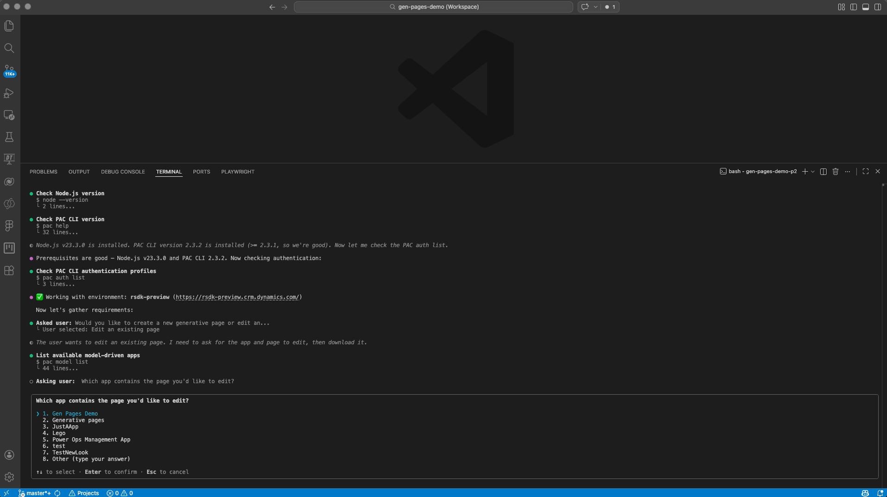

De page zal nu worden gedownload. Als deze klaar is zal een nieuwe map met de naam **genpage-edit** beschikbaar zijn in je file explorer.

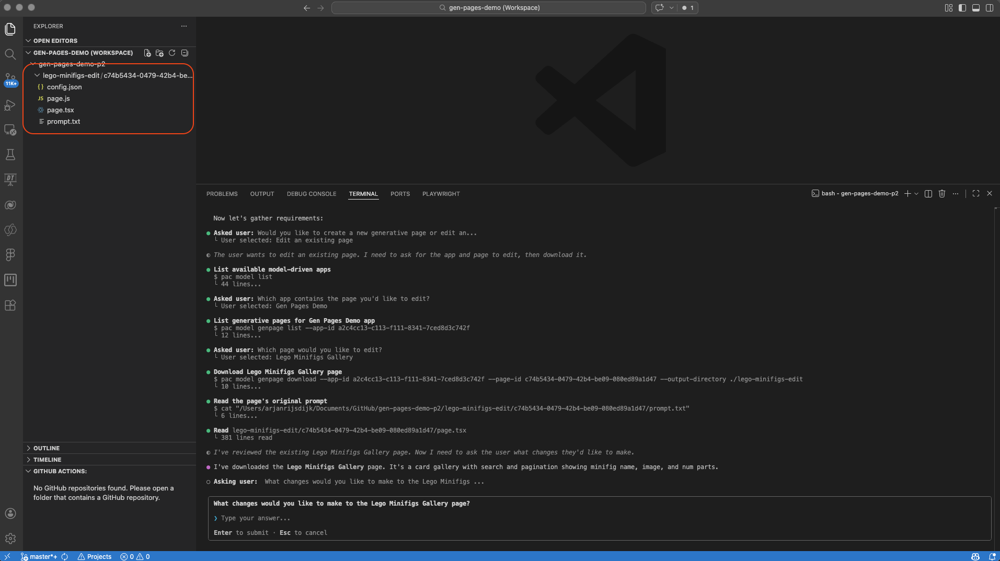


## Folders & files

Laten we voordat we verder gaan eens kijken naar de map en inhoud die zoijiuist door Copilot is gedownload. 

* config.json
* page.js
* page.tsx
* prompt.txt


## Make changes

Nu we de pagina hebben gedownload kunnen we deze lokaal bewerken. Ook hiervoor blijf ik gebruik maken van GitHub Copilot CLI. 

Beter nog, Copilot zal je na het downloaden vragen welke wijzigingen je zou willen toevoegen aan de pagina. Ook hiervoor heb ik een simpele prompt voorbereid. 

```
The image section of the card has a light gray background. Make the background transparent. So that it has the same background color as the card.

Center the ‘number of parts’ badge horizontally within the card.
```

Geef je gewenste wijzigingen op, ik plak hiervoor bovenstaande prompt

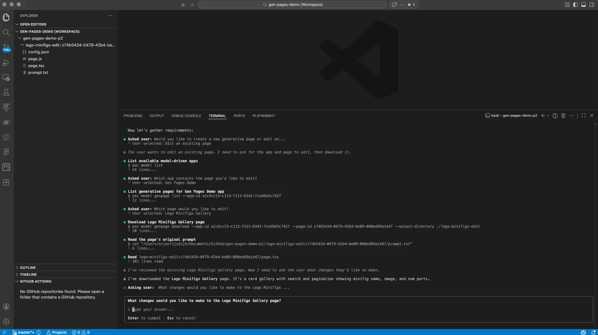

Copilot zal nu eerst samenvatting geven van de wijzigingen die het zal doorvoeren en deze vervolgens ook daadwerkelijk doorvoeren.


## Publish to Power Apps

Als de wijzigingen zijn doorgevoerd zal Copilot je vragen of je de pagina wilt publiceren naar Power Apps. 

Ik kies hier voor ```1. Yes, publish it```

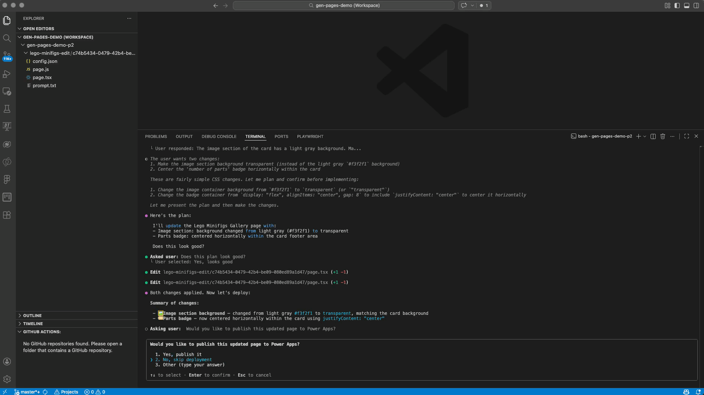

Voordat Copilot de pagina echt zal publiceren naar Power apps zal het je eerst vragen of je het resultaat wilt verifieren in de browser.

Ik kies hier voor ```1. Yes, verify in browser```

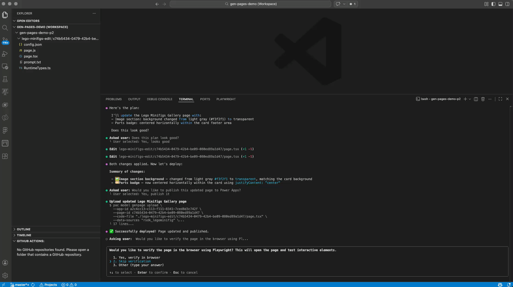

Copilot zal Playwright gebruiken om een browser te openen en de generative page weer te geven.

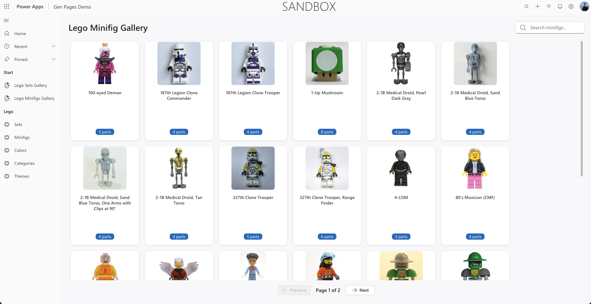

De gevraagde wijzigingen zijn nu doorgevoerd en Copilot zal nog een samenvatting geven van alle taken die het heeft uitgevoerd. 

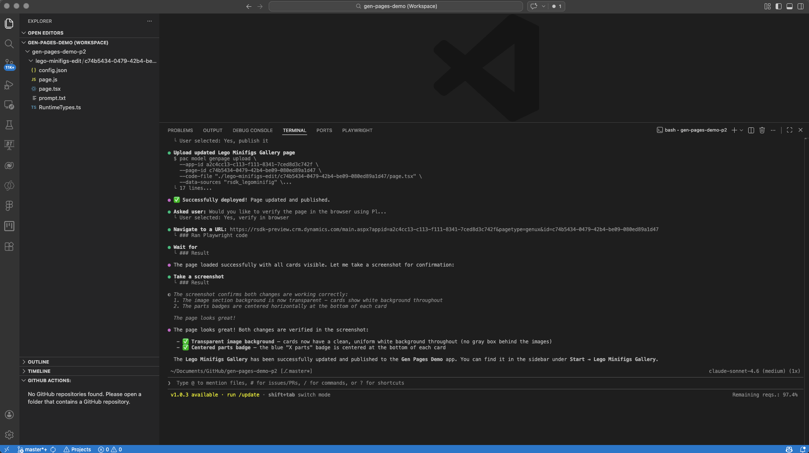


## Wrapping up


