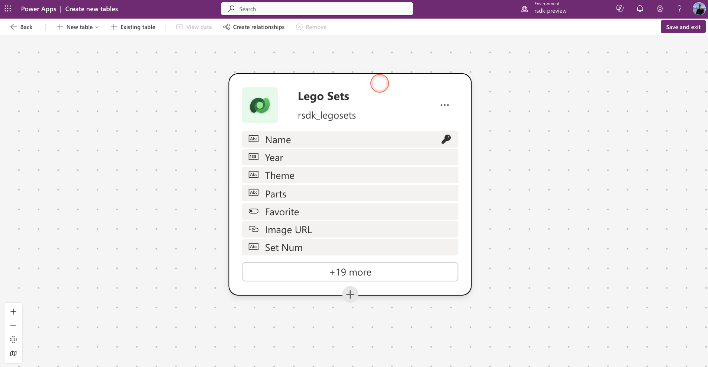
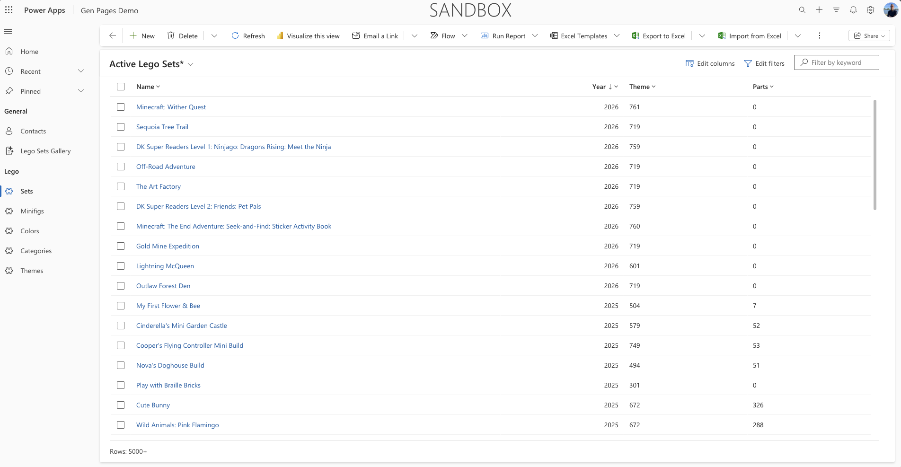
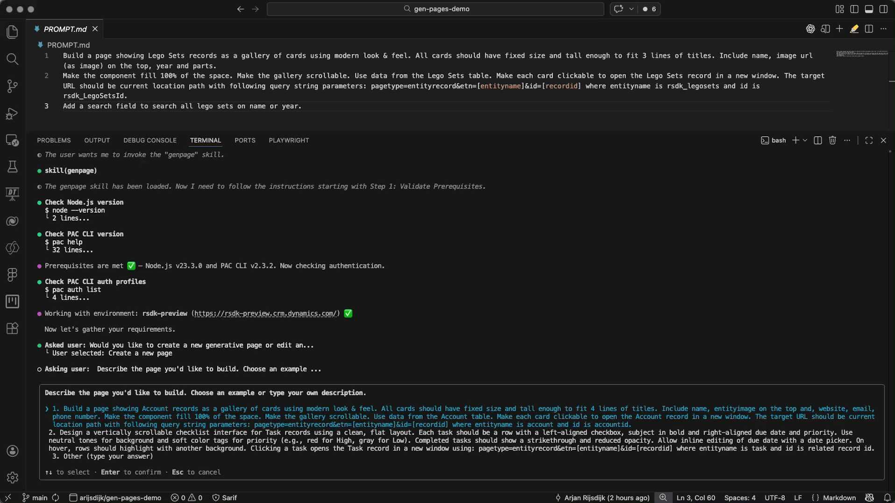
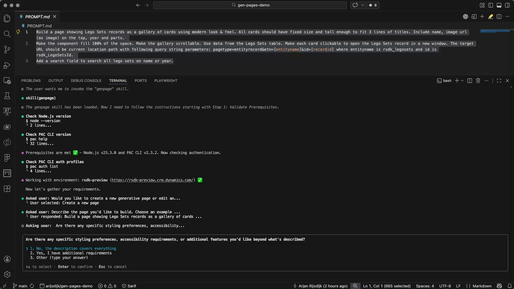
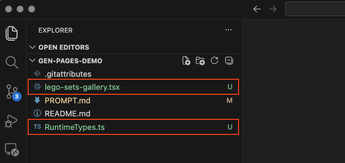
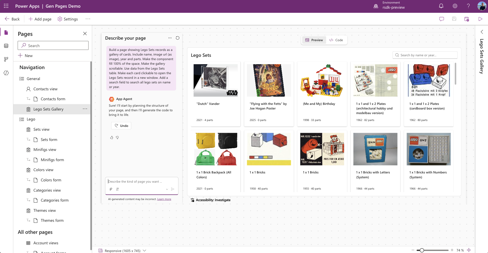
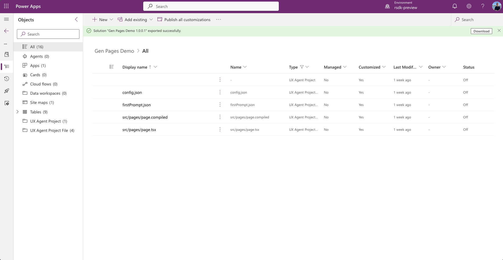

## Before we start

There was already an option to create generative pages directly within model-driven apps. I previously wrote an article about that: [My first look at generative pages](http://arjanrijsdijk.com/blogs/first-look-generative-pages/). Now we have the option to use AI coding tools to create these pages.

In this article, I’ll show you how to use GitHub Copilot CLI to create a generative page (or genux page, as Microsoft often calls it so now and then) for model-driven apps.

You can find the official Microsoft documentation here: [Create and edit generative pages with AI code generation tools](https://learn.microsoft.com/en-sg/power-apps/maker/model-driven-apps/generative-page-external-tools)

#### My goal

My goal is to use a table of LEGO sets (pretty much every LEGO set ever made :-)), I want to generate a page with cards (name, image and year). Given the number of records, I also want to include navigation (pagination), and it should be possible to search by keyword and/or year (release year).

Below you’ll find the table and app I've used to get started.





## Preparation

Before we can really start building a generative page with AI coding tools, we need to set up a few things first.

### Install Copilot CLI 

Before we can start using Copilot CLI, we first need to install it. You can find more information about the installation and available options here: [GitHub Copilot CLI - Install](https://github.com/features/copilot/cli/).

Open a terminal window in Visual Studio Code and run the following command

```
npm install -g @github/copilot
```


### Power Platform skills

Microsoft has made a number of awesome agent skills/plugins available for the Power Platform. In this example, we’ll use the model-apps plugin.

To install the Power Platform plugins (inclusing the model-apps variant), run the following command:

```
curl -fsSL https://raw.githubusercontent.com/microsoft/power-platform-skills/main/scripts/install.js | node
```

More information and available options for these plugins can be found here: [Power Platform Skills](https://github.com/microsoft/power-platform-skills/tree/main). 


### Select an environment

Before we can move on to the next step, we first need to select a Power Platform environment. By establishing this connection in advance, Copilot will be able to read and use the necessary information from your environment.

I personally like using the [Power Platform extensie](https://marketplace.visualstudio.com/items?itemName=microsoft-IsvExpTools.powerplatform-vscode) to keep an overview of my environments and solutions. You can also use the [PAC CLI](https://learn.microsoft.com/en-us/power-platform/developer/cli/reference/auth) to authenticate and select your environment(s).


### Model driven app

Of course, we also need an available model-driven app where we’ll upload the gen page later. So make sure you have created an app that you can use.

With the new (in preview) pac cli **model** commands, we now also have the option to retrieve a list of model-driven apps.

```
pac model list
```

For more information about the new (preview) pac model commands, see the following link: [pac cli model reference](https://learn.microsoft.com/en-us/power-platform/developer/cli/reference/model)


## Generate new page with Copilot CLI

Now that the preparation is done, we can start with the fun part: building a new generative page!


### Start GitHub Copilot CLI

Open your terminal and start Copilot using the following simple command.

```
copilot
```

We’re now going to start the genpage skill (this is part of the plugin we installed earlier). Go to your terminal and run the following command.

```
/model-apps:genpage
```


### Create a new page

Once the genpage skill has started, Copilot will perform a few checks (selected environment, versions, etc.). If these checks are completed successfully, Copilot will ask you a number of questions.

The first question is whether you want to create a new page, modify an existing one, or choose another option where you can specify what you want to do.

In this case, we’ll choose to create a new page.


### Describe your page

Copilot will now ask you to describe your page. You also have the option to choose from two predefined prompts.


In this example, I’m using my own description. See my prompt below.

```
Build a page showing Lego Sets records as a gallery of cards using modern look & feel. All cards should have fixed size and tall enough to fit 3 lines of titles. Include name, image url (as image) on the top, year and parts. 

Make the component fill 100% of the space. Make the gallery scrollable. Use data from the Lego Sets table. Make each card clickable to open the Lego Sets record in a new window. The target URL should be current location path with following query string parameters: pagetype=entityrecord&etn=[entityname]&id=[recordid] where entityname is rsdk_legosets and id is rsdk_LegoSetsId. 

Add a search field to search all lego sets on name or year.
```

In this example, I choose option ```3. Other (type your answer)``` and then copy and paste my prompt. In your terminal, it will look like this:



Copilot will now ask whether your description is complete or if you’d like to add any additional requirements. In this case, I choose option<br /> ```1. No, the description covers everything```. In your terminal, it will look like this:



What you’ll see now is that Copilot has created a plan based on my prompt. At this point, you still have the option to modify the plan or enter a different instruction. For now, I’m satisfied and choose option <br />```1. Looks good, proceed!```.


Copilot will now start building the page for you. During this process, Copilot may ask you to add certain folders and files to the **Allowed list**, so it can access them. For example, the **genpage-rules-reference.md** file in the plugin folder.


### What did we get?

After a little patience, GitHub Copilot CLI has created a new page for us. GitHub Copilot CLI will also generate and display a detailed summary. See below. 


Voordat we naar de volgende stap gaan en de pagina gaan publiceren in Power Apps gaan we eerst eens kijken naar wat GitHub Copilot CLI voor ons heeft gegenereerd. Als we nu kijken naar de file explorer dan zien we dat er twee bestanden zijn aangemaakt; 

* RuntimeTypes.ts
* lego-sets-gallery.tsx 



#### RuntimeTypes.ts

This script defines the structure of the Dataverse table (rsdk_legosets) in TypeScript, including all fields and choice columns such as name, year, and favorite. This allows an application to retrieve and use data from this table in a structured way via an API.

#### lego-sets-gallery.tsx

This script essentially represents the ‘front end’ of the page. It builds a React component that retrieves data from a Dataverse table and displays it as clickable cards in a gallery.


### Publish to Power Apps

Once the page has been created, Copilot will ask if you want to publish the page to Power Apps. Of course, we want to see the result, so we select the option ```1. Yes, publish to Power Apps```.

In the next step, Copilot will ask which model-driven app the page should be added to. Since we already selected an environment in an earlier step, Copilot will show you a list of available apps to choose from. In this example, we publish the page to the model-driven app named **Gen Pages Demo**.


After selecting a model-driven app, Copilot will publish the page to the chosen app.

Next, you’ll be asked to verify the page in the browser. Of course, we want to do that, so we select ```1. Yes, verify in browser```.

Copilot will use Playwright to launch the browser. We’ll need to allow the use of this tool first.


Once the browser opens with the newly created page, we can try it out and test it.


### Playwright

Personally, I’ve been a big fan of Playwright for quite some time when it comes to automated end-to-end testing in the Power Platform. But it’s really awesome to see that Playwright is now used by default within the Power Platform skills (plugin) to automatically test the result.

Within your GitHub Copilot CLI workflow, you’ll be asked after deploying your page whether you want Playwright to run a test right away. In this example, you can see Playwright performing a test by searching for the keyword ‘Star Wars’ across all LEGO sets.


If you want to learn more about Playwright, take a look at: [Playwright website](https://playwright.dev/)


## The end result

We’ve now created the page, deployed it to a model-driven app, and tested it. When we open the model-driven app in designer mode, we can see the new page in the navigation.




And what’s really cool about the new generative pages is that we can now make changes using Copilot through the in-app editor, or by directly modifying the code in this editor.


If we look at the solution, we can also see that new components have been added there. Generative pages are stored as so-called UX components within the solution.




## Wrapping up

I was already a big fan of GitHub Copilot, and it has become an essential part of my daily work, just like my terminal in VS Code. These days, we also can’t really avoid working with CLIs, whether it’s PAC CLI or tools like the Playwright CLI. 

With the arrival of GitHub Copilot CLI, I now have another option for how I want to generate apps, pages, or sites.

What really impressed me during my first experiences with gen pages using GitHub Copilot CLI is the Power Platform Skill repository, which also includes the plugin for gen pages (as used in this article). 

You don’t have to reinvent the wheel yourself—everything the AI needs in terms of knowledge and capabilities for specific scenarios (like generative pages in model-driven apps) is already available.

There’s a lot to explore and discover when it comes to GitHub Copilot CLI, Generative pages, and Power Platform skills. I’ll be publishing a second part of this article in the coming days!

