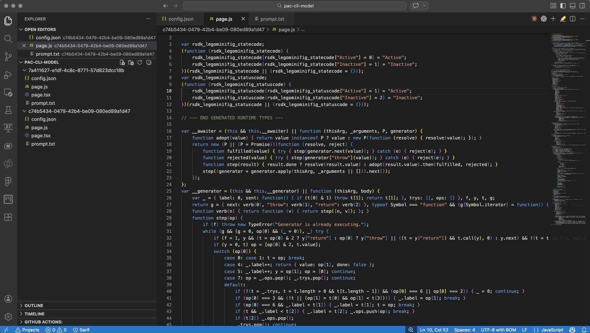

## ToDo 

- Transpile, what is it and how do we need to use it
- Short article, not o much other stuff
- Create basic slides for the LinkedIn post


De afgelopen periode heb ik kunnen experimenteren met GitHub Copilot CLI en de Popwer Platforms skills plugin. Een van de dingen die me opviel is een compleet nieuwe command group in PAC CLI met de naam ```model```. Let wel op, deze nieuwe PAC CLI commado's zijn nog in preview. 

Na wat onderzoek, vooral in de Power Platform skills repository, las ik dat de skill vooral gebruik maakt van deze commando's voor het lijsten van model-driven apps en genpages binnen model-driven apps of voor het downloaden en uploaden (deployen) van een genpage van of naar je lokale IDE. 

Tijd om daar verder in te duiken en een korte blogpost, want los van GitHub Copilot CLI zijn deze commando's natuurlijk ook zeer bruikbaar. 


## Before we start

Voor we kunnen starten moeten we eerst een environment authenticeren en selecteren. Er zijn meerdere manieren om dit te doen, bijvoorbeeld via de Power Platform extensie in Visual Studio code. Een uitgebreide omschrijving kun je [hier]() vinden. 


## Check selected environment

Om te controleren welke omgeving is geselecteerd kun je gebruik maken van het volgende commando.

```
pac env who
```

Zie hieronder de response

```
Connected as arjan@rsdk.dev
Connected to... rsdk-preview
Organization Information
  Org ID:                     f6055d9e-1972-f011-8589-0022480c2324
  Unique Name:                unqf6055d9e1972f01185890022480c2
  Friendly Name:              rsdk-preview
  Org URL:                    https://rsdk-preview.crm.dynamics.com/
  User Email:                 arjan@rsdk.dev
  User ID:                    3568f2f3-5f70-f011-b4cb-6045bd0342f1
  Environment ID:             61ed97ba-afaf-e47b-a156-bff555dc530f
```


## List all your model-driven apps

Om een lijst op te vragen van al je model-driven apps gebruik je het volgende commando.

```
pac model list
```

Response 

```
Retrieving model-driven apps...
Found 10 model-driven app(s):

  Gen Pages Demo
    App ID: a2c4cc13-c113-f111-8341-7ced8d3c742f
    Unique Name: rsdk_GenPagesDemo

  Generative pages
    App ID: ee042cb0-2d72-f011-b4cc-000d3a32c4b2
    Unique Name: rsdk_Generativepages
```


## List all genpages from a model-driven app

Om een lijst van alle generative pages in een model-driven app op te vragen gebruik je het volgende commando.

```
pac model genpage list --app-id [your-app-id]
```

De response ziet er als volgt uit

```
Connected as arjan@rsdk.dev
Retrieving generated pages from app...
Found 2 generated page(s):

  Lego Sets Gallery
    Page ID: 7a411627-e1df-4c8c-8771-57d823dcc18b
    Description: Created: 2026-03-04T13:38:48Z

  Lego Minifigs Gallery
    Page ID: c74b5434-0479-42b4-be09-080ed89a1d47
    Description: Created: 2026-03-10T19:16:55Z
```


## Genpage download

To download all genpages from a model-driven app

```
pac model genpage download --app-id [your-app-id]
```

Response 

```
No page ID specified. Listing all pages in app...
Found 2 page(s) to pull.
Pulling 2 page(s)...
Pulling page: 7a411627-e1df-4c8c-8771-57d823dcc18b ...
Pulling page: c74b5434-0479-42b4-be09-080ed89a1d47 ...
Successfully pulled 2 page(s).

```


### Download specific pages

To download a specific genpage

```
pac model genpage download 
  --app-id [your-app-id] 
  --page-id [your-page-id]
```

Response 

```
Pulling 1 page(s)...
Pulling page: 7a411627-e1df-4c8c-8771-57d823dcc18b, 
...
Successfully pulled 1 page(s).
```


### Result




## Genpage upload


