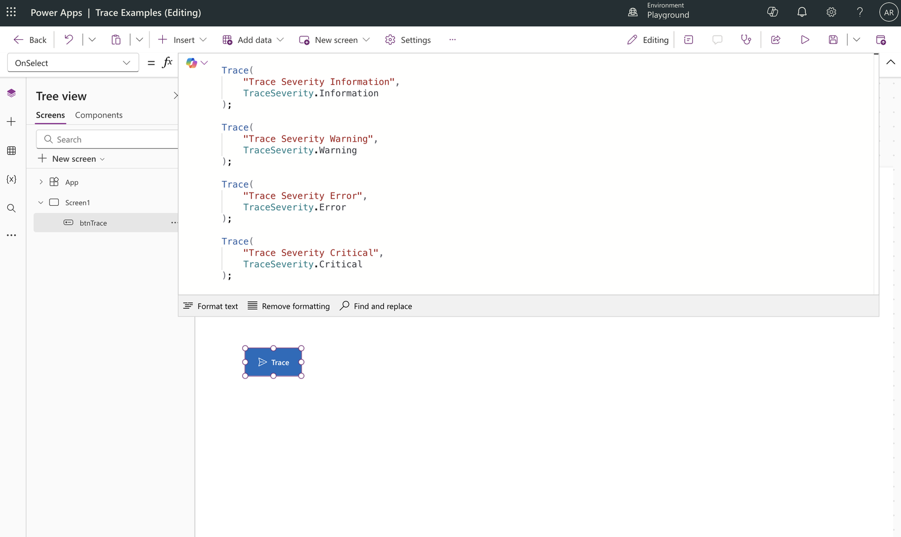
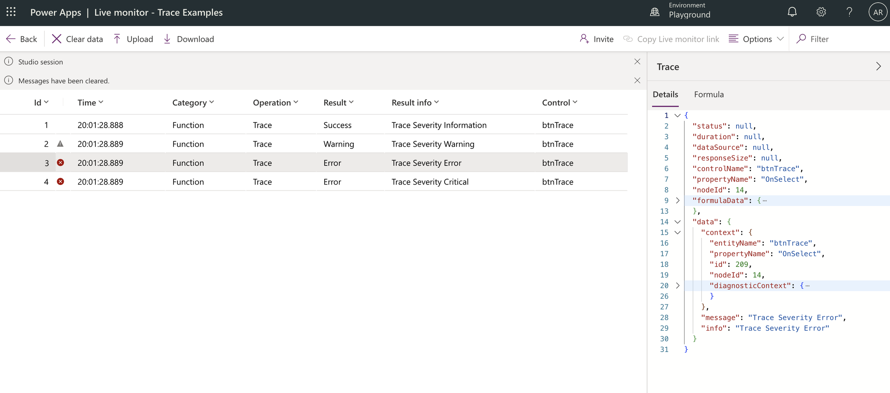
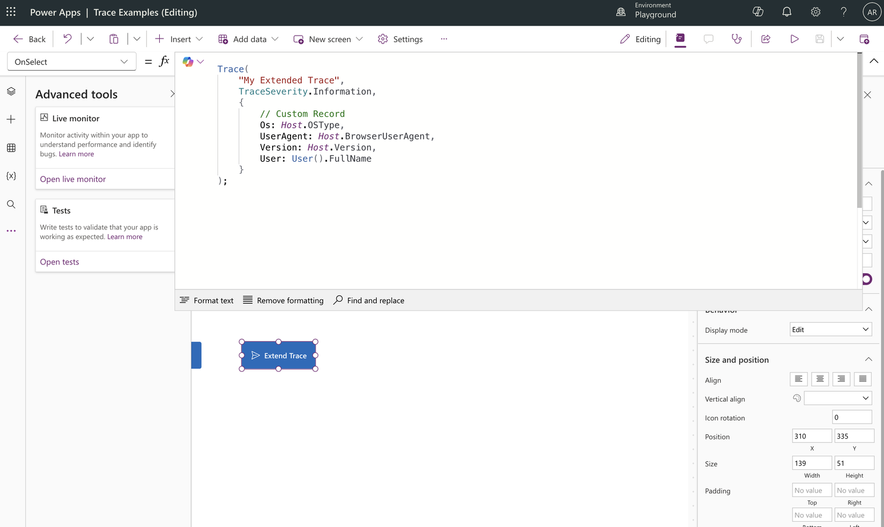
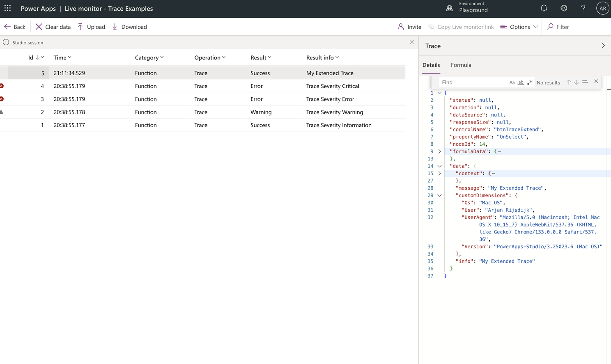
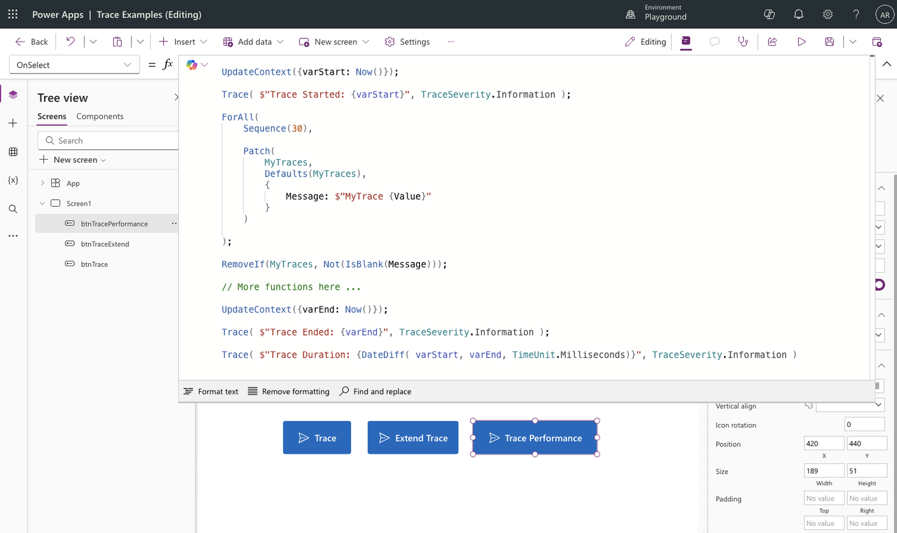
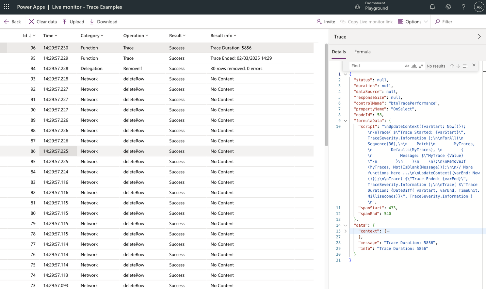

You can use the Trace function in Power Fx to capture diagnostic information while your app is running. This is very useful for debugging, analyze performance and collecting data about your app's behavior.

The data captured with the trace function is visible in Power Apps Live Monitor sessions and (if your app is connected) within Azure Application Insights.

Adding a trace to your app is super simple. Take a look at the example below

```
Trace( 
   "Trace Severity Information”
);
```

## Trace Severity
With the Trace function, you can do more than just add a message to your log. You can also include the severity of the trace to give it more context. 

There are 4 different severities you can use:

* Information
* Warning
* Error
* Critical

See the examples below.

```
Trace( 
   "Trace Severity Information",
   TraceSeverity.Information
);

Trace( 
   "Trace Severity Warning",
   TraceSeverity.Warning
);

Trace( 
   "Trace Severity Error",
   TraceSeverity.Error
);

Trace( 
   "Trace Severity Critical",
   TraceSeverity.Critical
);
```

In the example below, I added multiple traces to the OnSelect property of a button. After this, I started a Live Monitor session. From the start of the monitor session, all actions done in the app will be logged and visible in the monitor and as you can see below the traces are also visible.



To see the results of the button click, i opened up my Live Monitor session tab to check the results. 



## Extend your trace
Of course, you may want to log more information in your trace than just a text message and the severity. In this case, you can extend your trace with a custom record.

You can add any kind of information to this record you want. For example, information about the host, the user or the number of records saved in Dataverse during an action.

```
Trace(
   "My Extended Trace",  
   TraceSeverity.Information,
    {
      // Custom Record
      Os: Host.OSType,
      UserAgent: Host.BrowserUserAgent,
      Version: Host.Version,
      User: User().FullName
    }
);
``` 

In the example below, I added a trace with a custom record to the OnSelect property of a button. 



After this, I started a Live Monitor session to test my button. If you now open the trace details pane (right side) in the Live Monitor you will see the added data under custom dimensions.




## Use case: Check performance
During development, every now and then we run into a performance challenges or we want to be able to track the performance of a particular function (or multiple functions) in a test or production environment. You can use trace to log performance information.

In this example, I use a start and end time, with the code you want to track in between. Based on these times, I then calculate the run time of the code and add it to a trace.

```
UpdateContext( { varStart: Now() } );

Trace( $"Trace Started:{varStart}", TraceSeverity.Information );

// Start - Code to trace
  
      ForAll(
            Sequence(30),      
            Patch(        
                  MyTraces,         
                  Defaults( MyTraces ),     
                  {       
                  Message: $"MyTrace { Value }”       
                  }   
            )   
      );   

      RemoveIf( MyTraces, Not( IsBlank( Message ) ) );

// End – Code to trace

UpdateContext({varEnd: Now()});
Trace( $"Trace Ended: {varEnd}", TraceSeverity.Information );

Trace( 
      $"Trace Duration: { DateDiff( varStart, varEnd, TimeUnit.Milliseconds) }",
      TraceSeverity.Information 
);
```

See below the result of the performance trace. Clicking the button causes records to be added in Dataverse and then all these records to be cleaned up. 



All actions are logged with the last item in the log being the number of milliseconds it took the functions to complete.



## Conclusion
As mentioned, the trace function is ideally suited for capturing diagnostic information as you run your app. Especially useful for debugging, analyze performance and collecting log data about your app’s behavior.

Do think carefully about when to use trace, because basically all actions during the use of your app are already logged by default (just start a Live Monitor session, use your app and see the results in the monitor session). So choose the trace function if it really adds value to your analysis, other than the already existing logging!

### Power Apps Live Monitor 

To learn more about Live Monitor check out Microsoft's documentation. https://learn.microsoft.com/en-us/power-apps/maker/monitor-overview

### Application Insights 

You can also add your app to Application Insights, so you always have access to log data from your Power App (without starting a Live Monitor session). To do this check out Microsoft’s documentation. https://learn.microsoft.com/en-us/power-apps/maker/canvas-apps/application-insights
