## Introduction

AI is everywhere these days, and the Power Platform is of course no exception. With Copilot, AI Builder, generative pages, and more, you can keep adding smarter functionality to your apps. As a result, writing prompts has become part of everyday work.

But do you really need to write every prompt yourself? Have you already taken a look at the prebuilt AI prompts in the Power Platform?

In this article, I’ll show what these prebuilt prompts actually are and how you can use them in Canvas apps, Power Automate flows, and Dataverse functions.

## Preparation
Before you can use these prebuilt prompts in your canvas app, you first need to add the Environment data source (Dataverse) to your app. You can do this as follows.

1. Go to Data 
2. Choose Add Data 
3. Search Environment 
4. Select the environment table


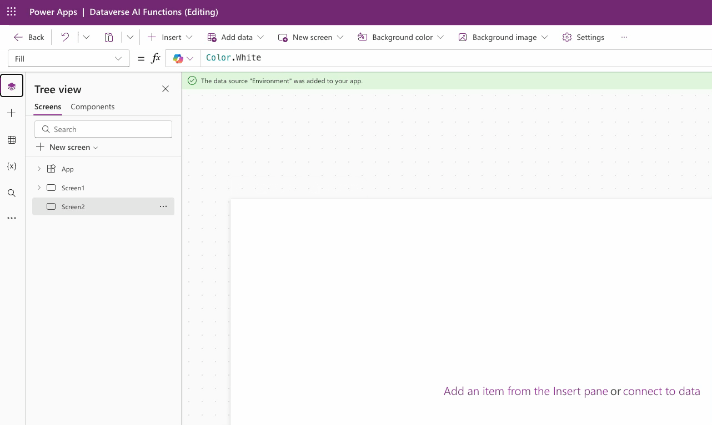

## Prebuilt AI prompts 
You can use the following prebuilt prompts directly in Canvas Apps or Power Automate flow: 

* Summarize 
* Translate
* Sentiment 
* Reply 
* Classify

The prebuilt AI prompts work like a function that you can call using Power Fx, where you also need to use the Environment namespace (similar to a data source added in an earlier step). See an example below.

```
Environment.AISentiment( 
    { Text: "I’m a happy consultant these days." } 
).AnalyzedSentiment
```

As the output of this function, you will for example receive positive


## Good to know
Before we move on to some examples, there’s one important thing to note. The prebuilt AI prompts that you can use as a function in your canvas app are behavior functions. This means they cannot be used directly within a non-behavior property.

So placing a prebuilt prompt directly inside a text label is not possible. A different behavior function is required to actually execute the prompt, such as App OnStart, OnVisible, or OnSelect. Of course, Set or ForAll can also be used to invoke the function.

For more information about these prebuilt AI prompts, see the Power fx reference or the Learn documentation.

## Power Apps
Let's take a look at how some of these prebuilt AI prompts work in practice and how you can use them in your Canvas app or custom page by simply adding a line of Power Fx code.

### AISummarize
One of the prebuilt prompts is AISummarize. As the name suggests, it creates a summary of the input you provide. The function can be easily called using the following code:

Environment.AISummarize( { Text: "Your input" } ).SummarizedText
In this example, I create a text input, then add a button, and place the following code in the OnSelect property of that button.

```
Set( 
    varSummarize, 
    Environment.AISummarize( 
        {
            Text:txtInput_AISummarize.Value
        } 
    ).SummarizedText 
);
```

I then place the result (the varSummarize variable) in a text label. In my Canvas app, this looks as follows.

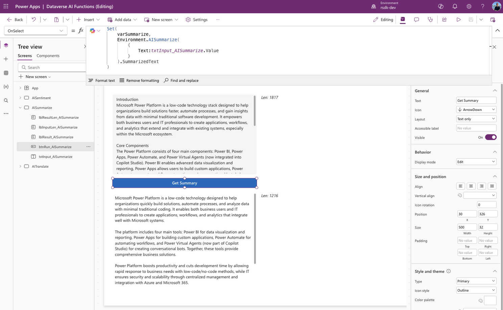

### AITranslate
Another example of a prebuilt AI prompt is AITranslate. Here, too, the name says it all 🙂. The function allows you to instantly translate your input text into any language. The function can easily be called using the following code.

```
Environment.AITranslate( 
    { 
        Text: "Your input", 
        TargetLanguage: "en" 
    } 
).TranslatedText
```

In this example, I create a text input. I then add three buttons for different translations and place the following code in the OnSelect property of the buttons.

```
Set( 
    varTranslate, 
    Environment.AITranslate( 
        {
            Text:txtInput_AITranslate.Value, 
            TargetLanguage: "de"
        } 
    ).TranslatedText 
);
```

Unlike the previous examples, an extra input parameter is required here, as you also need to specify the language into which you want to translate your text. You do this by providing the language code as the second input parameter (TargetLanguage).

I then place the result (the varTranslate variable) in a text label. In my Canvas app, this looks as follows. For each button, I can translate my input text into a specifically configured language.

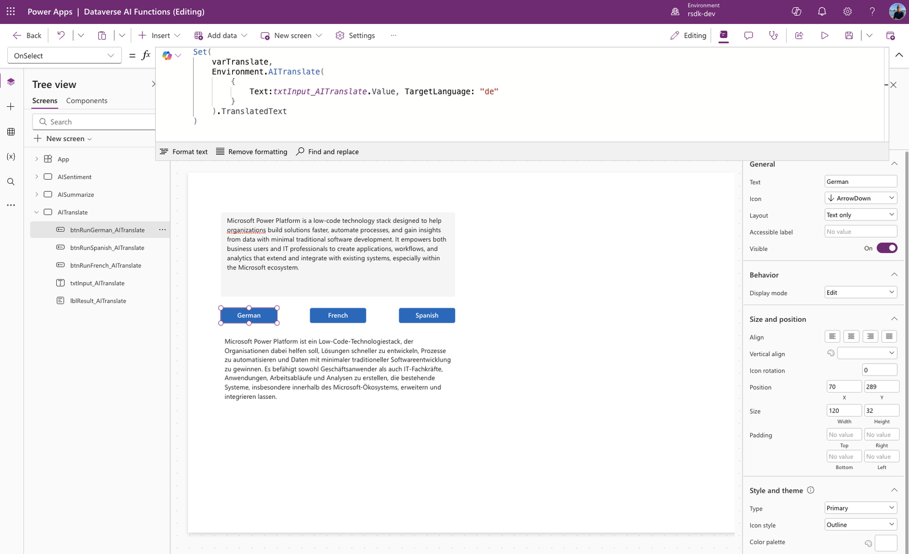

Or, for example, the translation into French.

```
Set( 
    varTranslate, 
    Environment.AITranslate( 
        {
            Text:txtInput_AITranslate.Value, 
            TargetLanguage: "fr"
        } 
    ).TranslatedText 
);
```

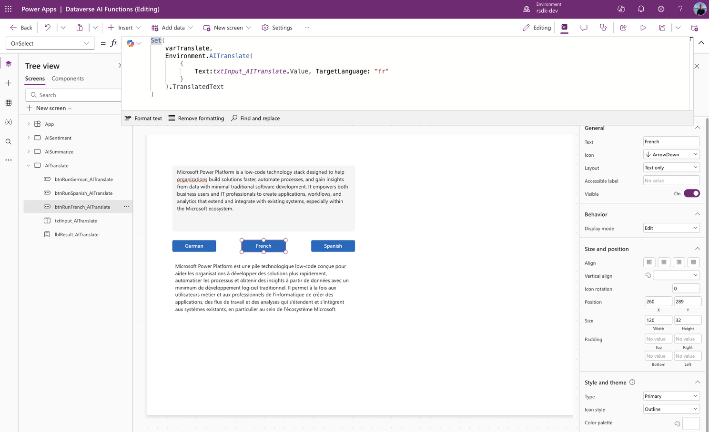


### AISentiment
A prebuilt prompt is also available for determining sentiment. Based on your input text, this prompt will analyze and determine the sentiment of that text. The result will be one of the following:

* Positive
* Neutral
* Negative

The function can be easily invoked using the following code.

```
Environment.AISentiment( { Text: "Your input" } ).AnalyzedSentiment
In this example, I create a text input.
```

Next, I add a button, and in the OnSelect property of the button I place the following code.

```
Set( 
    varSentiment, 
    Environment.AISentiment( 
        { 
            Text: txtInput_AISentiment.Value 
        } 
    ).AnalyzedSentiment
);
```

I then place the result (the variable) in a text label. In my canvas app, this looks like the following.

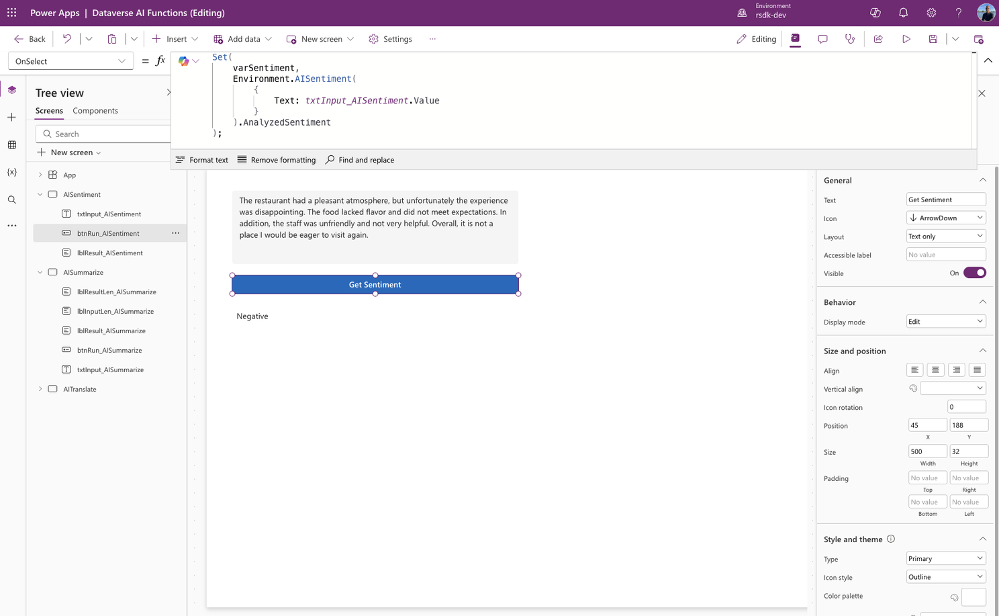


### AIReply
If you want a reply to be generated based on a given text, you can use AIReply.

Environment.AIReply( { Text: "Your input" } ).PreparedResponse 
In this example, we have an input text field. When we click Get Reply, we execute the following code.

```
Set( 
    varReply, 
    Environment.AIReply( 
        { 
            Text: txtInput_AIReply.Value 
        } 
    ).PreparedResponse
); 
```

I then place the result (the variable) in a text label. In my canvas app, this looks like the following.


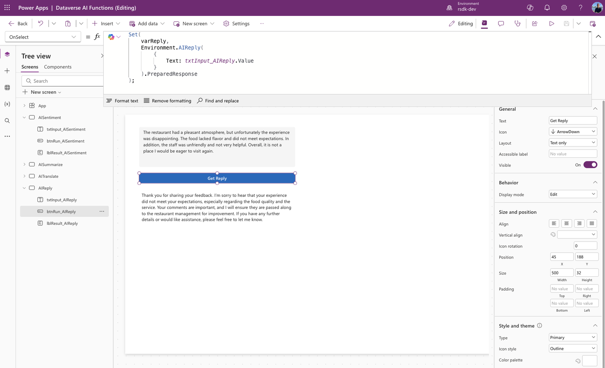


### AIClassify
If you want to categorize a piece of text, you can use the prebuilt prompt AIClassify.

Environment.AIClassify( { Text: "Your input", Categories: ["Category 1", "Category 2"]} ).Classification 
In this example, we have an input text field. When we click Get Classification, we execute the following code.

```
Set( 
    varClassify, 
    Environment.AIClassify( 
        { 
            Text: txtInput_AIClassify.Value, Categories: ["Power Platform", "Mendix", "UIPath"]
        } 
    ).Classification
); 
```

I then place the result (the variable) in a text label. In my canvas app, this looks like the following.

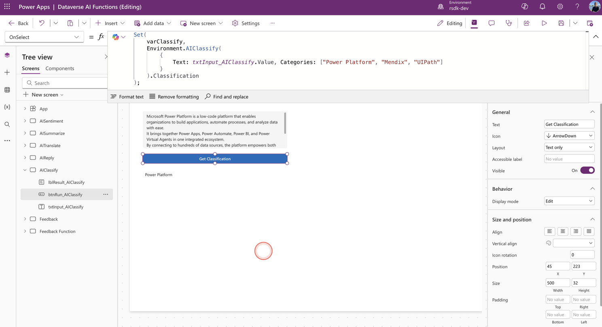

Or an example using a different text ...

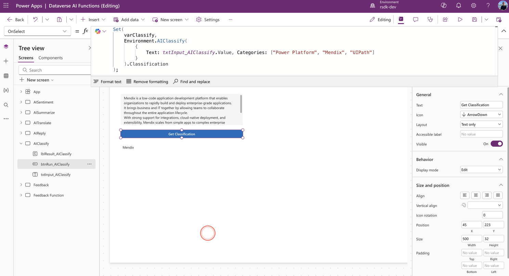


## Power Automate
The prebuilt AI prompts described above are also directly available in Power Automate. This means we can very easily add the same functionality to our flows as well.

Let’s take a look at an example. In this example, I want to determine the sentiment of the provided feedback and store it in a Dataverse entity.

As a first step, I created a table with two fields:

* Text – this is where we store the feedback
* Sentiment – this is where we store the sentiment of the feedback (text)

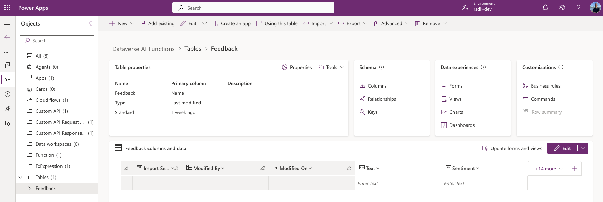

We create a new cloud flow. We choose the Dataverse trigger When a row is added, modified or deleted.

Next, we select the AI Builder action Run a prompt.

We then search for and select the AISentiment prompt from the list of prompts.

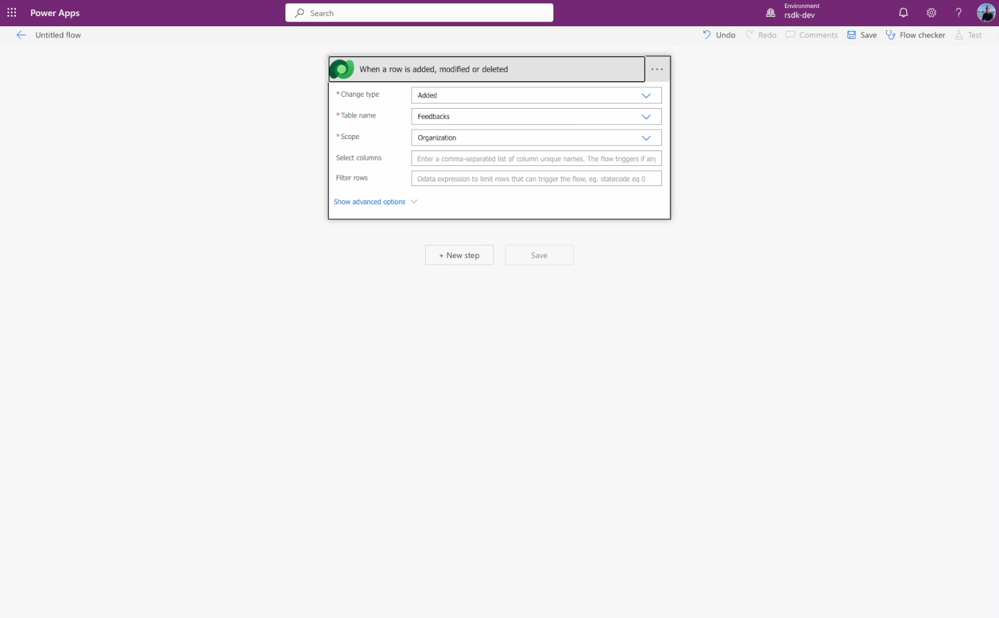

When we now run a test, we see that the flow determines the sentiment based on the value in the Text column.

The AI Builder action Run a prompt has an output value named Text, which we can use later in our flow.

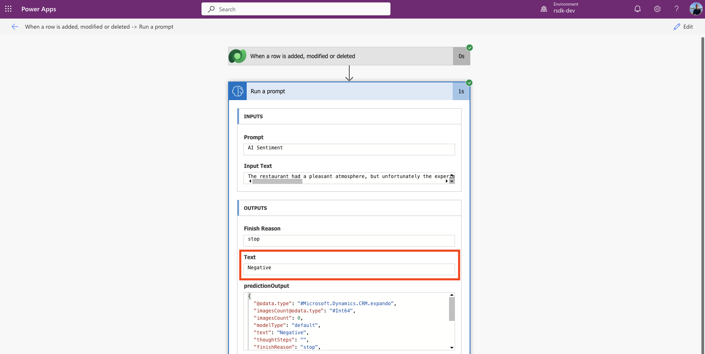

In this example, I then use the Dataverse action Update a row, so that I can store the retrieved sentiment in the record as well. See an example below.

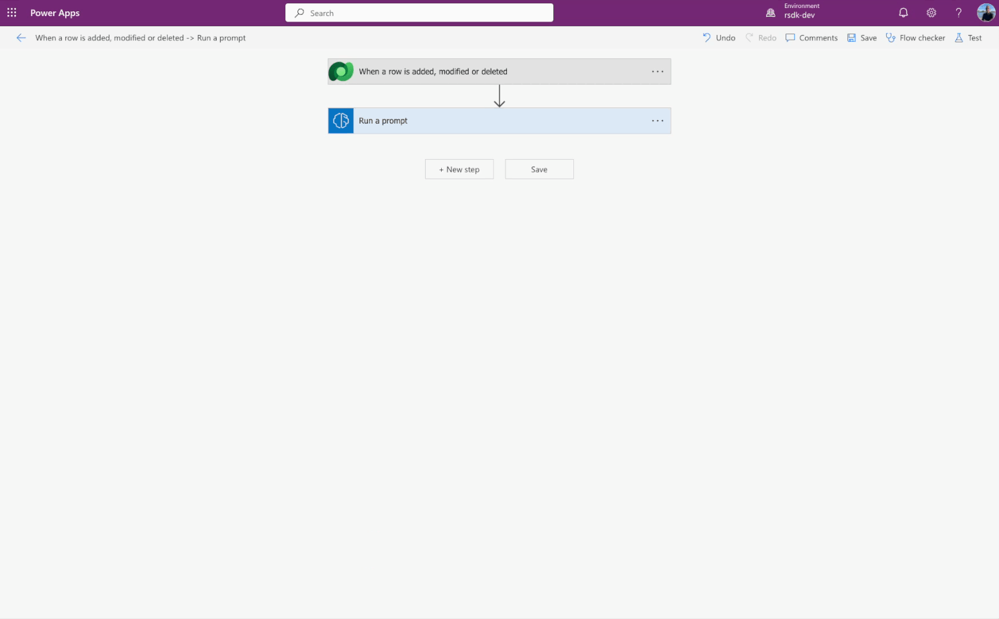

To complete the example, I created a simple form in my Canvas app to add feedback to my feedback table.

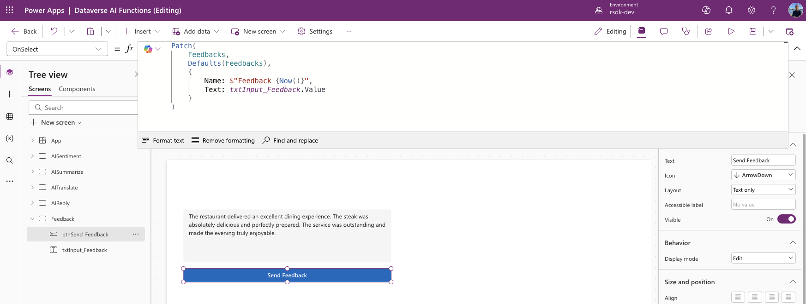

Below you can see the result in the Feedback Dataverse table.

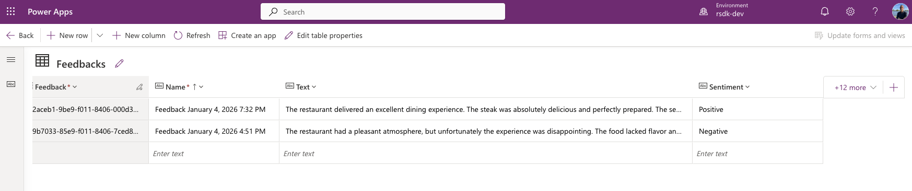


## Dataverse Functions
In addition to using them in your canvas app, custom pages, or Power Automate flows, the prebuilt prompts are also directly available in Dataverse functions.

With Dataverse functions, you can centralize specific actions, such as calculations or data logic. These functions live at the environment level and can therefore be (re)used across multiple solutions.

Please note: Dataverse Functions are still in preview. More information about Dataverse Functions can be found here.

In this example, I will create a function that handles adding the feedback to Dataverse. In this case, we store the feedback and immediately translate it into German by using the prebuilt AI prompt AITranslate.

First, we need to extend the Feedback table with a new column called GermanTranslation (Multiple lines of text). The table structure now looks as follows (based on the earlier Power Automate example):

Text – this is where we store the feedback
Sentiment – this is where we store the sentiment of the feedback (text)
GermanTranslation – this is where we store the German translation of the feedback

### Create a Dataverse function
Go to your Solution

Select New, Automation, and then choose Function.

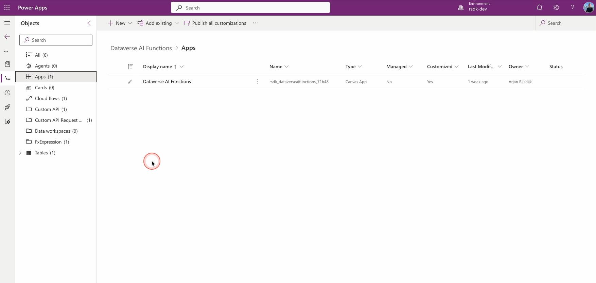


Now give the function a **Name** and a **Description** (In this example, we name the function Save Feedback)

Click **New input parameter**

Name the input parameter **InputText** and select the data type **String**

Under **Table References**, select the table on which you want to create the function (in this case the Feedbacks table)

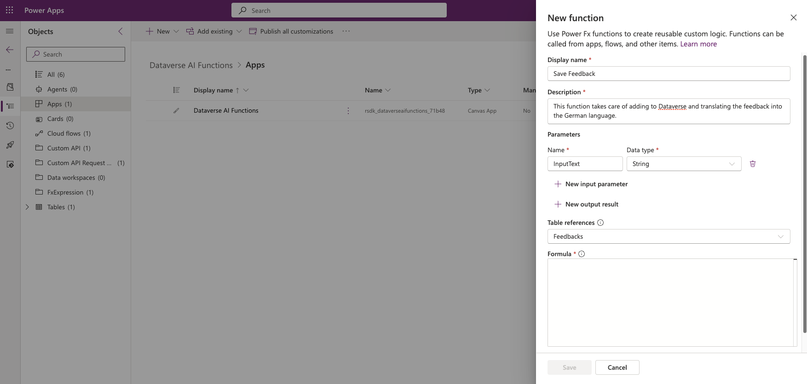

In the Formula field, we now need to add the Power FX code to write the data to Dataverse, as well as to include the prebuilt prompt so that the text is translated into German.

We now add the following code to the Formula field:

```
Collect( 
    Feedbacks, 
    { 
        Name: $"Feedback {Now()}",
        Text: InputText,
        Germantranslation: AITranslate(InputText,"de")
    }
);
```

Note: The syntax in a Dataverse function is slightly different from the examples shown earlier. For example, in this case we do not need to use the Environment namespace. This is because the Dataverse function resides in the same namespace (more on this later).

In addition, within a Dataverse function we can directly pass input parameters (Text and TargetLanguage) without having to prefix them with the input parameter names.

So instead of …

```
Environment.AITranslate( 
    { 
        Text: "Your input", 
        TargetLanguage: "en" 
    } 
).TranslatedText
```

We now use …

```
AITranslate(InputText,"de")
```

The complete function now looks as follows

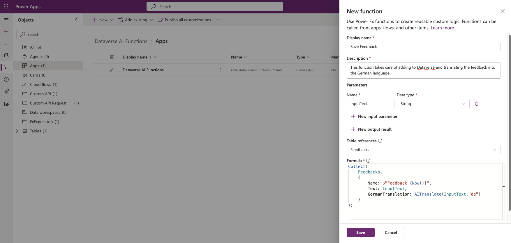


### Use the function
After saving the function, it can be used in our Canvas app.

In my Canvas app, I created a simple form with a text field (for the feedback) and a button.

Now we need to make sure that when we click the button, the Dataverse function is called. In the OnSelect property of the button, I add the following code:

```
Environment.rsdk_SaveFeedback( { InputText:txtInput_FeedbackFunction.Value } )
```

This looks as follows

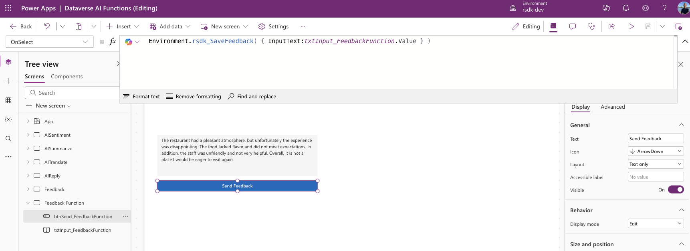

As you can see, when calling Dataverse Functions you also need to use the Environment namespace (just like we do for the prebuilt prompts).

Also note that when calling the function, we must use the Schema name. This name automatically receives the prefix of the publisher of your solution, as we often see in the Power Platform.

If you are unsure which name the function has received, go to your function, click or select Edit, scroll down, and click Advanced options. There you can find the Schema name.

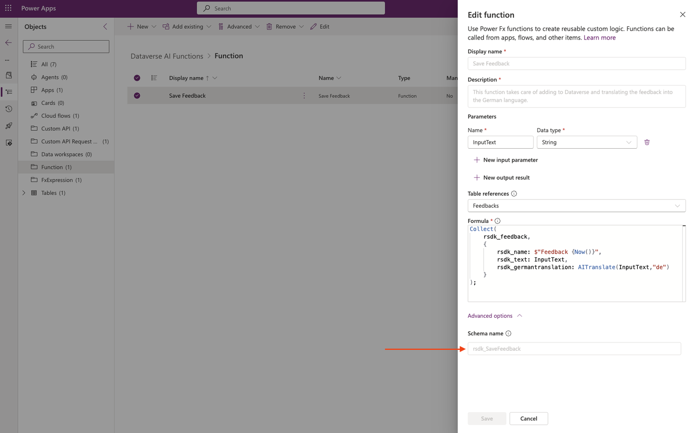

Clicking the Send Feedback button adds the feedback to Dataverse and also translates the feedback into German using the prebuilt prompt.

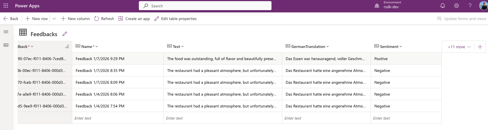

## AI Builder
As you may have noticed in the examples above, AI Builder is the key component. It is also the place where these prebuilt prompts are ultimately defined.

What I find both impressive and fascinating is how easy these prebuilt prompts are to use, while also being available across the different tools within the Power Platform.

Combined with the fact that I’ve noticed that not many people are aware of these prebuilt prompts, it felt like the right time for a new blog!

I hope you found this blog both informative and enjoyable. If you have any questions or feedback, please don’t hesitate to let me know!

Thank you for reading!