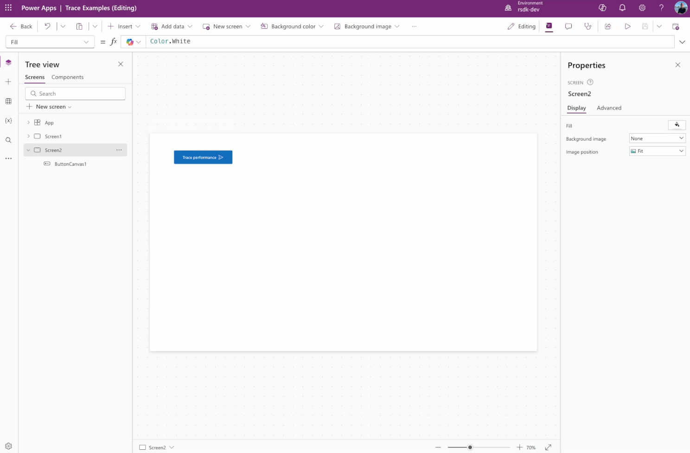
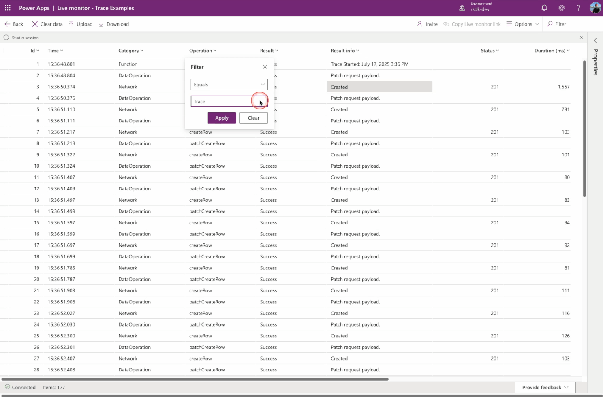
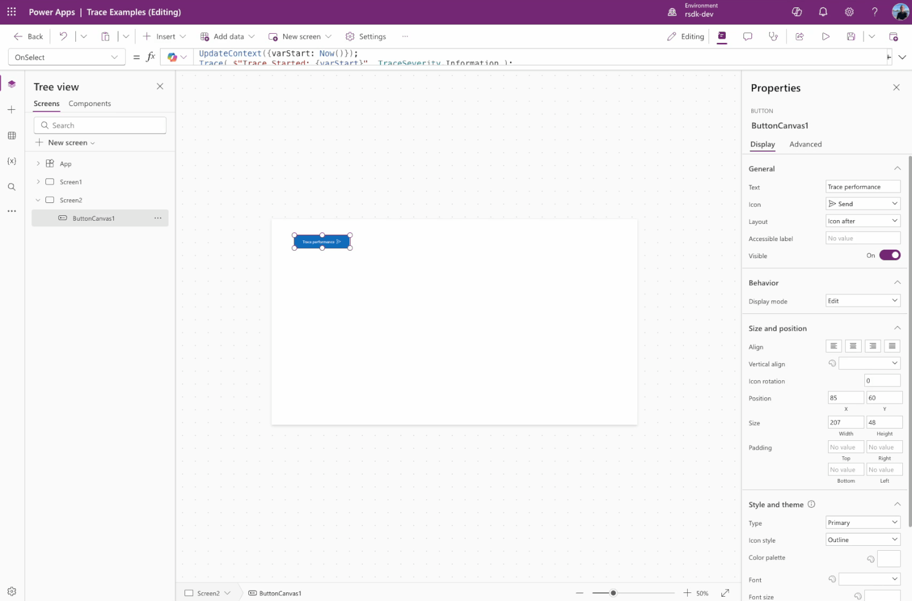

## The Idea
The idea is to use a ForAll function to add 30 records to a Dataverse table in a single operation. I want to measure the performance of this action and determine how many milliseconds it takes to complete. The goal is to demonstrate that using ForAll correctly can lead to significant performance improvements.

## The Code
To add the 30 records to Dataverse in one go, I use a ForAll loop. With the Sequence function, I create a loop of 30 items, and then use the Patch function to actually store the data in Dataverse. See the example below.

```
ForAll(
    Sequence(30),

    Patch(
        MyTraces, 
        Defaults(MyTraces), 
        { 
            Message: $"MyTrace {Value}"
        }
    )  
);
```

To measure the performance of these actions, I use the Trace function. This trace information can later be retrieved and analyzed using Live Monitor (or via Application Insights if it is configured).

```
UpdateContext({varStart: Now()});
Trace( $"Trace Started: {varStart}", TraceSeverity.Information );

ForAll(
    Sequence(30),

    Patch(
        MyTraces,  
        { 
            Message: $"MyTrace {Value}"
        }
    )
    
);

UpdateContext({varEnd: Now()});
Trace( $"Trace Ended: {varEnd}", TraceSeverity.Information );
Trace( $"Trace Duration in milliseconds: {DateDiff( varStart, varEnd, TimeUnit.Milliseconds)}", TraceSeverity.Information );
```

We want to measure the number of milliseconds it takes to execute the actions.

First, we start by creating a variable, varStart, which stores the starting timestamp of the action. We use the Now() function to capture the current time and log this value using the Trace function.

Next, we create the Patch and create another variable, varEnd, which stores the timestamp at the moment the action has fully completed—again using the Now() function.

Finally, we want to calculate the number of milliseconds between varStart and varEnd to determine how long the actions took to complete. For this, we use the DateDiff function.

```
DateDiff( varStart, varEnd, TimeUnit.Milliseconds)
```

We place the code in the OnSelect property of a button to trigger the actions when the button is clicked.



Or you can copy the YAML code below and paste it into your Power App.

```
- ButtonCanvas1:
    Control: Button@0.0.45
    Properties:
      Height: =48
      Icon: ="Send"
      Layout: ='ButtonCanvas.Layout'.IconAfter
      OnSelect: "=UpdateContext({varStart: Now()});\nTrace( $\"Trace Started: {varStart}\", TraceSeverity.Information );\n\nForAll(\n    Sequence(30),\n\n    Patch(\n        MyTraces, \n        Defaults(MyTraces), \n        { \n            Message: $\"MyTrace {Value}\"\n        }\n    )\n    \n);\n\nUpdateContext({varEnd: Now()});\nTrace( $\"Trace Ended: {varEnd}\", TraceSeverity.Information );\nTrace( $\"Trace Duration in milliseconds: {DateDiff( varStart, varEnd, TimeUnit.Milliseconds)}\", TraceSeverity.Information );"
      Text: ="Trace performance"
      Width: =207
      X: =85
      Y: =60 
```

## Run the code
Once we’ve executed the steps above, we can view the results. But before doing that, I want to track all actions in Live Monitor, so we need to start that first. 

In your Power App, go to Advanced Tools and click on Open live monitor. Live Monitor will now open in a new tab.


As you can see, no data is available in Live Monitor yet.

Now go back to Power Apps Studio and test the actions you just created by clicking the button. Once you’ve done that, immediately switch to the tab where Live Monitor is open.


What you’ll see is that Live Monitor has tracked all actions and created one or more records for each action. The individual Trace entries we added are also visible here.

Now filter the Operation column by Equals → Trace to isolate the trace entries.



In Live Monitor, we can now see that the actions inside the ForAll loop took a total of 5602 milliseconds to complete.

## Back to the ForAll
Let’s briefly return to the code, because what we are currently doing is placing a Patch inside the ForAll loop. In practice, this causes a new connection to Dataverse to be made for each record, which can slow down …

It is very important to carefully consider how you use the ForAll function. In the example above, for instance, we can reverse the order of the ForAll and Patch functions. See the code below.

```
Patch(
    MyTraces, 
    
    ForAll(
        Sequence(30),
            { 
                Message: $"MyTrace {Value}"
            }
    )
);
```

Replace the previously created code in the OnSelect property with the code shown above.



You can also easily create a second button by copying and pasting the YAML code below into your Power App.

```
- ButtonCanvas1:
    Control: Button@0.0.45
    Properties:
      Height: =48
      Icon: ="Send"
      Layout: ='ButtonCanvas.Layout'.IconAfter
      OnSelect: "=UpdateContext({varStart: Now()});\nTrace( $\"Trace Started: {varStart}\", TraceSeverity.Information );\n\nPatch(\n    MyTraces, \n    \n    ForAll(\n        Sequence(30),\n            { \n                Message: $\"MyTrace {Value}\"\n            }\n    )\n);\n\nUpdateContext({varEnd: Now()});\nTrace( $\"Trace Ended: {varEnd}\", TraceSeverity.Information );\nTrace( $\"Trace Duration in milliseconds: {DateDiff( varStart, varEnd, TimeUnit.Milliseconds)}\", TraceSeverity.Information );"
      Text: ="Trace performance"
      Width: =207
      X: =85
      Y: =60
```

In Live Monitor, we can now see that the actions inside the ForAll loop took a total of 826 milliseconds to complete — significantly faster than the first example 💪

## Is this really faster?
Let’s put it to the test.

Go to your Live Monitor session and click Clear data to start with a clean log.

Then return to your Power App and run the updated action by clicking the button.

Switch back to your Live Monitor session.

Once again, filter the Operation column by Equals → Trace to view the generated trace entries.


In Live Monitor, we can now see that the actions inside the ForAll loop took a total of 826 milliseconds to complete — much faster than the first example 💪

## Conclusion
The key takeaway is clear: always carefully consider how you use the ForAll function. As you’ve seen, it can have a significant impact on the performance of your app.

And while this blog focused primarily on using ForAll in combination with the Patch function, there are of course many other function combinations that could positively influence your app’s performance in a similar way.

## Useful Links

My previous blog about the Trace function [here](https://www.linkedin.com/pulse/powerfx-trace-function-arjan-rijsdijk-i8xxf/?trackingId=vf9sNiRAiQS3HevQRAwHqw%3D%3D)

More information about the ForAll function [here](https://learn.microsoft.com/en-us/power-platform/power-fx/reference/function-forall)

Connect your Canvas apps to Application Insights [here](https://learn.microsoft.com/en-us/power-apps/maker/canvas-apps/application-insights)