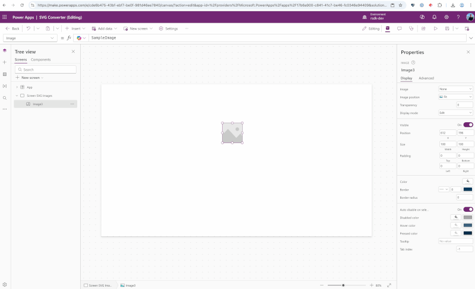

Do you also work with SVG images in Power Apps a lot and, like me, always end up wrestling with the right code? Copy-pasting, replacing double quotes for single quotes, or letting AI just do its thing? Even though it’s not rocket science, you still find yourself hunting for it every time—and a typo is so easily (and in my case: regularly) made 😬 

There’s help nearby now 🚀 Just download the Power Apps SVG Converter browser extension for **Google Chrome** [here](https://chromewebstore.google.com/detail/powerapps-svg-converter/fmkgolickeionocdcelijkjdlnmgnedo) or **Microsoft Edge** [here](https://microsoftedge.microsoft.com/addons/detail/powerapps-svg-converter/fmdmgkfamagbcmfpjbomiccijpbcmfnj)

How to use the extension:

1️⃣ Upload an SVG file or paste SVG code

2️⃣ Check the preview

3️⃣ Copy the Power FX code or a full YAML snippet

4️⃣ Paste the result into your Canvas app

More information, questions or feedback, visit the [Github repository](https://github.com/arijsdijk/powerapps-svg-converter-extension)