In this article, I will show you how to build toast notifications for Canvas apps. In this example, I use a component so that the functionalities are reusable on different screens within your app.

See an example below of an app that uses toast notifications.

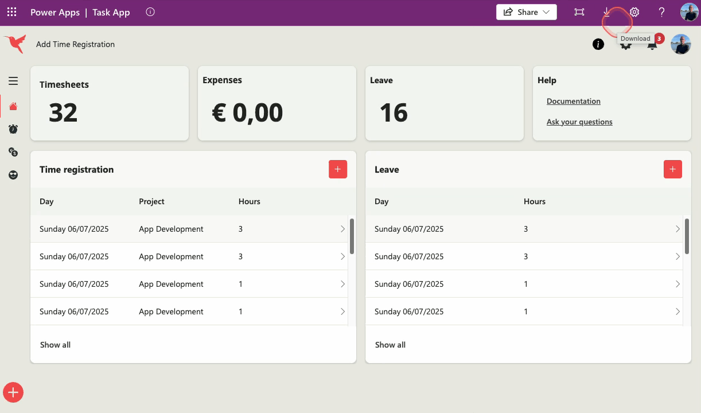

## Build the component
Before we start creating the actual notifications, we first need a color theme. We distinguish 4 different types of notifications (severities), each with its own colors:

* Success
* Danger
* Warning
* Info

There are different ways to obtain a color scheme, but since I'm a fan of Bootstrap, I use the color codes that you can easily get from there - after all, they've already put thought into it 🙏. See the website https://getbootstrap.com/docs/5.3/customize/color/ or the example below.

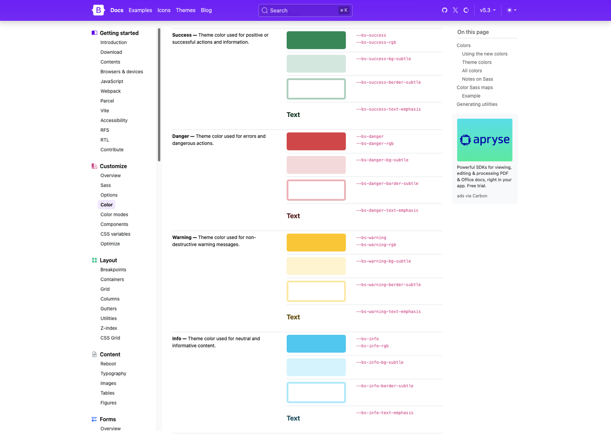


## Create a color scheme
Of course, I've already done the necessary preparations and created a color scheme based on the established Bootstrap colors.

I always choose to place the styling of my apps in a Formula (named formula), but there are certainly other methods such as a collection at the App OnStart level or defining a variable with all your styling.

Go to your Canvas app and select App, then the Formulas property and paste the code below.

```
nfColors = {

    success: { 
        Primary: ColorValue("#198854"),
        Fill: ColorValue("#d1e8de"), 
        BorderColor: ColorValue("#a3cfbb"),
        Text: ColorValue("#0a3622")
        
    },

    danger: { 
        Primary: ColorValue("#dc3646"),
        Fill: ColorValue("#f8d8da"), 
        BorderColor: ColorValue("#f2aeb6"),
        Text: ColorValue("#0a3622")
    }, 

    warning: { 
        Primary: ColorValue("#ffc205"),
        Fill: ColorValue("#fff3cd"), 
        BorderColor: ColorValue("#ffe69c"),
        Text: ColorValue("#664d03")
        
    },  

    info: { 
        Primary: ColorValue("#0ecaf1"),
        Fill: ColorValue("#d0f4fd"), 
        BorderColor: ColorValue("#9eebf9"),
        Text: ColorValue("#055160")
        
    }   

};
```

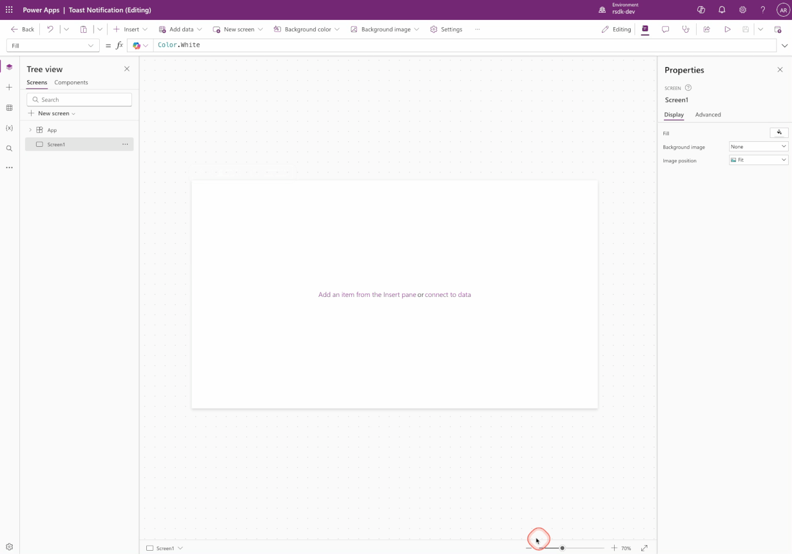


## Create a component
The notifications need to be available on all screens. To avoid having to copy all elements later, we choose to create a reusable component for his app. This way, we can add the same functionality to all screens in no time.

Go to the Tree view of your app and click Components

Choose New component

Name the component Notifications

Set the width and height to 400 x 700

Enable the Access app scope option

Access App Scope - This setting ensures that variables, collections, and formulas from your Canvas app are directly available in the component. This way, we can directly use the Formula with colors in the component or the data for the notifications from a collection.

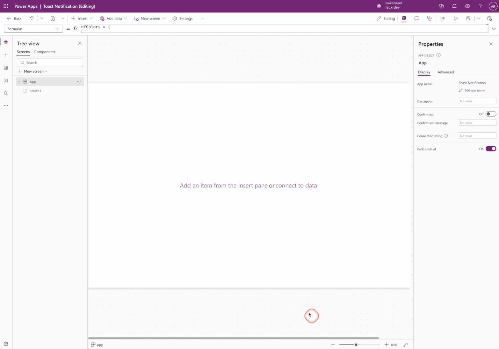

## The data
Of course, we also need data for the Notifications. To see an intermediate result soon, we'll create some data now by creating a collection. We are going to create a collection with the following fields;

* ID: The unique ID for the notification, we use the Guid() within Power Apps for this.
* Title: The title to display in the notification.
* Text: The text to display in the notification.
* Severity: The severity of the notification (success, danger, warning or info) and determines the color of the notification.
* isVisible: New notifications get the value true, so they are visible in the component. After closing a notification, this will be set to false.

Go to App, then select the OnStart property and copy the code below.

```
Collect( 
    colNotifications, 
    { 
        ID: GUID(),
        Title: "Success notification", 
        Text: "This is a notification of type Success",
        Severity: "success", 
        isVisible: true 
    },
    { 
        ID: GUID(),
        Title: "Danger notification", 
        Text: "This is a notification of type Danger",
        Severity: "danger", 
        isVisible: true 
    },
    { 
        ID: GUID(),
        Title: "Warning notification", 
        Text: "This is a notification of type Warning",
        Severity: "warning", 
        isVisible: true 
    },
    { 
        ID: GUID(),
        Title: "Info notification", 
        Text: "This is a notification of type Info",
        Severity: "info", 
        isVisible: true 
    }
)
``` 

Don't forget to run OnStart once, so that the collection will actually be created.

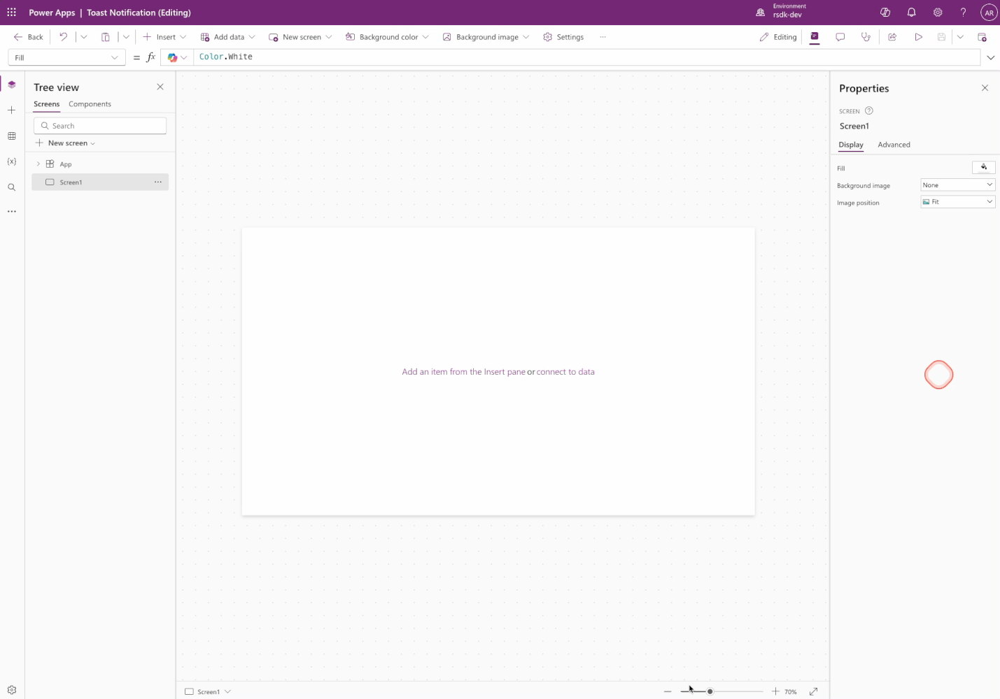


## Create notifications
We have now done the necessary preparations, time to build the notifications 🚀

Because we want to be able to display multiple notifications simultaneously, we use a vertical gallery that we place in the component. In the Items property of the gallery, we use the previously created collection colNotifications to get the data.

Next, we need several controls to make a notification into one nice looking message. We need to add the following controls:

* Container
* Rectangle
* Icon (Preview modern control)
* Text
* Button (Transparent and icon only)

Eventually, the Notification component should look like this.

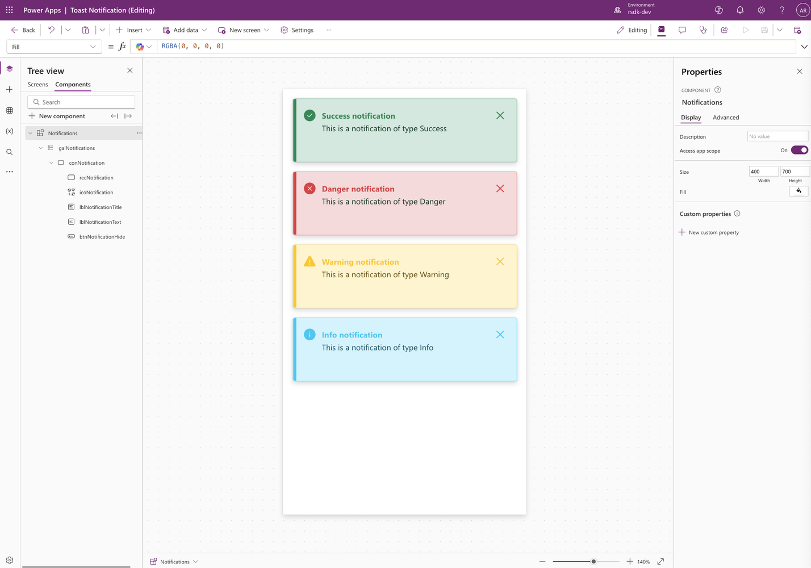

To achieve this, copy the YAML code below and paste it into the Notifications component.

```
- galNotifications:
    Control: Gallery@2.15.0
    Variant: Vertical
    Properties:
      Height: =Parent.Height
      Items: =colNotifications
      TemplatePadding: =16
      TemplateSize: |
        =104
      Width: =Parent.Width
    Children:
      - conNotification:
          Control: GroupContainer@1.3.0
          Variant: ManualLayout
          Properties:
            BorderColor: |-
              =Switch( 
                  ThisItem.Severity, 

                  "success",
                  nfColors.success.BorderColor,

                  "danger",
                  nfColors.danger.BorderColor,

                  "warning",
                  nfColors.warning.BorderColor,

                  nfColors.info.BorderColor
              )
            BorderThickness: =1
            DropShadow: =DropShadow.Regular
            Fill: |-
              =Switch( 
                  ThisItem.Severity, 

                  "success",
                  nfColors.success.Fill,

                  "danger",
                  nfColors.danger.Fill,

                  "warning",
                  nfColors.warning.Fill,

                  nfColors.info.Fill
              )
            Height: =Parent.TemplateHeight
            Width: =Parent.TemplateWidth
          Children:
            - btnNotificationHide:
                Control: Button@0.0.45
                Properties:
                  Appearance: ='ButtonCanvas.Appearance'.Transparent
                  FontColor: |-
                    =Switch( 
                        ThisItem.Severity, 

                        "success",
                        nfColors.success.Primary,

                        "danger",
                        nfColors.danger.Primary,

                        "warning",
                        nfColors.warning.Primary,

                        nfColors.info.Primary
                    )
                  Height: =24
                  Icon: ="Dismiss"
                  IconStyle: ='ButtonCanvas.IconStyle'.Filled
                  Layout: ='ButtonCanvas.Layout'.IconOnly
                  Width: =24
                  X: =Parent.Width - 40
                  Y: =16
            - lblNotificationText:
                Control: Text@0.0.51
                Properties:
                  AutoHeight: =true
                  FontColor: |-
                    =Switch( 
                        ThisItem.Severity, 

                        "success",
                        nfColors.success.Text,

                        "danger",
                        nfColors.danger.Text,

                        "warning",
                        nfColors.warning.Text,

                        nfColors.info.Text
                    )
                  Height: =24
                  Size: =13
                  Text: =ThisItem.Text
                  VerticalAlign: =VerticalAlign.Middle
                  Weight: ='TextCanvas.Weight'.Regular
                  Width: |+
                    =Parent.Width - 96

                  X: =48
                  Y: =40
            - lblNotificationTitle:
                Control: Text@0.0.51
                Properties:
                  FontColor: |-
                    =Switch( 
                        ThisItem.Severity, 

                        "success",
                        nfColors.success.Primary,

                        "danger",
                        nfColors.danger.Primary,

                        "warning",
                        nfColors.warning.Primary,

                        nfColors.info.Primary
                    )
                  Height: =24
                  Size: =13
                  Text: =ThisItem.Title
                  VerticalAlign: =VerticalAlign.Middle
                  Weight: ='TextCanvas.Weight'.Bold
                  Width: |+
                    =Parent.Width - 96

                  X: =48
                  Y: =16
            - icoNotification:
                Control: Icon@0.0.7
                Properties:
                  Height: =24
                  Icon: |-
                    =Switch( 
                        ThisItem.Severity, 

                        "success",
                        "CheckmarkCircle",

                        "danger",
                        "DismissCircle",

                        "warning",
                        "Warning",

                        "Info"
                    )
                  IconColor: |-
                    =Switch( 
                        ThisItem.Severity, 

                        "success",
                        nfColors.success.Primary,

                        "danger",
                        nfColors.danger.Primary,

                        "warning",
                        nfColors.warning.Primary,

                        nfColors.info.Primary
                    )
                  IconStyle: ='Icon.IconStyle'.Filled
                  Width: =24
                  X: =16
                  Y: =16
            - recNotification:
                Control: Rectangle@2.3.0
                Properties:
                  Fill: |-
                    =Switch( 
                        ThisItem.Severity, 

                        "success",
                        nfColors.success.Primary,

                        "danger",
                        nfColors.danger.Primary,

                        "warning",
                        nfColors.warning.Primary,

                        nfColors.info.Primary
                    )
                  Height: =104
                  Width: =6 
```

## Switch
As you can see in the YAML code above, we often use the Switch() function to determine the colors of certain controls. This function makes it super easy to add the right value based on the Severity (ThisItem.Severity) in a gallery.

Below is an example of the switch function used to determine the background color of an item. As you can see, the colors refer back to the formula that we added in an earlier step.

```
Switch( 
    ThisItem.Severity, 

    "success",
    nfColors.success.Fill,

    "danger",
    nfColors.danger.Fill,

    "warning",
    nfColors.warning.Fill,

    nfColors.info.Fill
)
```

For more information about the Switch function, see the documentation https://learn.microsoft.com/en-us/power-platform/power-fx/reference/function-if

## Filter
Because we only want to show notifications where the isVisible value is set to true, we need to apply a filter to the Gallery Items. Go to your component and select the Gallery, choose the Items property and paste the code below

```
Filter( colNotifications, isVisible )
```

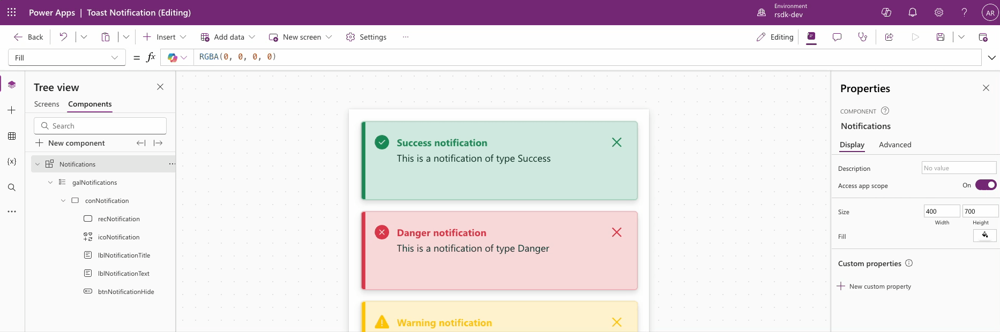


## Dismiss notification
The last thing left to take care of is updating the visibility based on the dismiss button in the notification. When the user clicks on the close icon it will have to disappear from the list of notifications.

Select the control named btnNotificationHide and go to the OnSelect property. Then paste the code below.

```
UpdateIf( 
    colNotifications, 
    ID = ThisItem.ID, 
    { 
        isVisible: false 
    }
)
```

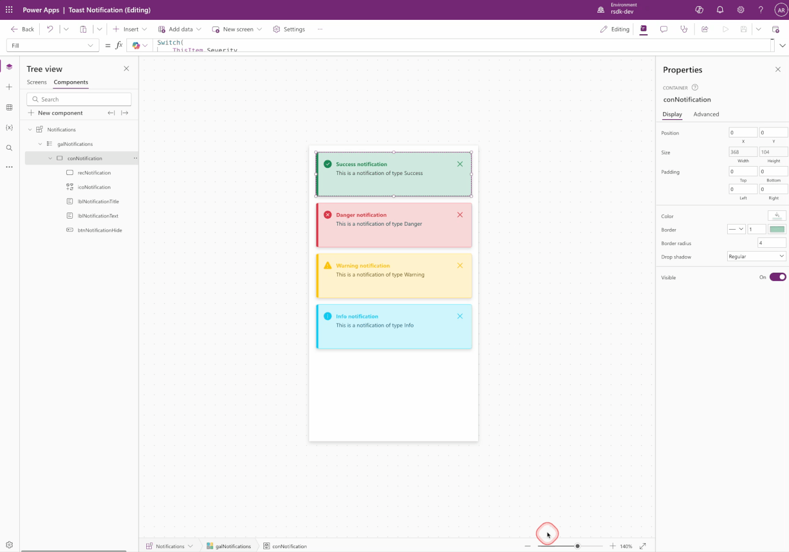

The reason I set the visibility to false here is because I want to reuse the read notifications later on. Of course, you can also choose to remove the notification from the collection.

## Add the component to your screen(s)
Great, the component is there, so now it's time to start using it on one or more screens of your app. Adding the component is super easy.

Go to the screen where you want to add the notifications

Go to Insert, click Custom and then click Notifications

To align the notifications on the right side of the screen open the component's property X and add the following code

```
Parent.Width - Self.Width
```

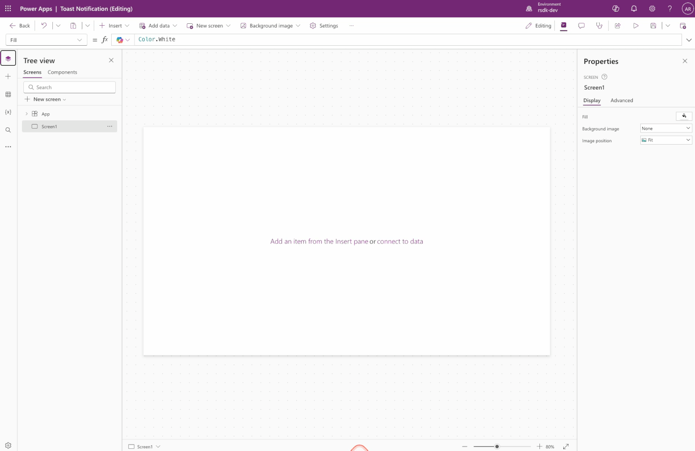

Place a new button on your screen, rename it and put the following code in the OnSelect property. This way we can add notifications tom the component.

```
Collect( 
    colNotifications, 
    { 
        ID: GUID(),
        Title: "Cool", 
        Text: "These notifications are really super cool",
        Severity: "success", 
        isVisible: true 
    },
    { 
        ID: GUID(),
        Title: "Oops!", 
        Text: "Something went terribly wrong",
        Severity: "danger", 
        isVisible: true 
    }
)
``` 

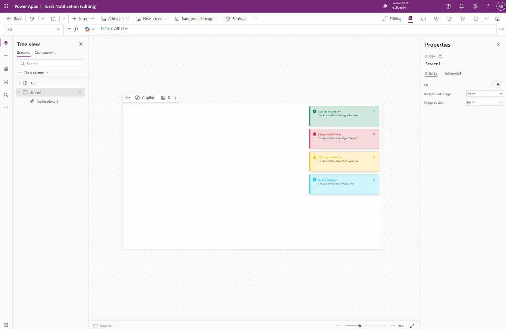

We have now created a notification component and added it to a screen! Time to see the result 💪

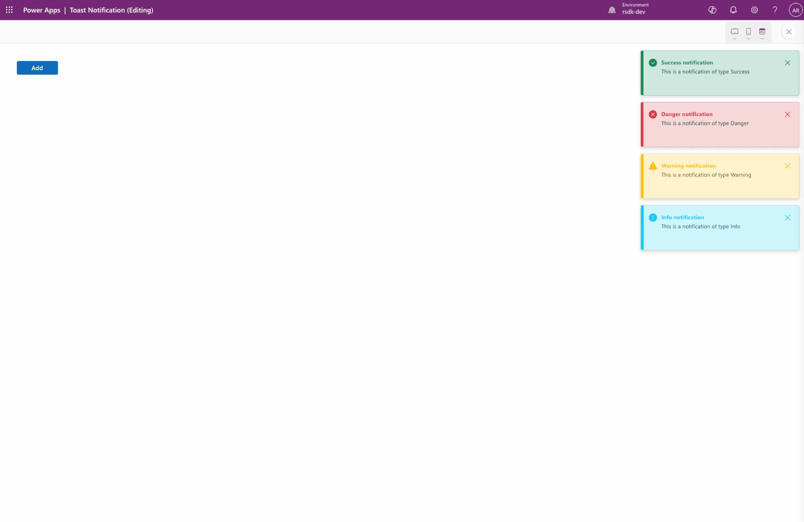

## Next steps
We have now created a component that we can use on multiple screens within an app. These notifications can give the user more detailed and more visual feedback compared to the standard notifications.

The next steps I will take to extend functionality and (re)usability are;

* Creating Library Component so that the component can be (re)used across multiple Canvas apps.
* Add functionality where the user can look back at previous notifications, including those that have already been viewed.
* Apply flexible height gallery, so that the height of the notification bases itself on the text to be displayed, without limitations.

Do you have any ideas, wishes or comments? Please let me know 💡 

Thanks for reading 🙏