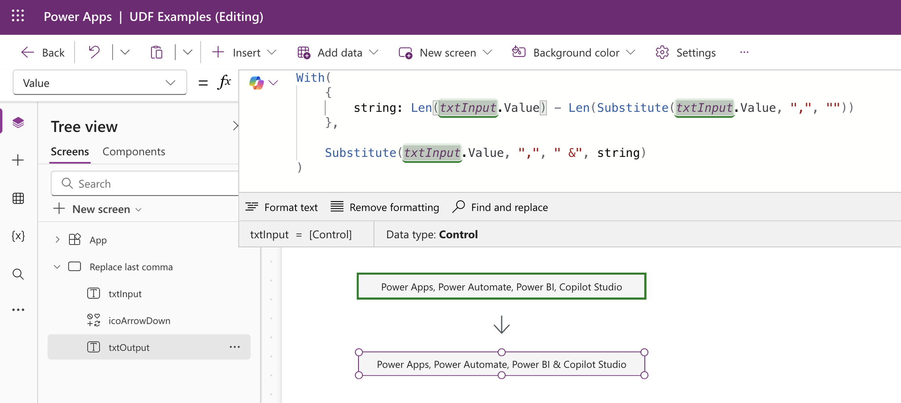
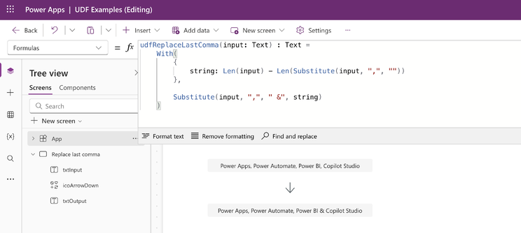
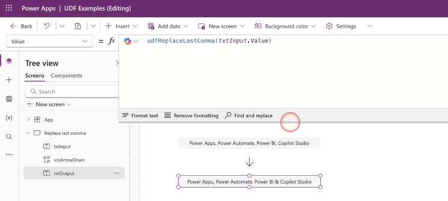
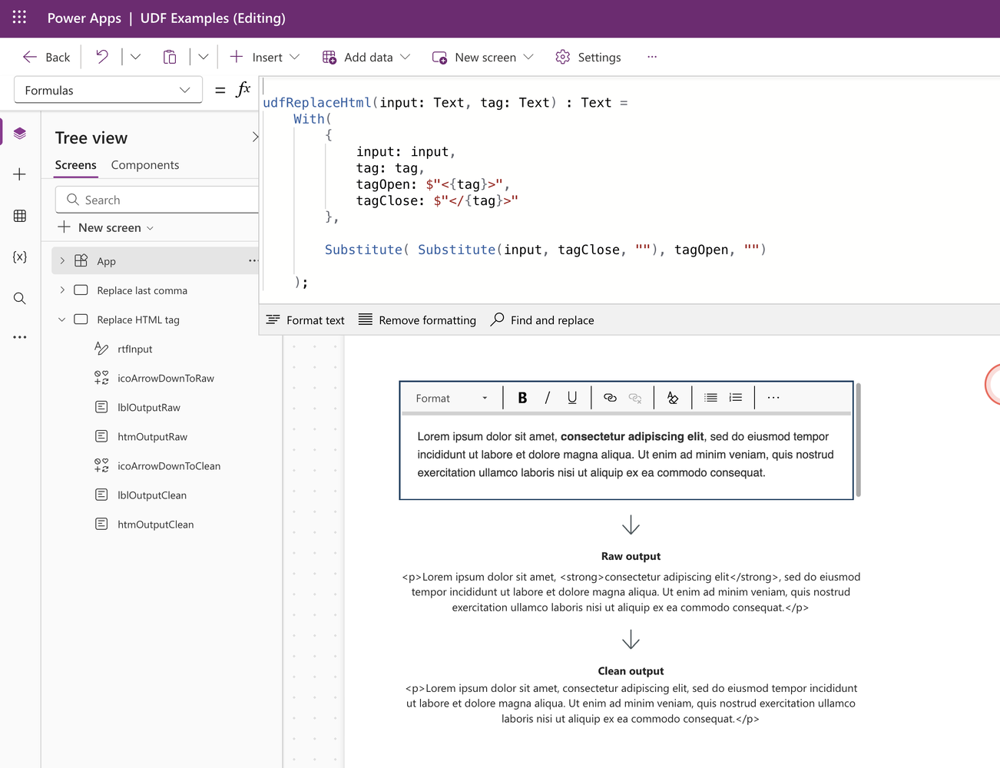
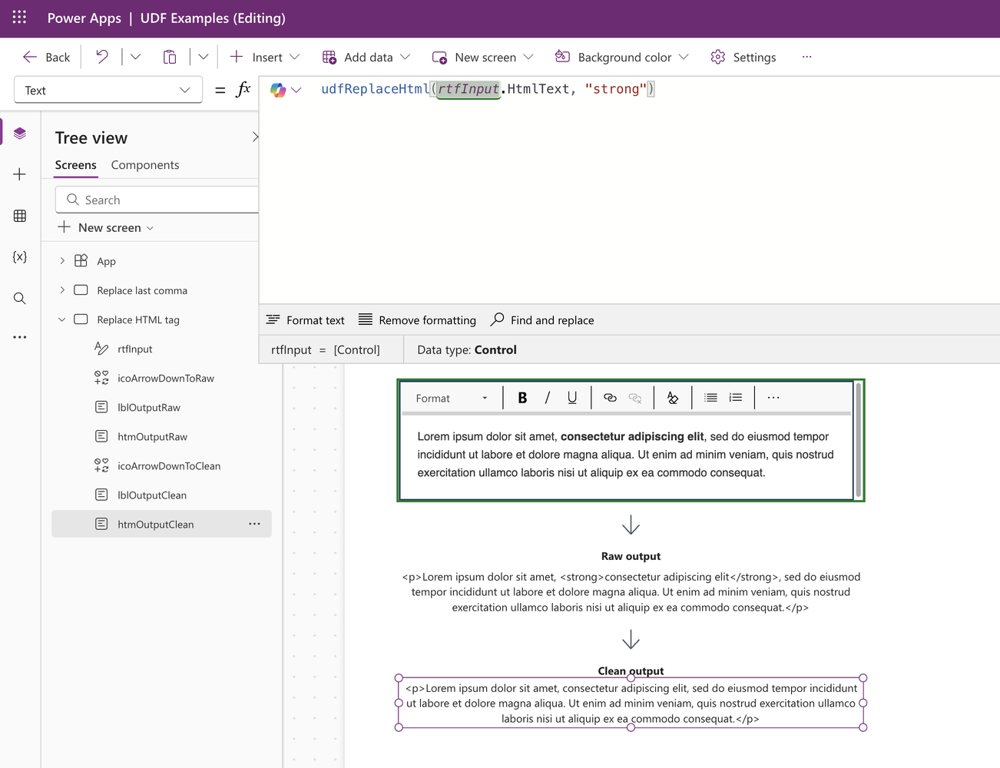
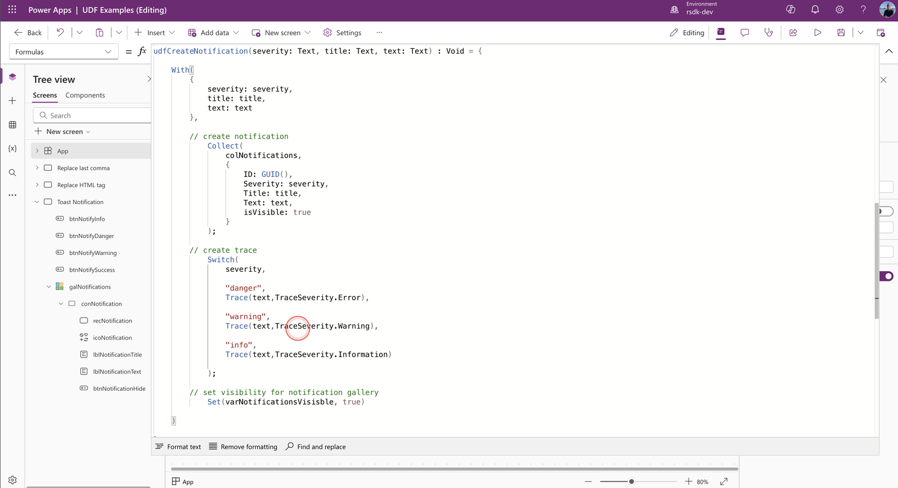
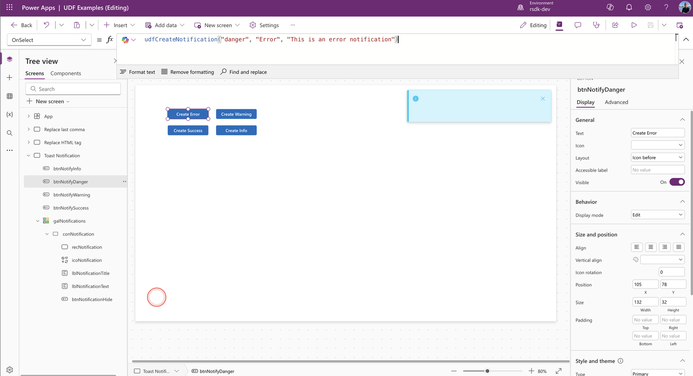
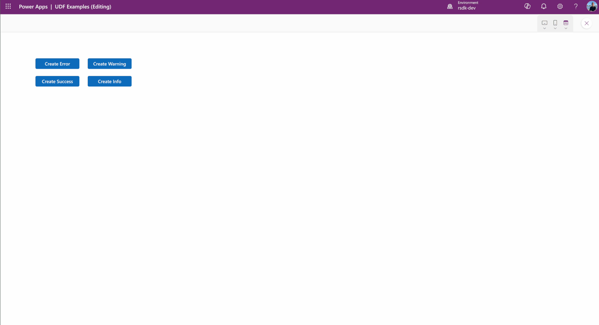
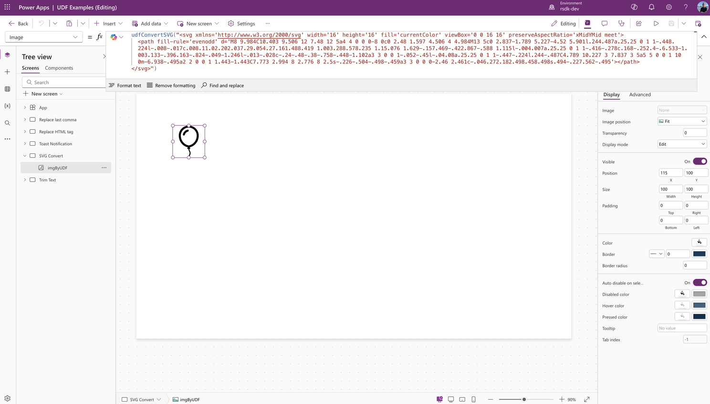
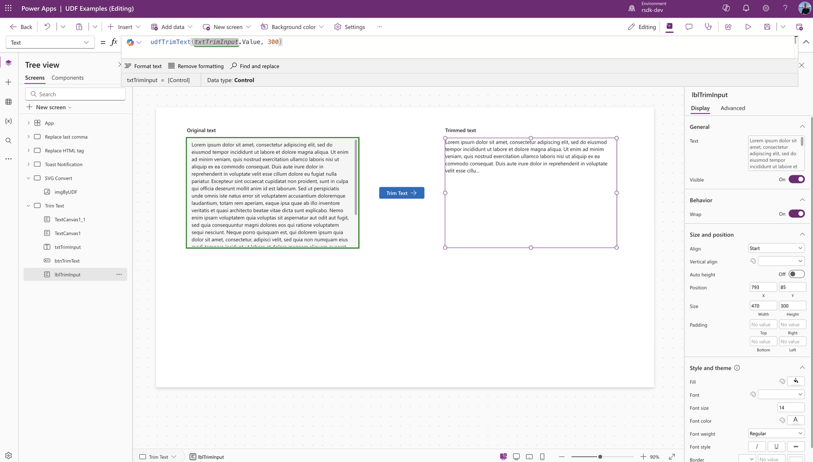

## What are user-defined functions?
With user defined functions, we can now write functions in one central place and reuse them across the entire canvas app or custom page (in model-driven app). Creating a user defined function is super easy and is done in the App > Formulas property. A user defined function consists of one or more input parameters and an output parameter. Every paramaters needs a data type.

User-defined functions can be used in different ways throughout your app. For example, to trim text, convert SVG code to Power FX code for use in a image control, to bundle a combination of actions that need to be executed in multiple places in your app, and many more.

I could go on explaining how user defined functions work, but it’s much more fun to share a few examples instead. Check out the examples below.

## Replacing text
Recently, I was working on an app where, in several places, I needed to take a string of comma-separated words and/or phrases and replace the last comma with an & symbol. That way, the string becomes a properly formatted sentence that can be used in different texts.

As the base (input), I’m using the following string in this example:

```
Power Apps, Power Automate, Power BI, Copilot Studio
```

I want to modify this string so that the last comma is replaced with an ampersand (&). Like the example below.

```
Power Apps, Power Automate, Power BI & Copilot Studio
```

By using the following piece of Power Fx code, I can achieve that.

```
With(
    { 
        string: Len(txtInput.Value) - 
                Len(Substitute(txtInput.Value, ",", "")) 
    },
    Substitute(txtInput.Value, ",", " &", string)
)
```

See the example below.




### Create a user defined function
And now it gets interesting, because I want to use this function in several places within my Canvas app. So it makes sense to turn it into a reusable user defined function and created the following code.

```
udfReplaceLastComma(input: Text) : Text =
    With(
        { 
            string: Len(input) - Len(Substitute(input, ",", "")) 
        },
        
        Substitute(input, ",", " &", string)
    )
```

User defined functions are created in the App > Formulas property. See the example below.



### Use the function
To use the defined function we need to call the function and give it the proper inputs.

```
udfReplaceLastComma(txtInput.Value)
```

This is what it looks like in the app.




## Removing HTML elements
Another example from one of my apps is removing a specific HTML element from a piece of text. This action needs to be performed in multiple places in my app and with different HTML elements. Once again, I use a user-defined function for this.

In this example, we have two input parameters:

* input (Text): this is where we pass in the full string from which the HTML element (tag) should be removed
* tag (Text): this is where we pass in the HTML element that needs to be removed from the string

```
udfReplaceHtml(input: Text, tag: Text) : Text = 
    With(
        {
            input: input, 
            tag: tag,
            tagOpen: $"<{tag}>", 
            tagClose: $"</{tag}>"
        }, 

        Substitute( Substitute(input, tagClose, ""), tagOpen, "")

    );
```

Example in the **App** > **Formulas** property.




Power fx to run the function

```
udfReplaceHtml(rtfInput.HtmlText, "strong")
```

Usage of the function in my Canvas app




## Custom (toast) notifications
A while ago, I wrote a blog post about how to create and use custom notifications in your Power App — you can check out my article here.

Now, whenever I want to create one of those custom notifications, I have to use and define a few different functions: • Collect (to add a new notification to a collection) • Trace (to make the notification visible in the Live Monitor) • Set (to control the visibility of my notification gallery)

That means three functions in multiple places throughout my app — but luckily, there’s a much easier way to handle this… with a user defined function!

### The function
Based on three input parameters of type Text:

* severity (the type of notification: danger, warning, info, or success)
* title (the title of the notification)
* text (the message of the notification)

In this case, we’re not using a specific output, since everything is handled inside the function itself. That’s why we choose the output parameter Void.

Inside the function, we then add the three PowerFX functions mentioned earlier. See the function below.

```
udfCreateNotification(severity: Text, title: Text, text: Text) : Void = {

    With( 
        { 
            severity: severity, 
            title: title, 
            text: text 
        }, 

        // create notification

            Collect(
                colNotifications,
                {
                    ID: GUID(),
                    Severity: severity, 
                    Title: title, 
                    Text: text,
                    isVisible: true 
                }
            ); 

        // create trace when severity is set to danger, 
           warning or info

            Switch( 
                severity, 

                "danger",
                Trace(text,TraceSeverity.Error),

                "warning",
                Trace(text,TraceSeverity.Warning),

                "info", 
                Trace(text,TraceSeverity.Information)

            );

        // set visibility for notification gallery
            Set(varNotificationsVisisble, true)

    )
    
}; 
```

We need to place this function in the Formula property of the app.



### Use the function
We’ll first add a few buttons to a screen and put the functions below in the OnSelect property. This way, we can create and show a different notification for each button.

```
// Create & show a danger/error notification
udfCreateNotification("danger", "Error", "This is an error notification")

// Create & show a warning notification
udfCreateNotification("warning", "Warning", "This is an warning notification")

// Create & show a success notification
udfCreateNotification("success", "Success", "This is an success notification")

// Create & show a info notification
udfCreateNotification("info", "Info", "This is an info notification")
```




### End result
Let’s see what the final result looks like.




## Other examples

### Convert SVG
You probably, like me, regularly use SVG images in your Canvas app. This means you constantly have to add and replace code. Basically, you need to convert the SVG code into PowerFX: replace double quotes (") with single quotes (') and wrap the SVG code in an EncodeUrl function.

This is where user defined functions come in really handy. You can create one function that converts the SVG into usable code for your image control.

#### Function
In the example below, we create a function called udfConvertSVG. We use the With function to create a variable that we can reuse, called cleanSVG. Then we use the Substitute function to replace double quotes with single ones, where Char(34) represents the double quotes. For more information about the Char function, check out the Microsoft Learn Documentatie

```
udfConvertSVG(input: Text) : Text = With( 

    {
        cleanSVG: Substitute( input, Char(34), "'" )
    },

    "data:image/svg+xml;utf8, "&EncodeUrl($"{cleanSVG}")

);
```

#### Usage
See the example below for how to use the function we just created.

```
udfConvertSVG("<svg>...</svg>")
```

As output, we now get the converted SVG code that can be used directly in an image control.




### Trim Text
In many of my apps, I have to deal with displaying descriptions. I often run into the challenge of having to shorten text to keep the UI consistent—maintaining the same height/width ratio for an information block.

To achieve this, I shorten the text and add three dots (...) so the user knows there’s more to read. The function to do this comes up quite often within a single solution, which makes it another great use case for a user defined function.

#### Function
In this example, I’m using a function with two input parameters:

* input (Text) – the text that needs to be shortened
* maxlen (Number) – indicates the maximum length the text is allowed to be (in characters)

For the output parameter, we choose Text, because we want to use (display) the text directly in the app after calling the function.

Inside the function, we first check the length of the input to determine whether it actually needs to be shortened. Then we make sure three dots (...) are added if the text was shortened.

```
udfTrimText(input: Text, maxlen: Number) : Text = With(
  {
    InputText: Trim(input)
  },

  If(
    Len(InputText) > maxlen,
    Left(InputText, maxlen) & "...",
    InputText
  )
)
```

#### Usage
See the example below showing how we can use the function we just created.

```
udfTrimText( [input], [maxlen] )
```

As a result, we now get trimmed text.




## More information
You can find more information about user-defined functions in Microsoft’s Learn documentation — check it out [here](https://learn.microsoft.com/en-us/power-platform/power-fx/reference/object-app#user-defined-functions) or [here](https://www.microsoft.com/en-us/power-platform/blog/power-apps/power-apps-user-defined-functions-ga/).

The next step when working with user-defined functions is something called user-defined types. I’ll definitely share more about those later, but if you can’t wait, you can already dive into the documentation [here](https://learn.microsoft.com/en-us/power-platform/power-fx/reference/object-app#user-defined-types).